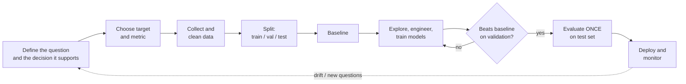
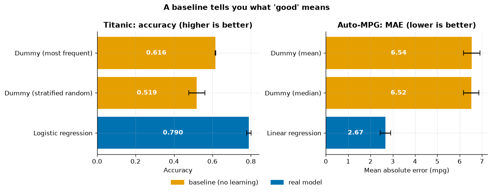
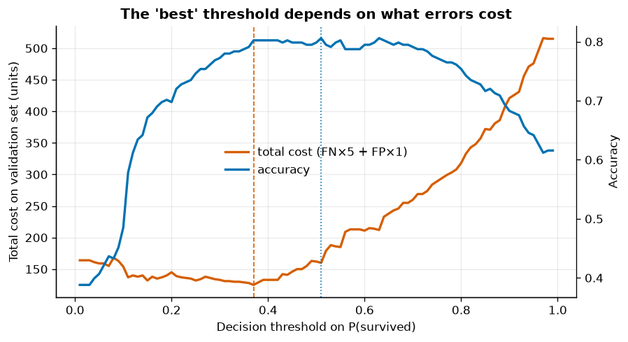
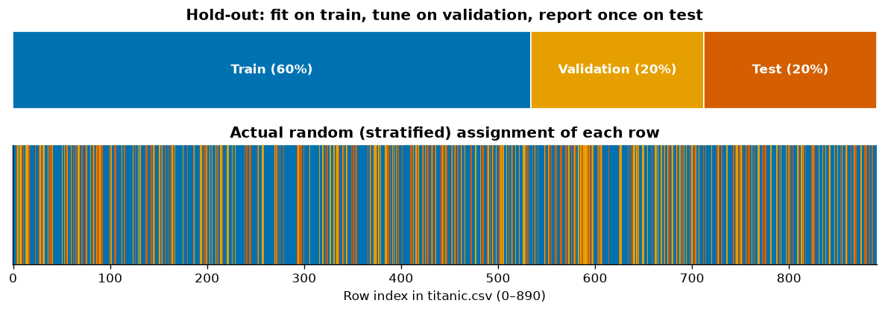
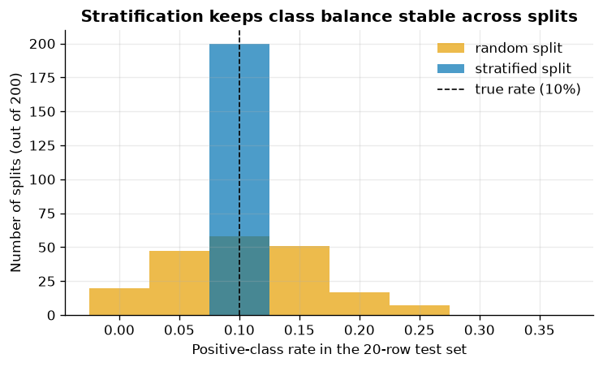
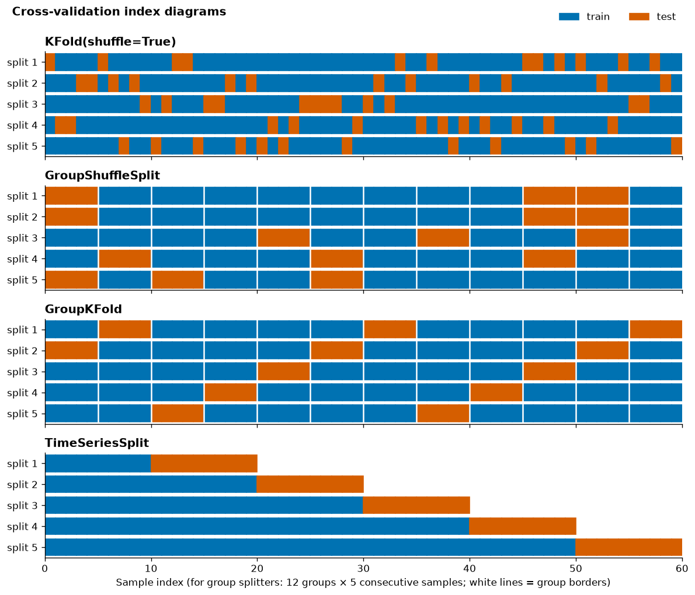
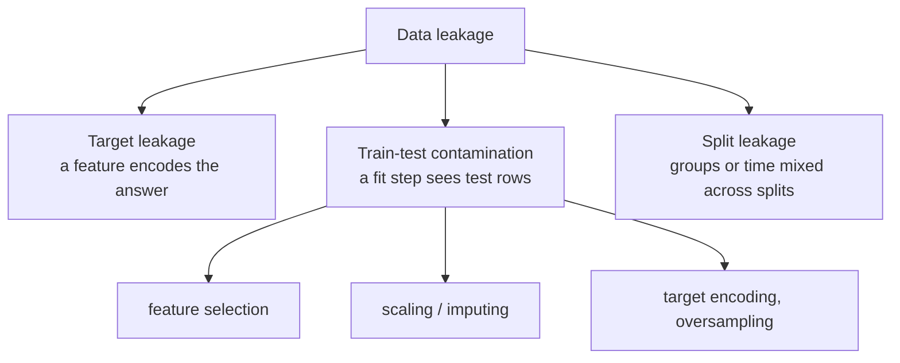
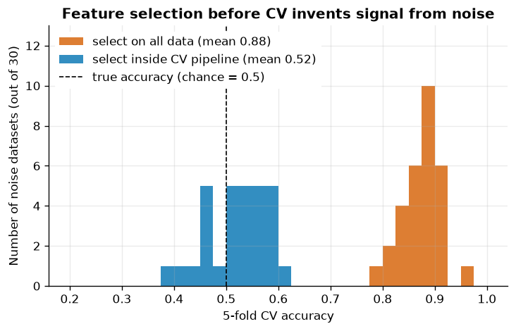
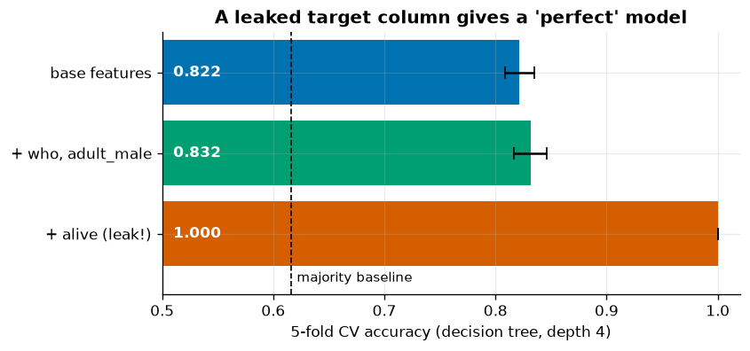
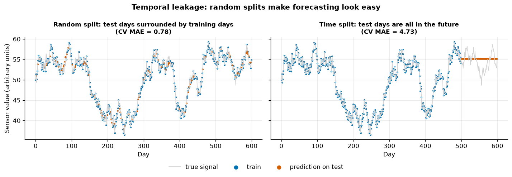

# 01 · Problem Framing, Data Splits & Leakage

> Before you train anything, decide exactly what you predict, how you will score it, and how you will hold data back so that your score tells the truth.

[Course home](../README.md) · [Next →](../02-data-cleaning/README.md)

**Notebook:** [`01-problem-framing.ipynb`](01-problem-framing.ipynb) · **Datasets:** Titanic, Auto-MPG, synthetic noise & time series · **Time:** ~2 h

---

## Learning objectives

By the end of this chapter you can:

1. Classify a problem as **supervised / unsupervised** and as **regression / classification**.
2. Choose a **target** and a **metric** that reflect the real (business or physical) cost of mistakes.
3. Build a **baseline** with `DummyClassifier` / `DummyRegressor` and explain why it comes first.
4. Explain why we need **train, validation and test** sets, and when to **stratify**.
5. Choose between **random, group and time-based** splits and draw their index diagrams.
6. Recognise and prevent the three most common kinds of **data leakage**.

---

## 1. The ML project lifecycle

Most of the time in a real project is spent *outside* the model-fitting box. Framing mistakes made at the
start are the most expensive, because everything downstream inherits them.



Notice where the split sits: **before** exploration and feature engineering. Anything you learn by
staring at the test set is a subtle form of leakage.

---

## 2. Framing the problem

Ask four questions:

| Question | Titanic | Auto-MPG |
|---|---|---|
| Do we have labels? | yes → **supervised** | yes → **supervised** |
| What type is the target? | binary `survived` → **classification** | continuous `mpg` → **regression** |
| What decision does the prediction drive? | e.g. prioritising rescue resources | e.g. estimating fuel cost of a design |
| What does an error cost? | missing a survivor ≠ a false alarm | 1 mpg of error ≈ money per km driven |

- **Supervised learning** learns a mapping $f: \mathbf{x} \mapsto y$ from labelled examples $(\mathbf{x}_i, y_i)$.
  - **Regression**: $y \in \mathbb{R}$ (fuel economy, concrete strength, price).
  - **Classification**: $y \in \{1,\dots,K\}$ (survived / died, penguin species).
- **Unsupervised learning** has only $\mathbf{x}_i$: clustering, dimensionality reduction, anomaly detection
  (chapter 10).

> [!TIP]
> The same raw data can support several framings. "Will this passenger survive?" (classification),
> "What is P(survive)?" (probabilistic classification) and "How many lifeboat seats will we need?"
> (regression on an aggregate) need different targets, metrics and even different rows.

### Choosing the target

The target should be (a) **what the decision actually needs**, (b) **available at training time** for enough
rows, and (c) **defined before** the features are measured. Proxy targets (e.g. "clicked" instead of
"satisfied") are common and fine, as long as you know they are proxies.

---

## 3. Baselines first

A **baseline** is the score of a model that ignores the features. It tells you what "good" means for
this dataset.

| Baseline | Predicts | Resulting score |
|---|---|---|
| `DummyClassifier(strategy="most_frequent")` | always the majority class | accuracy = majority share |
| `DummyClassifier(strategy="stratified")` | random labels with the training class ratio | accuracy ≈ $\sum_k p_k^2$ |
| `DummyRegressor(strategy="mean")` | always $\bar y_{\text{train}}$ | $R^2 = 0$ by construction |
| `DummyRegressor(strategy="median")` | always the training median | minimises MAE among constants |

```python
from sklearn.dummy import DummyClassifier
from sklearn.model_selection import cross_val_score, StratifiedKFold

cv = StratifiedKFold(5, shuffle=True, random_state=42)
cross_val_score(DummyClassifier(strategy="most_frequent"), X, y, cv=cv).mean()   # 0.616
```



*Left: always predicting "died" already scores 0.616 accuracy on Titanic; logistic regression reaches 0.790.
Right: predicting the mean mpg is off by 6.54 mpg on average; linear regression cuts that to 2.67 mpg.*

| Dataset | Baseline | Score | Real model | Score |
|---|---|---|---|---|
| Titanic (accuracy ↑) | most frequent | 0.616 ± 0.002 | logistic regression | 0.790 ± 0.012 |
| Auto-MPG (MAE ↓, mpg) | mean | 6.54 ± 0.37 | linear regression | 2.67 ± 0.24 |

> [!IMPORTANT]
> Always report the baseline next to your model. "79 % accuracy" means little on its own; "79 % vs a
> 62 % majority-class baseline" tells the reader how much the features actually help.

---

## 4. Tie the metric to the real cost

Accuracy counts every mistake equally. Real decisions rarely do. With a cost per false negative
$c_{FN}$ and per false positive $c_{FP}$, the total cost of a classifier that flags "positive" when
$\hat p \ge t$ is

$$
\text{Cost}(t) = c_{FN}\,\text{FN}(t) + c_{FP}\,\text{FP}(t).
$$

In the notebook we set (illustratively) $c_{FN}=5$, $c_{FP}=1$ — missing someone who needs help is five
times worse than a false alarm — and scan the threshold of a logistic regression on a **validation** set.



*Accuracy peaks at t = 0.51 (accuracy 0.806, cost 160), but the cost is minimised at t = 0.37 (cost 125,
accuracy 0.802). Giving up 0.4 percentage points of accuracy saves 22 % of the cost.*

Some rules of thumb for choosing a metric:

| Situation | Metric |
|---|---|
| Regression, errors cost proportionally | MAE (in target units — easy to explain) |
| Regression, large errors are disproportionately bad | RMSE |
| Regression, relative errors matter (prices, concentrations) | MAPE, or RMSE on $\log y$ |
| Classification, balanced classes, equal costs | accuracy |
| Classification, imbalanced classes | precision / recall / F1, PR-AUC |
| Ranking quality independent of threshold | ROC-AUC |
| Asymmetric known costs | expected cost at a tuned threshold |

Chapter 08 covers these metrics in depth.

---

## 5. Train, validation and test sets

| Set | Purpose | How often you look at it |
|---|---|---|
| **Train** | fit model parameters (weights, split points) | constantly |
| **Validation** | compare models, tune hyperparameters, pick thresholds | many times |
| **Test** | final, unbiased estimate of performance | **once** |

Why not just train/test? Every decision you make by looking at a score — which model, which features,
which `max_depth` — slightly fits that data. If you choose the best of 100 models on the test set, the
winner's test score is biased upward (the *winner's curse*). The validation set absorbs that bias; the
test set stays clean. In practice we often replace the single validation set with **cross-validation on
the training portion**.

```python
from sklearn.model_selection import train_test_split

idx_trval, idx_test = train_test_split(idx, test_size=0.20, stratify=y, random_state=42)
idx_train, idx_val = train_test_split(idx_trval, test_size=0.25,               # 0.25 × 0.8 = 0.2
                                      stratify=y.iloc[idx_trval], random_state=42)
```



*Top: the conceptual 60/20/20 split. Bottom: which of the 891 rows actually landed in each set — shuffled,
so each set is a representative sample.*

| | n | share | survival rate |
|---|---|---|---|
| train | 534 | 0.599 | 0.384 |
| validation | 178 | 0.200 | 0.382 |
| test | 179 | 0.201 | 0.385 |

### Stratification

With `stratify=y`, each split keeps the same class proportions as the whole dataset. It matters most for
**small** or **imbalanced** data. The notebook draws 200 random 80/20 splits of a 100-row dataset with 10
positives:



*Random splits give test sets with anywhere from 0 % to 25 % positives (std 0.062); a test set with no
positives cannot even measure recall. Stratified splits always contain exactly 10 %.*

> [!NOTE]
> For regression you can stratify on a binned target (`pd.qcut(y, 5)`) to make sure every split
> contains both cheap and expensive, light and heavy, etc.

---

## 6. Random vs group vs time-based splits

The golden rule: **the split must simulate how the model will be used.** If the model will see *new
patients*, the test set must contain patients it has never seen. If it will predict *tomorrow*, the test
set must lie *after* the training data.

| Situation | Danger of a random split | Splitter |
|---|---|---|
| Independent rows (i.i.d.) | none | `KFold`, `StratifiedKFold` |
| Several rows per patient / customer / machine / car model | the model memorises the entity; test looks easy | `GroupKFold`, `GroupShuffleSplit`, `StratifiedGroupKFold` |
| Rows ordered in time | training on the future to predict the past | `TimeSeriesSplit` |



*Each row is one CV iteration; each column is a sample in index order (blue = train, orange = test).
`KFold` scatters test samples everywhere. The group splitters keep every group of 5 samples (between
white lines) entirely on one side. `TimeSeriesSplit` always tests on the block right after an expanding
training window.*

```python
from sklearn.model_selection import GroupKFold, TimeSeriesSplit

cross_val_score(model, X, y, cv=GroupKFold(5), groups=df["patient_id"])
cross_val_score(model, X, y, cv=TimeSeriesSplit(5))           # rows must be sorted by time!
```

> [!WARNING]
> `TimeSeriesSplit` assumes the rows are already **sorted by time**. It does not look at a date column.

---

## 7. Data leakage

**Leakage** happens when information that will not be available at prediction time influences training or
evaluation. It never throws an error; it just makes your offline score lie. The typical symptom is a model
that looks excellent in the notebook and disappoints in production.



### Demo 1 — feature selection on pure noise

We create 100 samples with **5 000 features of pure Gaussian noise** and random 0/1 labels. The true
accuracy of any model on new data is 50 %. Then:

- **Wrong:** select the 20 features most associated with $y$ (ANOVA F-test) using *all* rows, then
  cross-validate a logistic regression on those 20 columns.
- **Right:** put `SelectKBest` inside a `Pipeline`, so that selection is refit on each training fold.

```python
# WRONG
X_sel = SelectKBest(f_classif, k=20).fit_transform(X_noise, y_noise)
cross_val_score(LogisticRegression(), X_sel, y_noise, cv=cv)          # 0.880

# RIGHT
pipe = Pipeline([("select", SelectKBest(f_classif, k=20)),
                 ("model", LogisticRegression())])
cross_val_score(pipe, X_noise, y_noise, cv=cv)                        # 0.530
```



*Across 30 independent noise datasets the leaky procedure averages 0.877 accuracy — on data that contains
no signal at all. The pipeline averages 0.522, i.e. chance.*

Why does it happen? Among 5 000 random columns, some are correlated with $y$ **by chance in this sample**,
including in the rows that later become test folds. Selecting them with the full data bakes that chance
correlation into every fold. This example is from *The Elements of Statistical Learning* (§7.10.2, "The
wrong and right way to do cross-validation").

### Demo 2 — target leakage: a column that *is* the answer

The Titanic CSV has a column `alive` with values "yes"/"no":

| alive \ survived | 0 | 1 |
|---|---|---|
| no | 549 | 0 |
| yes | 0 | 342 |

It is `survived` spelled differently. Adding it makes a depth-4 decision tree perfect:



*Base features (pclass, sex, age, fare): 0.822. Adding `who` and `adult_male`: 0.832 — a small,
legitimate gain. Adding `alive`: 1.000 — a leak.*

What about `who` (man / woman / child) and `adult_male`? They are **derived** from `sex` and `age`, which
are known at boarding, so they are *not* leaks — but they illustrate the right habit: for every column ask

1. **When** is this value recorded — before or after the outcome?
2. **How** is it computed — from which other columns, using which rows?

Typical real-world target leaks: "number of follow-up visits" when predicting a disease, "account closed
date" when predicting churn, "final grade" when predicting drop-out, a curing report written *after* a
concrete strength test.

> [!TIP]
> A single feature that makes the model (almost) perfect is far more often a leak than a discovery.
> Inspect feature importances (chapter 11) for suspicious winners.

### Demo 3 — preprocessing fit on all the data

Fitting `StandardScaler` or `SimpleImputer` on the full dataset lets test-set statistics (means,
standard deviations, medians) shape the training features. To make the effect visible, the notebook
sorts Auto-MPG by `model_year`, keeps the oldest 75 % for training and the newest 25 % for testing, and
uses a KNN regressor (distance-based, so scaling matters).

| Scaler mean | fit on all rows | fit on train only |
|---|---|---|
| displacement | 193.4 | 214.5 |
| weight | 2970.4 | 3130.2 |
| model_year | 76.0 | 74.4 |

| Procedure | Test MAE (mpg) |
|---|---|
| imputer + scaler fit on **all** rows | 4.563 |
| imputer + scaler fit on **train** only (pipeline) | 4.471 |

The leaky scaler "knows" that newer, lighter cars are coming. Here the difference in score is small (and
happens to go in the "wrong" direction) — the point is that the leaky number is **not what production
would see**, because in production the scaler can only have been fit on the past. For unsupervised steps
on large i.i.d. data the effect is usually small; for **supervised** steps (feature selection, target
encoding, SMOTE oversampling) it is often huge, as Demo 1 showed.

The fix is always the same:

```python
from sklearn.pipeline import make_pipeline
model = make_pipeline(SimpleImputer(strategy="mean"), StandardScaler(), KNeighborsRegressor(10))
model.fit(X_train, y_train)          # every .fit sees training rows only
```

### Temporal leakage

With time-ordered data a random split lets the model **interpolate** between yesterday and tomorrow
instead of **extrapolating** into the future. The notebook generates a 600-day random-walk "sensor" and
predicts it from the day number with 5-nearest-neighbours:



*Left: with a random split, each test day has training neighbours on both sides, so the CV MAE is only
0.78. Right: with `TimeSeriesSplit` the model must forecast, and the honest MAE is 4.73 — six times worse.*

Other forms of temporal leakage: computing rolling averages that include the current or future rows,
using "latest known" customer attributes that were updated after the event, or de-duplicating using
information from the future.

---

## Common pitfalls

| Pitfall | Why it hurts | Fix |
|---|---|---|
| No baseline | cannot tell if 80 % is good | always fit a `Dummy*` model |
| Metric chosen by habit (accuracy) | optimises the wrong trade-off | derive the metric from costs |
| Tuning on the test set | optimistic, non-reproducible score | validation set or CV on train only |
| Preprocessing before splitting | test statistics leak into training | put every `fit` step in a `Pipeline` |
| Feature selection on all data | invents signal from noise | selection inside the CV pipeline |
| Random split on grouped data | model memorises entities | `GroupKFold` / `GroupShuffleSplit` |
| Random split on time series | model sees the future | `TimeSeriesSplit`, sorted by time |
| Columns recorded after the outcome | perfect offline, useless online | audit *when* each column is created |

---

## Key takeaways

- Write down the **target, the metric and the cost of each error type** before modelling.
- Always report a **baseline**; a model must beat it clearly to be worth anything.
- Train fits parameters, validation (or CV) chooses models, the **test set is used once**.
- Split the way the model will be used: **stratify** small/imbalanced classes, keep **groups** together,
  never train on the **future**.
- **Leakage** makes offline scores lie. Everything that calls `.fit` belongs **inside** a `Pipeline`
  evaluated with cross-validation.

---

## Exercises

1. **Baseline for regression.** Replace MAE with $R^2$ for the MPG baselines. What score does
   `DummyRegressor(strategy="mean")` get and why?
   *Hint: $R^2 = 1 - SS_{res}/SS_{tot}$; what is $SS_{res}$ when you always predict $\bar y$?*
2. **Cost-sensitive threshold.** Redo the threshold analysis with $c_{FN}=1$, $c_{FP}=5$. Which way does
   the optimal threshold move?
   *Hint: false positives are now the expensive mistake.*
3. **Group leakage.** Treat the MPG car `name` as a group (some names occur several times). Compare `KFold`
   and `GroupKFold` CV scores of a KNN model.
   *Hint: start with `mpg["name"].value_counts().head()`.*
4. **Noise demo scale.** In Demo 1, vary `k` and `n_features`. When is the fake accuracy highest?
   *Hint: more candidate features → more chances for a spurious correlation.*
5. **Find the leak.** A colleague adds
   `fare_ratio = fare / titanic.groupby("survived")["fare"].transform("mean")`. Why is this a leak even
   though it looks like a harmless ratio?
   *Hint: which column is used in the `groupby`?*

---

## Further reading

- Hastie, Tibshirani & Friedman, *The Elements of Statistical Learning*, 2nd ed., §7.10 "Cross-Validation"
  (including "The wrong and right way to do cross-validation").
- James, Witten, Hastie & Tibshirani, *An Introduction to Statistical Learning*, ch. 2 and 5.
- Géron, *Hands-On Machine Learning with Scikit-Learn, Keras & TensorFlow*, 3rd ed., ch. 1–2.
- scikit-learn user guide: [Cross-validation](https://scikit-learn.org/stable/modules/cross_validation.html),
  [Common pitfalls and recommended practices](https://scikit-learn.org/stable/common_pitfalls.html),
  [Dummy estimators](https://scikit-learn.org/stable/modules/model_evaluation.html#dummy-estimators).
- Kaufman, Rosset, Perlich & Stitelman (2012), "Leakage in data mining: formulation, detection, and
  avoidance", *ACM TKDD* 6(4).
- Kapoor & Narayanan (2023), "Leakage and the reproducibility crisis in machine-learning-based science",
  *Patterns* 4(9).

[Course home](../README.md) · [Next →](../02-data-cleaning/README.md)
