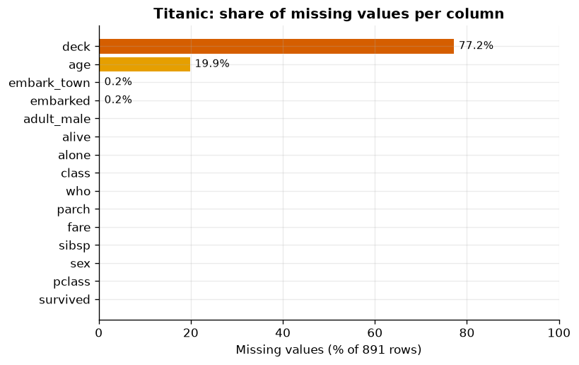
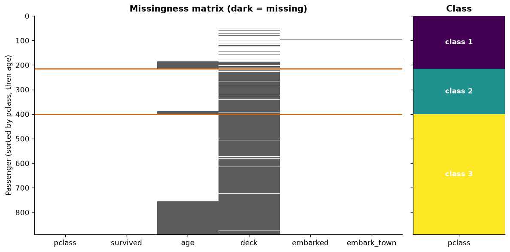
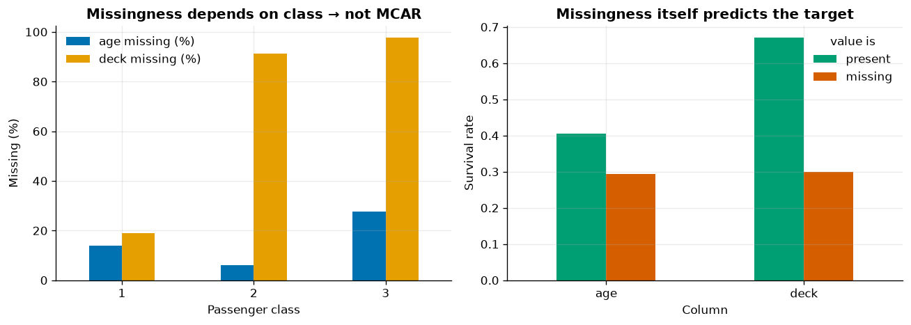
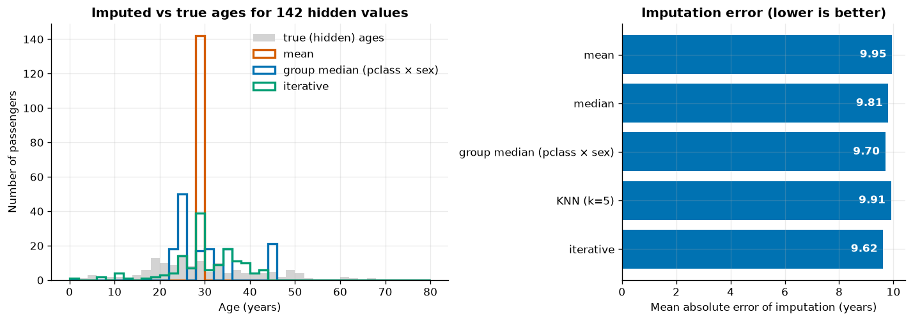
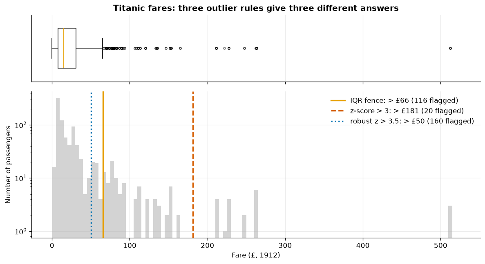
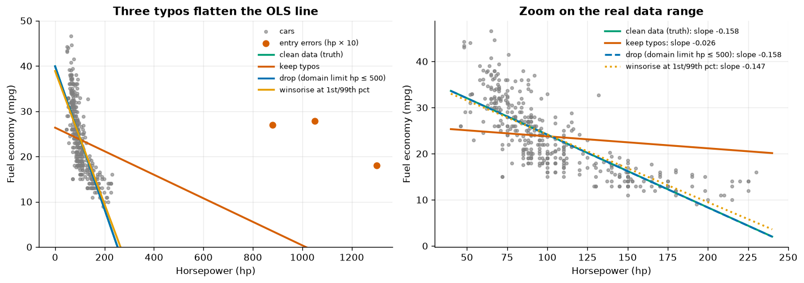
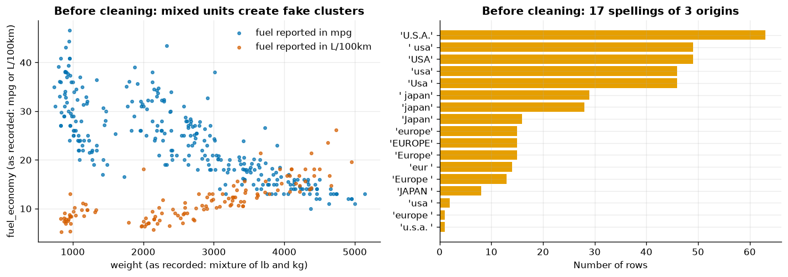
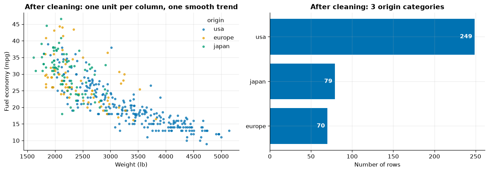

# 02 · Data Cleaning

> Missing values, outliers, duplicates, wrong types and mixed units: find them, understand why they exist, fix them in code you can re-run, and guard the result with assertions.

[← Previous](../01-problem-framing/README.md) · [Course home](../README.md) · [Next →](../03-exploratory-data-analysis/README.md)

**Notebook:** [`02-data-cleaning.ipynb`](02-data-cleaning.ipynb) · **Datasets:** Titanic, Auto-MPG (plus a deliberately messy copy generated in the notebook) · **Time:** ~2.5 h

---

## Learning objectives

1. Visualise missing data and reason about it with **MCAR / MAR / MNAR**.
2. Compare **deletion, simple, group-wise, KNN and iterative imputation**, and use **missing indicators**.
3. Detect outliers with **IQR, z-score, robust z (MAD)** and **domain limits**, and choose between fixing,
   dropping, winsorising, transforming and keeping them.
4. Find **exact and near-duplicates**, and know when *not* to drop them.
5. Convert **dtypes**: text → numbers, categoricals, booleans, dates.
6. Write a reusable **`clean_mpg()`** function and an **assertion-based validator** for a file with mixed units.

---

## Why cleaning deserves its own chapter

A model is a function of its training data. If 30 % of the weights are in kilograms and 70 % in pounds, the
model will happily learn a relationship that does not exist. Cleaning is not glamorous, but it is where a
large share of project time goes and where many silent errors are born. Three principles guide this chapter:

1. **Understand before you fix.** Every missing value, outlier or duplicate has a *reason*. The reason decides the fix.
2. **Clean in code, never by hand.** A function you can re-run on next month's data is worth more than a perfect one-off spreadsheet.
3. **Fit on train only.** Anything *learned* from data (an imputation median, a winsorisation percentile) belongs in the pipeline, not in a global cleaning step. Deterministic fixes (unit conversion, typo mapping) can be applied to all data up front.

| Cleaning step | Learned from data? | Where it goes |
|---|---|---|
| strip whitespace, fix case, map spellings | no | cleaning function, before splitting |
| unit conversion (kg → lb) | no | cleaning function |
| impossible values → NaN (domain limits) | no | cleaning function |
| impute with median / KNN / iterative | **yes** | `Pipeline`, fit on training folds |
| winsorise at percentiles, scale | **yes** | `Pipeline` |

---

## 1. Missing values

### 1.1 Look before you impute



*`deck` is 77.2 % missing, `age` 19.9 %, `embarked`/`embark_town` 0.2 % (2 rows). All other columns are complete.*

A bar chart shows *how much* is missing; a **missingness matrix** shows *where*. Sorting rows by a
suspected driver (here passenger class) exposes structure:



*Each row is a passenger, dark cells are missing. `deck` is known for most 1st-class passengers and almost
nobody in 2nd/3rd class; missing ages cluster in 3rd class.*

```python
titanic.isna().mean().sort_values()                   # share missing per column
titanic.groupby("pclass")["age"].apply(lambda s: s.isna().mean())
```

### 1.2 Why is it missing? MCAR, MAR, MNAR

Rubin's (1976) taxonomy. Let $R$ be the indicator "value is missing", $X_{obs}$ the observed data and
$X_{mis}$ the unobserved values.

| Mechanism | Definition | Titanic-style example | What it implies |
|---|---|---|---|
| **MCAR** | $P(R \mid X_{obs}, X_{mis}) = P(R)$ | a clerk randomly lost some records | deleting rows is unbiased, only loses power |
| **MAR** | $P(R \mid X_{obs}, X_{mis}) = P(R \mid X_{obs})$ | age missing more often in 3rd class | impute *using* the observed drivers |
| **MNAR** | depends on $X_{mis}$ itself | very old passengers refused to state age | no imputation fully fixes it; missingness is information |

You can *reject* MCAR with the observed data, but you can never prove MAR vs MNAR — that needs domain knowledge.

| pclass | age missing (%) | deck missing (%) |
|---|---|---|
| 1 | 13.9 | 19.0 |
| 2 | 6.0 | 91.3 |
| 3 | 27.7 | 97.6 |



*Left: missingness rates differ strongly by class, so neither column is MCAR. Right: passengers with a
recorded deck survived 67.0 % of the time vs 29.9 % without — the fact that a value is missing is itself a
strong predictor.*

> [!IMPORTANT]
> Missingness is often **informative**. The deck was recorded mainly for cabin passengers — who were
> richer and closer to the lifeboats. Dropping `deck` because it is "77 % empty" throws that signal away.

### 1.3 Imputation strategies

| Strategy | Code | Pros | Cons |
|---|---|---|---|
| Listwise deletion | `df.dropna()` | simple, unbiased under MCAR | loses rows (80 % here if `deck` is required) and biases under MAR |
| Drop the column | `df.drop(columns="deck")` | simple | loses the signal |
| Mean / median / mode | `SimpleImputer(strategy=...)` | fast, pipeline-friendly | collapses variance, weakens correlations |
| Group-wise | `groupby([...]).transform("median")` | uses the MAR structure | must be learned on train only |
| k-nearest neighbours | `KNNImputer(n_neighbors=5)` | multivariate, local | needs scaled features, $O(n^2)$ |
| Iterative (MICE-like) | `IterativeImputer()` | models each column from the others | slower; experimental import |
| + missing indicator | `SimpleImputer(add_indicator=True)` | model can use "was missing" | a few more columns |

**Iterative imputation** cycles through the incomplete columns; each is regressed on all the others
(Bayesian ridge by default) and its missing entries are replaced by predictions, repeating until the values
stabilise. It needs an explicit opt-in import:

```python
from sklearn.experimental import enable_iterative_imputer  # noqa: F401
from sklearn.impute import IterativeImputer, KNNImputer
```

**How good is each imputer?** We can only measure it where the truth is known. The notebook hides 20 % of
the *known* ages (142 values), imputes them from `pclass, sex, sibsp, parch, fare`, and compares.
Distance- and regression-based imputers get standardised inputs (the scaler ignores NaN when fitting).

| Imputer | MAE (years) | RMSE (years) | std of imputed ages |
|---|---|---|---|
| mean | 9.95 | 12.41 | 0.00 |
| median | 9.81 | 12.40 | 0.00 |
| group median (pclass × sex) | 9.70 | 12.57 | 7.21 |
| KNN (k = 5) | 9.91 | 12.92 | 11.20 |
| iterative | **9.62** | **12.12** | 7.74 |

*(True std of the hidden ages: 12.44 years.)*



*Left: mean imputation puts all 142 values on a single spike; group-wise and iterative imputation spread
them out like real ages. Right: pointwise errors are surprisingly similar.*

Two lessons:

1. **No imputer creates information.** These features only weakly predict age, so every method is off by
   about 10 years. Iterative is best, but only by ~0.3 years.
2. **Distributions matter even when MAE doesn't.** Mean imputation shrinks the variance of `age` and
   pulls every correlation involving `age` towards zero. That hurts linear models and any analysis of the
   column.

### 1.4 Missing indicators inside a pipeline

In a model, the imputer is a *learned* step, so it goes into the pipeline and is refit on every CV training fold.

```python
num_pipe = make_pipeline(SimpleImputer(strategy="median", add_indicator=True), StandardScaler())
pre = ColumnTransformer([("num", num_pipe, num_cols),
                         ("cat", OneHotEncoder(handle_unknown="ignore"), cat_cols)])
model = Pipeline([("pre", pre), ("model", LogisticRegression(max_iter=1000))])
```

For categoricals, the simplest indicator is a **"missing" category**: `deck.fillna("missing")`.

| deck (with "missing" level) | age missing-indicator | 5-fold CV accuracy |
|---|---|---|
| no | no | 0.790 ± 0.012 |
| no | yes | 0.791 ± 0.017 |
| yes | no | 0.798 ± 0.027 |
| yes | yes | 0.797 ± 0.029 |

Adding `deck` with a "missing" level helps (+0.8 points); the age indicator adds nothing measurable here.
Indicators are cheap — try them and let cross-validation decide.

---

## 2. Outliers

An outlier is a value far from the bulk of the data. It may be

- an **error** (typo, wrong unit, sensor glitch) → fix or remove,
- a **legitimate extreme** (a 1st-class suite ticket) → keep, maybe transform,
- a **different population** (a truck in a car dataset) → decide whether it belongs in scope.

### 2.1 Detection rules

| Rule | Flag if | Notes |
|---|---|---|
| IQR (Tukey) fences | $x < Q_1 - 1.5\,\text{IQR}$ or $x > Q_3 + 1.5\,\text{IQR}$ | the boxplot whiskers; assumes rough symmetry |
| z-score | $\lvert x - \bar x\rvert / s > 3$ | mean and $s$ are inflated by the outliers themselves ("masking") |
| robust z (MAD) | $\lvert x - \tilde x\rvert / (1.4826\,\text{MAD}) > 3.5$ | median-based; 1.4826 makes MAD ≈ σ for normal data (Iglewicz & Hoaglin) |
| domain limits | outside physically possible range | the only rule that detects *errors* rather than *rarity* |

with $\text{MAD} = \operatorname{median}_i \lvert x_i - \tilde x\rvert$ and $\tilde x$ the median.

On Titanic `fare` (Q1 = 7.91, Q3 = 31.00, median = 14.45, MAD = 6.90):

| Rule | Upper threshold | Flagged |
|---|---|---|
| IQR fence | £65.6 | 116 |
| z-score > 3 | £181.3 | 20 |
| robust z > 3.5 | £50.3 | 160 |



*Three rules, three answers — from 20 to 160 "outliers". Fares are strongly right-skewed (skewness 4.79),
so symmetric rules flag hundreds of perfectly legitimate 1st-class tickets. The log scale on the y-axis
makes the rare high fares visible.*

For skewed, positive quantities a **transform** is usually better than deletion: `log1p(fare)` has
skewness 0.39 and only 31 IQR outliers. The 15 fares of exactly **£0** are a domain question (crew?
complimentary tickets?) that no statistical rule can answer.

### 2.2 What to do with an outlier

| Option | When |
|---|---|
| **Fix** | it is a typo and the true value can be recovered (e.g. a unit error) |
| **Set to NaN / drop** | it is impossible and cannot be recovered |
| **Winsorise** (clip at e.g. 1st/99th percentile) | legitimate but extreme values dominate a sensitive model |
| **Transform** (log, rank) | skewed positive data |
| **Keep** | legitimate values and a robust model (trees, Huber loss, MAE) |

The notebook multiplies `horsepower` by 10 for just **three** of 392 cars (a slipped zero) and fits
$\text{mpg} = \beta_0 + \beta_1\,\text{hp}$ by ordinary least squares:

| Variant | Slope (mpg per hp) | Intercept |
|---|---|---|
| clean data (truth) | −0.158 | 39.94 |
| keep typos | −0.026 | 26.36 |
| drop (domain limit hp ≤ 500) | −0.158 | 39.92 |
| winsorise at 1st/99th pct | −0.147 | 38.88 |



*OLS minimises squared errors, so points far away in $x$ have huge leverage: three typos flatten the slope
by 84 %. A domain limit removes them and restores the true slope; winsorising helps but leaves three wrong
values at the 99th percentile.*

> [!WARNING]
> Winsorisation percentiles and z-score thresholds are **learned from data** — compute them on the
> training set only. Domain limits are fixed knowledge and can be applied anywhere.

---

## 3. Duplicates

**Exact duplicates** are identical rows: `df.duplicated()`. Titanic has **107** of them (160 rows
involved) — but the file has no passenger name or ticket number, so two 3rd-class men with unknown age who
paid the standard fare can be two different people. Dropping them would *delete real passengers*.

> [!TIP]
> Before de-duplicating, ask: *does the table have a natural key (an ID)?* and *could two identical rows
> legitimately describe two entities?* If there is no key, duplicates are often legitimate.

**Near-duplicates** differ only in formatting (`"Ford Pinto "` vs `"ford pinto"`), units (1008.3 kg vs
2223 lb) or rounding. They become exact duplicates only after normalisation — which is why
`drop_duplicates()` is the *last* step of the cleaning function below. For fuzzier matches (typos in names)
use a similarity join, e.g. on normalised names plus numeric tolerance.

---

## 4. Data types

| Problem | Symptom | Fix |
|---|---|---|
| numbers stored as text | dtype `str`/`object`; `"130"`, `"88 hp"`, `"?"` | `str.extract(r"(\d+\.?\d*)")` then `pd.to_numeric(..., errors="coerce")` |
| repeated labels | many identical strings | `astype("category")` — fixed levels, less memory |
| booleans spelled many ways | `"yes"`, `"Y"`, `"TRUE"`, `"1"` | explicit `map` to `True`/`False` (never `astype(bool)` on strings — `"false"` is truthy!) |
| dates as text | `"1975-01-07"`, `"unknown"` | `pd.to_datetime(..., format=..., errors="coerce")` |
| integer with NaN | float column of integers | nullable `Int64` |

```python
s = pd.Series(["130", " 95", "?", "88 hp", "", None])
pd.to_numeric(s.str.extract(r"(\d+\.?\d*)")[0], errors="coerce")   # [130, 95, NaN, 88, NaN, NaN]
```

A column of 4 000 origin strings uses 245 132 bytes as strings and 4 317 bytes as a `category`.

---

## 5. End-to-end: cleaning a messy Auto-MPG file

The notebook's `make_messy_mpg()` builds a deterministic (seed 42) messy copy of `mpg.csv` that mimics an
export merged from several sources. It contains **410 rows** (398 cars + 8 exact + 4 near-duplicates) and:

| Mess | Example |
|---|---|
| fuel economy in two units + unit column | `9.41, "L/100km"` next to `13.0, "mpg"` |
| weight in two units + unit column | `1008.3, "kg"` next to `4699, "lb"` |
| horsepower as text | `"71"`, `"90 hp"`, `"?"` |
| 17 spellings of 3 origins | `"U.S.A."`, `" usa"`, `"Usa "`, `"eur "`, `"JAPAN "` … |
| two- and four-digit years | `74` and `1975` |
| booleans in 8 spellings | `yes, Y, TRUE, 1, no, N, false, 0` |
| dates as text | `"1975-01-07"`, `"unknown"` |
| names with case/whitespace noise | `"  Buick Century Luxus (Sw) "` |
| three impossible values | acceleration 0 s, 0 cylinders, displacement −97 |
| exact and near-duplicates | same car, name upper-cased, weight re-expressed in kg |



*Left: plotting the raw columns suggests two populations — an artefact of mixing mpg with L/100 km and lb
with kg. Right: 17 spellings of 3 categories; a one-hot encoder would create 17 columns.*

### 5.1 The cleaning function

Order matters: normalise strings → parse numbers → convert units → fix types → apply domain limits →
**then** de-duplicate.

```python
LB_PER_KG = 2.20462
L100KM_FROM_MPG = 235.215                      # L/100km = 235.215 / mpg (US gallon)
ORIGIN_MAP = {"usa": "usa", "u.s.a.": "usa", "japan": "japan", "europe": "europe", "eur": "europe"}
DOMAIN_LIMITS = {"mpg": (5, 60), "cylinders": (3, 12), "displacement": (50, 500),
                 "horsepower": (40, 300), "weight": (1000, 6000),
                 "acceleration": (5, 30), "model_year": (1970, 1982)}

def clean_mpg(df):
    out = df.copy()
    out["name"] = out["name"].str.strip().str.lower().str.replace(r"\s+", " ", regex=True)
    out["origin"] = out["origin"].str.strip().str.lower().map(ORIGIN_MAP)
    assert out["origin"].notna().all(), "unknown origin spelling - extend ORIGIN_MAP"
    out["horsepower"] = pd.to_numeric(out["horsepower"].str.extract(r"(\d+\.?\d*)")[0], errors="coerce")
    is_l100 = out["fuel_unit"].eq("L/100km")
    out["mpg"] = np.where(is_l100, L100KM_FROM_MPG / out["fuel_economy"], out["fuel_economy"]).round(1)
    is_kg = out["weight_unit"].eq("kg")
    out["weight"] = np.where(is_kg, out["weight"] * LB_PER_KG, out["weight"]).round(0).astype(int)
    out["model_year"] = np.where(out["model_year"] < 100, out["model_year"] + 1900, out["model_year"])
    # ... booleans, category, datetime (see notebook)
    for col, (lo, hi) in DOMAIN_LIMITS.items():
        bad = ~out[col].between(lo, hi) & out[col].notna()
        out[col] = out[col].astype(float).mask(bad)         # impossible -> NaN, keep the row
    return out[CLEAN_COLUMNS].drop_duplicates()
```

Running it prints a log of what changed:

```
  - horsepower: 6 unknown ('?') -> NaN
  - converted 126 L/100km -> mpg and 114 kg -> lb
  - cylinders: 1 value(s) outside [3, 12] -> NaN
  - displacement: 1 value(s) outside [50, 500] -> NaN
  - acceleration: 1 value(s) outside [5, 30] -> NaN
  - dropped 12 duplicate rows
```

All 12 duplicates are found — including the 4 near-duplicates, which only match *after* the names are
normalised and the weights converted back to pounds.

> [!NOTE]
> Impossible values become `NaN` rather than causing the row to be dropped: the other nine columns of that
> car are still good, and the imputer in the modelling pipeline can deal with a single gap.

### 5.2 Validation with assertions

Cleaning code should **fail loudly** when new data breaks an assumption. The notebook's `validate_mpg()`
runs 21 named checks and reports every one that fails:

```python
checks = {"expected columns": lambda: set(df.columns) == EXPECTED_COLUMNS,
          "no duplicate rows": lambda: not df.duplicated().any(),
          "weight in [1000, 6000]": lambda: df["weight"].dropna().between(1000, 6000).all(),
          "origin in {usa, europe, japan}": lambda: set(df["origin"].unique()) <= {"usa", "europe", "japan"},
          ...}
failed = [name for name, fn in checks.items() if not safe(fn)]
assert not failed, f"{len(failed)} of {len(checks)} checks failed: " + "; ".join(failed)
```

On the cleaned data: `✓ all 21 checks passed for 398 rows`. On the raw file, 12 of 21 checks fail
(duplicates, text horsepower, kg weights, two-digit years, origin spellings, …).

> [!TIP]
> Notice which check does **not** fail on the raw file: `mpg in [5, 60]`. L/100 km values (5–26) happen to
> lie inside the plausible mpg range. Range checks cannot detect unit mix-ups — that is why the unit column
> and an explicit conversion step matter. Libraries such as *pandera* and *Great Expectations* formalise
> this pattern for production pipelines.

### 5.3 Before / after

Because we created the mess ourselves we know the truth — the original `mpg.csv`. After cleaning, the 398
rows match it exactly: max |clean − original| = 0.00 for every numeric column; the only differences are the
3 injected impossible values, now `NaN`. Origins and names are identical.

| | messy count | messy mean | clean count | clean mean | original mean |
|---|---|---|---|---|---|
| mpg | 410 | 20.1 | 398 | 23.5 | 23.5 |
| weight (lb) | 410 | 2603.6 | 398 | 2970.4 | 2970.4 |
| model_year | 410 | 840.6 | 398 | 1976.0 | 1976.0 |

A mean model year of 840.6 is the kind of number that should make you stop and look.



*After cleaning: one unit per column produces one smooth, decreasing weight–mpg relationship, and three
origin categories (usa 249, japan 79, europe 70).*

---

## Common pitfalls

| Pitfall | Consequence | Better |
|---|---|---|
| `df.dropna()` as a reflex | lose most rows; bias under MAR | inspect missingness; impute in a pipeline |
| Mean-imputing and forgetting | variance and correlations shrink; signal in missingness lost | group/model imputers + indicator |
| Imputing before the train/test split | test statistics leak into training | imputer inside the `Pipeline` |
| Deleting every IQR outlier | removes legitimate extremes in skewed data | domain limits for errors, transforms for skew |
| `drop_duplicates()` without a key | deletes real, identical-looking entities | check for an ID; normalise first |
| `astype(bool)` on strings | `"false"` becomes `True` | explicit mapping |
| Range checks as the only validation | unit mix-ups pass unnoticed | unit columns + explicit conversion + distribution checks |
| Manual fixes in a spreadsheet | not reproducible | a tested `clean_*()` function |

---

## Key takeaways

- **Look at missingness** (bar chart + matrix) and ask *why* values are missing: MCAR, MAR or MNAR.
- Mean imputation is a baseline, not a solution: it collapses variance. Group-wise, KNN or iterative
  imputers use the MAR structure; a **missing indicator** keeps the signal in the missingness itself.
- Imputers, like all fitted transformers, go **inside the pipeline**.
- Outlier rules disagree; for skewed data IQR flags legitimate values. Use **domain limits** for errors and
  **transforms / robust models** for legitimate extremes.
- **Normalise before de-duplicating**: near-duplicates hide behind case, whitespace and units.
- Wrap cleaning in a **function** and guard it with **assertions** so new data fails loudly.

---

## Exercises

1. **MNAR thought experiment.** Give an example where Titanic `age` could be MNAR. Can any test on the
   observed data prove it?
   *Hint: what would have to depend on the unobserved age itself?*
2. **Imputation in CV.** Compare `SimpleImputer(median)`, `KNNImputer` and `IterativeImputer` inside the
   logistic-regression pipeline with 5-fold CV. Does better imputation accuracy translate into better
   survival prediction?
   *Hint: swap the imputer in `make_model`.*
3. **Robust z on MPG.** Apply the robust-z rule to every numeric column of the clean Auto-MPG data. Which
   cars are flagged, and are they errors?
   *Hint: `(x - x.median()) / (1.4826 * MAD)`.*
4. **Break the pipeline.** Change one messy `origin` to `"Deutschland"` and re-run `clean_mpg`. What happens,
   and how would you extend the function?
   *Hint: look at the first `assert`.*
5. **Fuzzy near-duplicates.** Find pairs of rows in the clean data with the same `name` and `model_year` and
   weights within 1 %.
   *Hint: `merge` the frame with itself on `["name", "model_year"]`.*

---

## Further reading

- Little & Rubin, *Statistical Analysis with Missing Data*, 3rd ed. (2019) — the MCAR/MAR/MNAR framework.
- van Buuren, *Flexible Imputation of Missing Data*, 2nd ed. (2018), free online — MICE and diagnostics.
- Iglewicz & Hoaglin, *How to Detect and Handle Outliers* (1993) — the modified (robust) z-score.
- Wickham, "Tidy Data", *Journal of Statistical Software* 59(10), 2014.
- Géron, *Hands-On Machine Learning*, 3rd ed., ch. 2 ("Prepare the Data for Machine Learning Algorithms").
- scikit-learn user guide: [Imputation of missing values](https://scikit-learn.org/stable/modules/impute.html).
- pandas user guide: [Working with missing data](https://pandas.pydata.org/docs/user_guide/missing_data.html),
  [Categorical data](https://pandas.pydata.org/docs/user_guide/categorical.html).

[← Previous](../01-problem-framing/README.md) · [Course home](../README.md) · [Next →](../03-exploratory-data-analysis/README.md)
