# 03 · Exploratory Data Analysis

> Plot first, model later: learn what every variable looks like, how the variables relate, and what the target needs, before you commit to features or algorithms.

[← Previous](../02-data-cleaning/README.md) · [Course home](../README.md) · [Next →](../04-feature-engineering/README.md)

**Notebook:** [`03-exploratory-data-analysis.ipynb`](03-exploratory-data-analysis.ipynb) · **Datasets:** Palmer penguins, Auto-MPG, Anscombe's quartet · **Time:** ~2 h

---

## Learning objectives

1. Describe numeric variables with **histograms, KDEs, box and violin plots**, and quantify **skewness**.
2. Know when a **log transform** helps, and when it doesn't.
3. Summarise **categorical** variables and spot rare levels and proxies.
4. Explore pairs of variables with **scatter and pair plots**.
5. Compute and interpret **Pearson vs Spearman** correlation, and explain why you must **always plot** (Anscombe).
6. Recognise **confounding** and **Simpson's paradox**; never read causation into a correlation.
7. Analyse the **target**: distribution, class balance, feature-vs-target plots and **mutual information**.
8. Apply a reusable **EDA checklist**.

---

## What EDA is for

EDA (a term popularised by John Tukey, 1977) is a loop: *plot → notice → ask → plot again*. It has three jobs:

| Job | Example finding in this chapter | Consequence for modelling |
|---|---|---|
| Understand the variables | bill length is bimodal | there is a hidden grouping (species) |
| Catch problems cleaning missed | 3- and 5-cylinder cars are extremely rare | merge rare categories or be careful with them |
| Form hypotheses | mpg decays non-linearly with weight | transform or use a non-linear model |

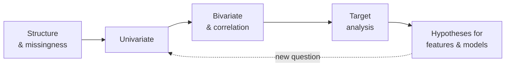

> [!WARNING]
> **EDA can leak.** Decisions you make by looking at data (which features to keep, which transform to use)
> are part of the model. In a real project explore the **training set** only. The univariate and bivariate
> sections below use all rows for teaching; the target-analysis section splits first, as you should.

The first look is always the same three calls:

```python
penguins.info()          # 344 rows; bill/flipper/mass have 2 NaN, sex has 11
penguins.describe()      # ranges, means, quartiles
penguins.head()
```

---

## 1. Univariate analysis

### 1.1 Histograms and kernel density estimates

A **histogram** counts observations per bin. A **kernel density estimate** replaces each point with a small
bump and adds them up:

$$
\hat f_h(x) = \frac{1}{n h} \sum_{i=1}^{n} K\!\left(\frac{x - x_i}{h}\right), \qquad K(u) = \frac{1}{\sqrt{2\pi}} e^{-u^2/2}.
$$

The bandwidth $h$ is a bias–variance knob: small $h$ follows noise, large $h$ blurs real structure.
Scott's rule, $h \approx 1.06\,\hat\sigma\, n^{-1/5}$ (scipy's default factor $n^{-1/5}$ times the std), is a sensible start.

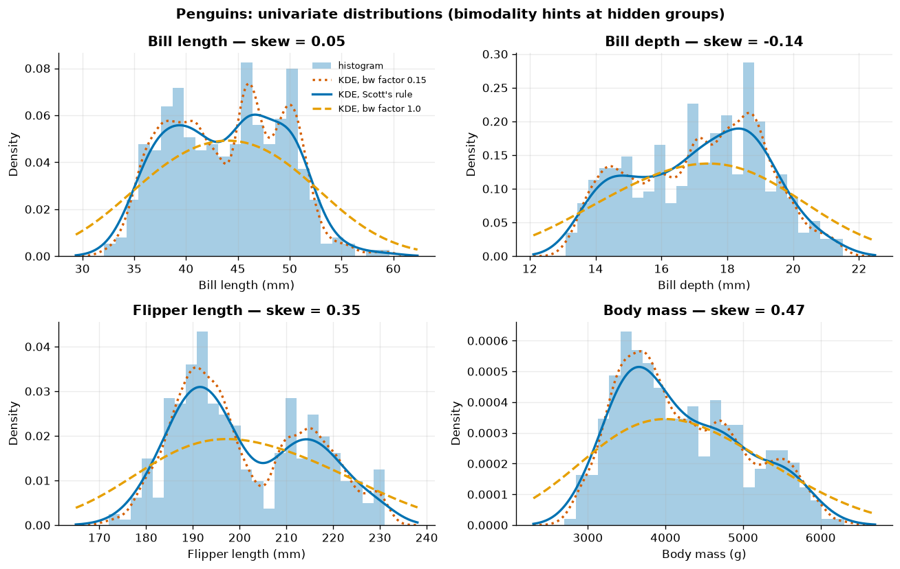

*Bill length and flipper length are clearly **bimodal**. The dotted KDE (bandwidth factor 0.15) invents
extra wiggles; the dashed one (factor 1.0) smooths the second mode away; Scott's rule (solid) is a good
compromise. Skewness is small for all four variables (−0.14 to 0.47), yet they are far from normal.*

> [!TIP]
> Multimodality almost always means the data mixes **groups**. Before modelling, find out which variable
> defines them — here, as the pair plot will show, it is `species`.

### 1.2 Box plots and violin plots

A **box plot** shows the median, the quartiles (the box spans the IQR) and whiskers reaching the most extreme
point within 1.5 IQR; points beyond are drawn individually. A **violin plot** mirrors a KDE around the axis and
therefore shows the *shape*.

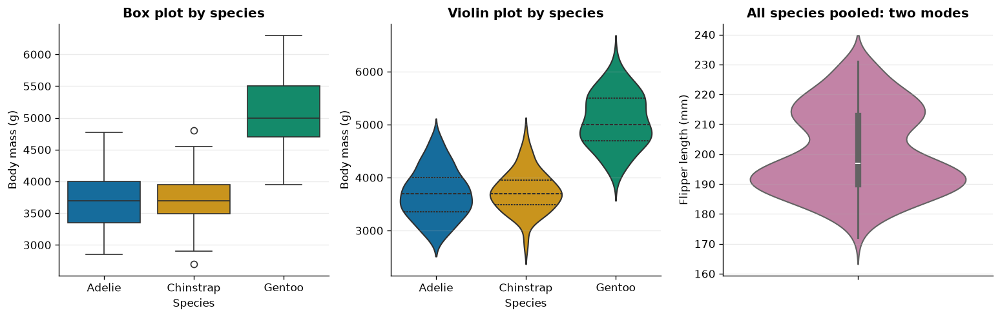

*By species, box and violin tell similar stories: Gentoos are about 1.3 kg heavier. But pooled over species
(right) the violin shows the two modes of flipper length that a box plot would completely hide.*

| Plot | Shows | Hides |
|---|---|---|
| histogram | shape, modes, gaps | depends on bin width/origin |
| KDE | smooth shape, easy to overlay groups | depends on bandwidth; leaks past natural bounds |
| box plot | median, IQR, outliers; compact for many groups | multimodality |
| violin | shape per group | exact counts; can over-smooth small groups |

### 1.3 Skewness and log transforms

Sample skewness is the standardised third moment:

$$
g_1 = \frac{\tfrac{1}{n}\sum_i (x_i - \bar x)^3}{s^3}.
$$

$g_1 \approx 0$: symmetric; $g_1 > 0$: long right tail. Rule of thumb: $|g_1| < 0.5$ roughly symmetric,
0.5–1 moderate, > 1 strong. Positive, right-skewed quantities (sizes, powers, prices) are often
approximately **log-normal**; the log turns multiplicative variation into additive variation.

| Auto-MPG column | skew (raw) | skew (log) |
|---|---|---|
| mpg | 0.46 | −0.14 |
| displacement | 0.72 | 0.23 |
| horsepower | 1.09 | 0.37 |
| weight | 0.53 | 0.16 |
| acceleration | 0.28 | −0.36 |

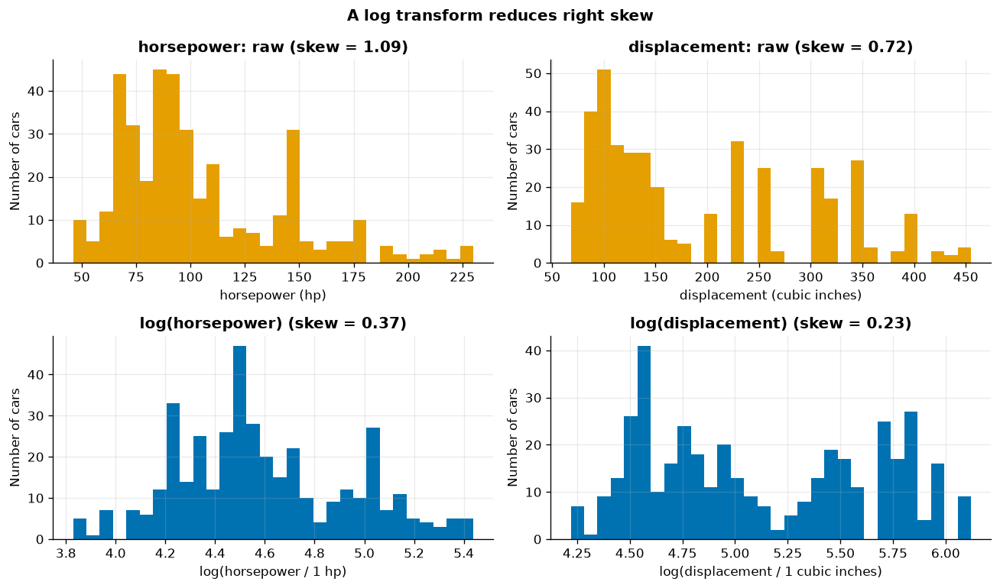

*The log shrinks the right tail of horsepower (skew 1.09 → 0.37). Displacement stays multimodal: its modes
are engine families (4, 6, 8 cylinders). A transform fixes skew, not mixtures.*

> [!NOTE]
> Acceleration becomes *negatively* skewed after the log: don't log everything by reflex. Tree-based models
> (chapter 07) are invariant to monotone transforms anyway; linear models and distance-based models care.

### 1.4 Categorical variables

```python
penguins["species"].value_counts()             # Adelie 152, Gentoo 124, Chinstrap 68
penguins["sex"].value_counts(dropna=False)     # MALE 168, FEMALE 165, NaN 11
mpg["cylinders"].value_counts().sort_index()   # 3: 4, 4: 204, 5: 3, 6: 84, 8: 103
```

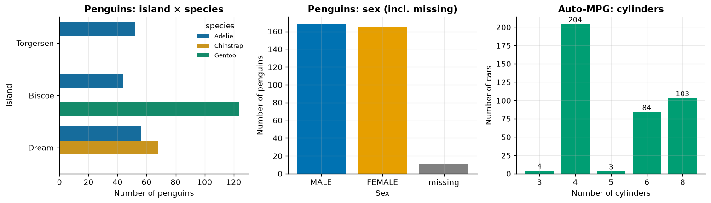

*Left: Chinstraps live only on Dream, Gentoos only on Biscoe — `island` is partly a proxy for the target.
Middle: always count missing values as their own bar. Right: only 4 and 3 cars have 3 and 5 cylinders; any
statistic for those levels is unreliable.*

---

## 2. Bivariate analysis: scatter and pair plots

A **pair plot** (scatter-plot matrix) shows every pair of numeric variables, with univariate distributions
on the diagonal. Colouring by a categorical variable is often the single most informative EDA plot.

```python
sns.pairplot(penguins, vars=num_cols, hue="species", corner=True)
```

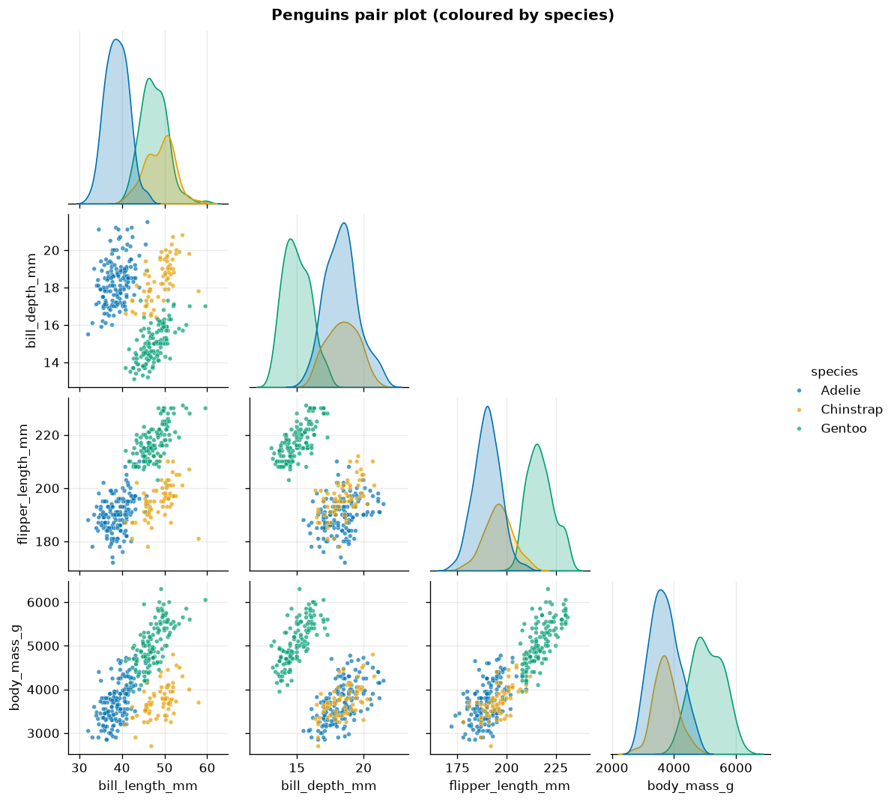

*The bimodal distributions from section 1 are the three species. Gentoos (green) separate from the others on
almost every pair; Adelie and Chinstrap separate mainly along bill length. Classification (chapter 06) will be
easy with two well-chosen features.*

---

## 3. Correlation

### 3.1 Pearson vs Spearman

**Pearson's** $r$ measures *linear* association:

$$
r = \frac{\sum_i (x_i-\bar x)(y_i-\bar y)}{\sqrt{\sum_i (x_i-\bar x)^2}\,\sqrt{\sum_i (y_i-\bar y)^2}} \in [-1, 1].
$$

**Spearman's** $\rho$ is Pearson's $r$ computed on the **ranks** of $x$ and $y$. It captures any *monotonic*
relationship and is robust to outliers. If $|\rho|$ clearly exceeds $|r|$, the relation is monotonic but curved.

| Correlation with mpg | Pearson | Spearman |
|---|---|---|
| cylinders | −0.775 | −0.822 |
| displacement | −0.804 | −0.856 |
| horsepower | −0.778 | −0.854 |
| weight | −0.832 | −0.875 |
| acceleration | 0.420 | 0.439 |
| model_year | 0.579 | 0.573 |

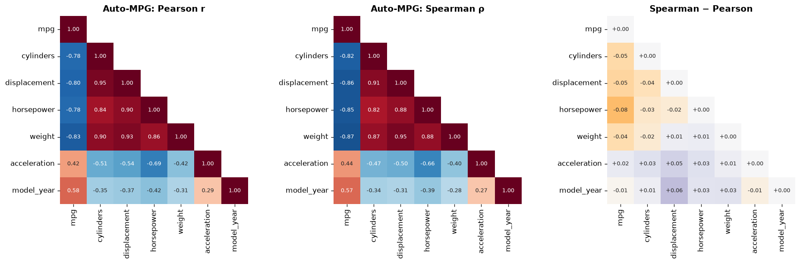

*For horsepower, displacement and weight, Spearman is stronger than Pearson (difference up to −0.08): mpg
decays in a curve, not a line. The size features are also strongly correlated with each other (0.84–0.95),
i.e. largely redundant — relevant for linear models (multicollinearity, chapter 05).*

```python
mpg_num.corr(method="pearson")
mpg_num.corr(method="spearman")
```

### 3.2 Always plot: Anscombe's quartet

Anscombe (1973) constructed four datasets with the same summary statistics:

| | I | II | III | IV |
|---|---|---|---|---|
| mean x / mean y | 9.00 / 7.50 | 9.00 / 7.50 | 9.00 / 7.50 | 9.00 / 7.50 |
| var x / var y | 11.00 / 4.13 | 11.00 / 4.13 | 11.00 / 4.12 | 11.00 / 4.12 |
| Pearson r | 0.82 | 0.82 | 0.82 | 0.82 |
| fitted line | y = 3.00 + 0.50x | y = 3.00 + 0.50x | y = 3.00 + 0.50x | y = 3.00 + 0.50x |

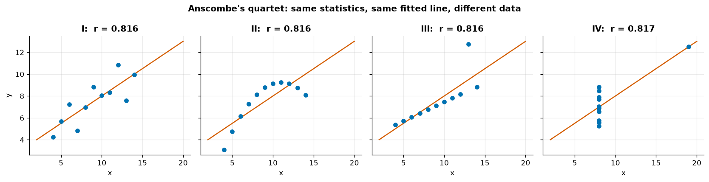

*I: a noisy linear relationship. II: a perfect curve — a line is the wrong model. III: a perfect line spoiled
by one outlier. IV: no relationship at all, except for a single high-leverage point that creates r = 0.82.*

> [!IMPORTANT]
> A correlation coefficient is a one-number summary of a two-dimensional picture. Never report one
> without having looked at the scatter plot.

### 3.3 Correlation ≠ causation, and Simpson's paradox

An observed association between $X$ and $Y$ can come from

- $X \rightarrow Y$ (causation),
- $Y \rightarrow X$ (reverse causation),
- $X \leftarrow Z \rightarrow Y$ (a **confounder** $Z$ drives both),
- selection effects or chance.

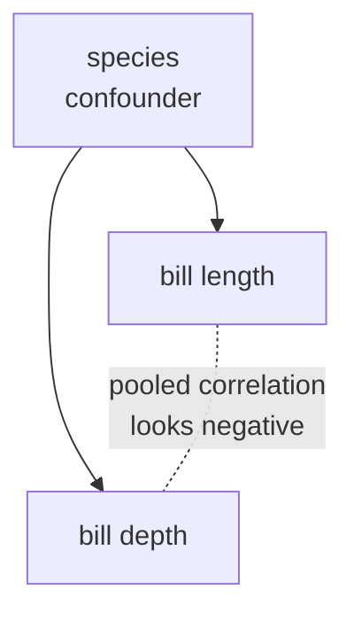

**Simpson's paradox** is the dramatic case where a trend in pooled data **reverses** inside every subgroup.
The penguins show it for bill length vs bill depth:

| Group | n | Pearson r | p-value | slope (mm per mm) |
|---|---|---|---|---|
| all species pooled | 342 | −0.235 | 1.1e−05 | −0.085 |
| Adelie | 151 | 0.391 | 6.7e−07 | 0.179 |
| Chinstrap | 68 | 0.654 | 1.5e−09 | 0.222 |
| Gentoo | 123 | 0.643 | 1.0e−15 | 0.205 |

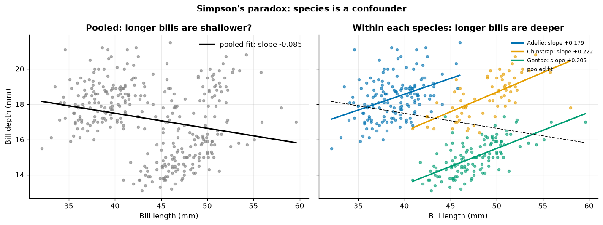

*Left: pooled, longer bills appear shallower (r = −0.235, and "highly significant"). Right: within every
species, longer bills are deeper (r = 0.39–0.65). Gentoos have long but shallow bills, which drags the pooled
line down. Species confounds the relationship.*

The p-value of the pooled correlation is tiny — statistical significance does not protect you from
confounding. Colour or facet by candidate grouping variables whenever you interpret a relationship.

---

## 4. Target analysis

Now we behave as in a real project: split first (80/20, penguins stratified by species), explore the
training set.

```python
mpg_train, mpg_test = train_test_split(mpg, test_size=0.2, random_state=42)
pen_train, pen_test = train_test_split(pen, test_size=0.2, stratify=pen["species"], random_state=42)
```

### 4.1 Target distribution and feature vs target

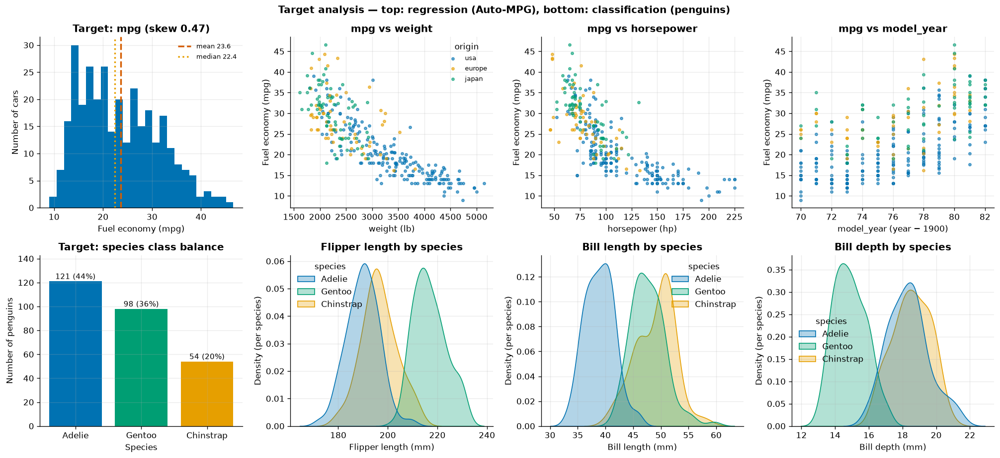

*Top: the mpg target (318 training cars) is mildly right-skewed (0.47; mean 23.6 > median 22.4). It falls
with weight and horsepower along a curve, and rises with model year. Bottom: penguin classes are Adelie 44 %,
Gentoo 36 %, Chinstrap 20 %. Flipper length isolates Gentoo, bill length isolates Adelie, bill depth isolates
Gentoo again — no single feature separates all three.*

Questions to ask about the target:

| Question | Why it matters |
|---|---|
| Is it skewed? On which scale is the error meaningful? | as consumption (L/100 km = 235.215/mpg) the target is *more* skewed (0.73); the choice is a framing decision |
| Are classes balanced? | Chinstrap is 20 %: stratify splits, report per-class metrics |
| Are there impossible or suspicious values? | a target outside physical limits is a data error |
| Is the relationship with each feature linear, monotonic, thresholded? | guides transforms and model family |
| Does any feature predict the target *too* well? | possible leakage (chapter 01) |

### 4.2 Mutual information

Correlation only detects linear or monotonic relationships and needs a numeric target. **Mutual information**
measures any kind of dependence:

$$
I(X;Y) = \iint p(x,y)\,\log\frac{p(x,y)}{p(x)\,p(y)}\;dx\,dy \;\ge\; 0,
$$

with $I(X;Y) = 0$ if and only if $X$ and $Y$ are independent. scikit-learn estimates it from data with a
k-nearest-neighbour estimator (Kraskov et al. 2004; Ross 2014) and reports it in nats.

```python
from sklearn.feature_selection import mutual_info_regression, mutual_info_classif
mutual_info_regression(X, y, discrete_features=[...], random_state=42)
mutual_info_classif(X_pen, y_species, random_state=42)
```

| Feature (Auto-MPG) | MI with mpg (nats) | \|Pearson r\| | \|Spearman ρ\| |
|---|---|---|---|
| displacement | 0.757 | 0.803 | 0.850 |
| weight | 0.739 | 0.828 | 0.870 |
| horsepower | 0.710 | 0.772 | 0.849 |
| cylinders | 0.650 | 0.773 | 0.820 |
| model_year | 0.335 | 0.589 | 0.596 |
| acceleration | 0.146 | 0.393 | 0.414 |

| Feature (penguins) | MI with species (nats) |
|---|---|
| flipper_length_mm | 0.643 |
| bill_depth_mm | 0.594 |
| bill_length_mm | 0.586 |
| body_mass_g | 0.509 |

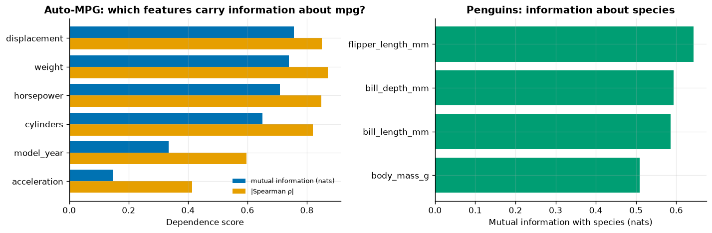

*Left: MI and rank correlation broadly agree; the four size-related features are nearly tied. Right: MI works
for the categorical species target, where correlation is undefined.*

> [!NOTE]
> MI is **univariate**: it cannot see that weight, displacement and horsepower carry largely the *same*
> information, nor interactions (a feature useful only in combination with another). Use it to screen, not
> to decide. The estimate is also noisy for small samples — compare against a pure-noise column (exercise 4).

---

## 5. An EDA checklist

| Step | Questions | Tools |
|---|---|---|
| Structure | rows, columns, dtypes, ID column, time column? | `df.info()`, `df.head()` |
| Missingness | how much, where, why (MCAR/MAR/MNAR)? | `isna().mean()`, missingness matrix (ch. 02) |
| Univariate numeric | range, skew, modes, impossible values | histogram + KDE, box/violin, `describe()` |
| Univariate categorical | levels, rare levels, spelling variants | `value_counts(dropna=False)` |
| Target | distribution, skew, class balance, scale choice | histogram, bar chart |
| Feature vs target | linear? monotonic? thresholds? interactions? | scatter, grouped KDE/box |
| Feature vs feature | redundancy, collinearity, clusters | pair plot, Pearson + Spearman heatmaps |
| Confounders | could a third variable explain a pattern? | colour/facet by groups (Simpson) |
| Leakage smell | a feature *too* good to be true? | MI / correlation ranking, domain check |
| Write it down | hypotheses for features and models | a short notes cell or README |

---

## Common pitfalls

| Pitfall | Why it hurts | Better |
|---|---|---|
| Exploring the full dataset, including test rows | your modelling decisions leak test information | explore the training split |
| Reporting correlations without plots | Anscombe: one number, four realities | scatter plot every important pair |
| Pearson on curved relationships | underestimates the association | also compute Spearman; transform |
| Reading causation into correlation | confounders, reverse causation | think about the data-generating process |
| Ignoring groups | Simpson's paradox; bimodal "noise" | colour/facet by categorical variables |
| Log-transforming by reflex | can create negative skew, breaks on zeros | check skew before and after; `log1p` for zeros |
| Box plots only | hide multimodality | add violins, histograms or strip plots |
| Trusting a single MI ranking | univariate, noisy, blind to redundancy | combine with plots and domain knowledge |

---

## Key takeaways

- Start with structure and missingness, then go **univariate → bivariate → target**.
- Histograms + KDEs reveal skew and **multimodality**; multimodality usually means hidden groups.
- Right-skewed positive variables often look better on a **log scale** — but check.
- **Pearson** = linear, **Spearman** = monotonic; compare both, and **always plot** (Anscombe).
- A pooled trend can reverse within groups (**Simpson's paradox**): look for confounders before interpreting
  any correlation, and never read causation into it.
- **Mutual information** screens for any univariate dependence, including with categorical targets.
- Do EDA that informs modelling decisions on the **training set**.

---

## Exercises

1. **Bandwidth.** Plot KDEs of `body_mass_g` with bandwidth factors 0.05, 0.2, 0.5 and 1. Which would you
   trust, and why?
   *Hint: compare with a histogram with many bins and think about sample size.*
2. **Transforms.** Compute Pearson r between `mpg` and `weight`, `log(weight)`, and between `1/mpg` and
   `weight`. Which pair is most linear?
   *Hint: physics suggests fuel consumption (∝ 1/mpg) is roughly proportional to mass.*
3. **Simpson in Auto-MPG.** Look at `mpg` vs `acceleration` pooled and within each `cylinders` group. Does
   the sign or strength change?
   *Hint: `mpg.groupby("cylinders")[["mpg", "acceleration"]].corr()`.*
4. **MI with noise.** Add a pure-noise column to the mpg features and recompute mutual information for five
   different `random_state`s. How large is the MI of noise?
   *Hint: this gives you a rough "zero" level for the estimator.*
5. **Your own checklist.** Apply the checklist to the Titanic data and write down five hypotheses about survival.
   *Hint: start with `sex`, `pclass`, `age` and the missingness of `deck` (chapter 02).*

---

## Further reading

- Tukey, *Exploratory Data Analysis* (1977) — the original.
- Anscombe, "Graphs in Statistical Analysis", *The American Statistician* 27(1), 1973.
- Matejka & Fitzmaurice, "Same Stats, Different Graphs" (the *Datasaurus Dozen*), CHI 2017.
- Pearl, Glymour & Jewell, *Causal Inference in Statistics: A Primer* (2016), ch. 1 — Simpson's paradox and confounding.
- Horst, Hill & Gorman, *palmerpenguins* R package and paper, *R Journal* 14(1), 2022.
- Kraskov, Stögbauer & Grassberger, "Estimating mutual information", *Phys. Rev. E* 69, 2004; Ross, "Mutual
  information between discrete and continuous data sets", *PLoS ONE* 9(2), 2014.
- James et al., *An Introduction to Statistical Learning*, ch. 2–3; Géron, *Hands-On Machine Learning*, 3rd ed., ch. 2
  ("Explore and Visualize the Data to Gain Insights").
- seaborn tutorial: [Visualizing distributions of data](https://seaborn.pydata.org/tutorial/distributions.html);
  scikit-learn: [`mutual_info_regression`](https://scikit-learn.org/stable/modules/generated/sklearn.feature_selection.mutual_info_regression.html).

[← Previous](../02-data-cleaning/README.md) · [Course home](../README.md) · [Next →](../04-feature-engineering/README.md)
