# 04 · Feature Engineering

> Turn raw columns into numbers that make learning easy — scaled, reshaped, encoded, expanded, and wrapped in a leak-proof pipeline.

[← Previous](../03-exploratory-data-analysis/README.md) · [Course home](../README.md) · [Next →](../05-regression/README.md)

**Notebook:** [`04-feature-engineering.ipynb`](04-feature-engineering.ipynb) · **Datasets:** Titanic, Auto MPG (+ small synthetic examples) · **Time:** ~2.5 h

---

## Learning objectives

By the end of this chapter you will be able to:

- Explain **which models need feature scaling and why**, and choose between `StandardScaler`, `MinMaxScaler` and `RobustScaler`.
- Reshape skewed features with **log, Box-Cox and Yeo-Johnson** transforms.
- Encode categorical variables with **one-hot**, **ordinal** and **target encoding**, and handle unseen/rare categories safely.
- Explain **why naive target encoding leaks** and how cross-fitting fixes it.
- Use **binning**, **polynomial/interaction features**, **domain features** and **cyclical encodings**.
- Build a complete preprocessing + model **`Pipeline`** with `ColumnTransformer`, `make_column_selector`, `FunctionTransformer` and your own transformer class.

---

## 1. Scaling

### Three scalers

| Scaler | Formula | Output | Outliers? |
|---|---|---|---|
| `StandardScaler` | $z = (x-\mu)/\sigma$ | mean 0, sd 1, unbounded | sensitive — $\mu$ and $\sigma$ are pulled by extremes |
| `MinMaxScaler` | $x' = (x-\min)/(\max-\min)$ | $[0,1]$ | very sensitive — one extreme value squashes the rest |
| `RobustScaler` | $x' = (x-\text{median})/\text{IQR}$ | median 0, IQR 1 | robust — median and IQR ignore the tails |

All three are **affine** maps $x' = ax + b$: they change the units, never the shape of the distribution.

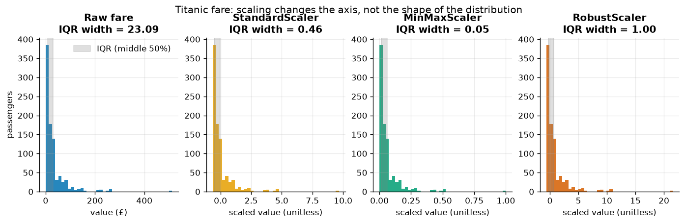

*The four histograms have identical shapes. Look at the IQR width in each title: MinMax squeezes the middle 50 % of passengers into a band only 0.05 wide because a handful of £512 fares define the maximum, while RobustScaler keeps it at exactly 1.*

### Who needs scaling?

| Model family | Needs scaling? | Why |
|---|---|---|
| k-NN, k-means, SVM (RBF), PCA | **Yes** | Euclidean distance $\sqrt{\sum_j (x_j-x'_j)^2}$ is dominated by the largest-range feature |
| Linear/logistic regression trained by gradient descent, neural nets | **Yes** | Badly scaled features → elongated loss surface → slow, zig-zagging GD |
| Ridge / Lasso / any penalised model | **Yes** | The penalty $\lambda \sum_j w_j^2$ compares coefficients that live in different units |
| Plain OLS (closed form) | Not for predictions | Predictions are unchanged, but coefficients become comparable after scaling |
| Decision trees, random forests, gradient boosting | **No** | Splits $x_j \le t$ only depend on the *ordering* of values |

The notebook tests this on Auto MPG (6 numeric features, weight in lb ≈ 1 600–5 100, acceleration in s ≈ 8–25):

```python
for scaling, est in [("raw", model), ("standardised", make_pipeline(StandardScaler(), model))]:
    r2 = cross_val_score(est, X_mpg, y_mpg, cv=cv, scoring="r2")
```

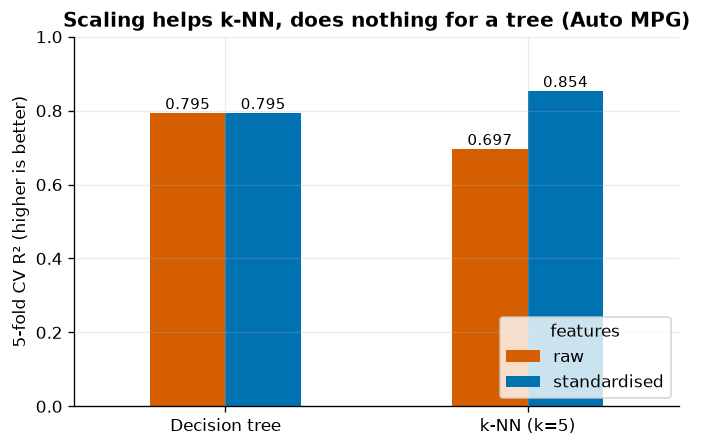

*k-NN jumps from R² = 0.697 to 0.854 after standardising, because on raw features its "distance" is essentially the difference in weight. The tree scores 0.795 either way — scaling is monotone, so it builds the very same splits.*

### Scaling and gradient descent

For the least-squares loss $L(\mathbf w) = \frac1n \lVert X\mathbf w - \mathbf y\rVert^2$ the Hessian is

$$
H = \frac{2}{n} X^\top X .
$$

Gradient descent is stable only for a learning rate $\eta < 2/\lambda_{\max}(H)$, while its progress along the flattest direction is proportional to $\eta\,\lambda_{\min}$. The ratio $\kappa = \lambda_{\max}/\lambda_{\min}$ — the **condition number** — therefore controls how many steps you need. For Auto MPG, $\kappa(X^\top X)$ is **2 676 886** on centred raw features and **117** after standardising.

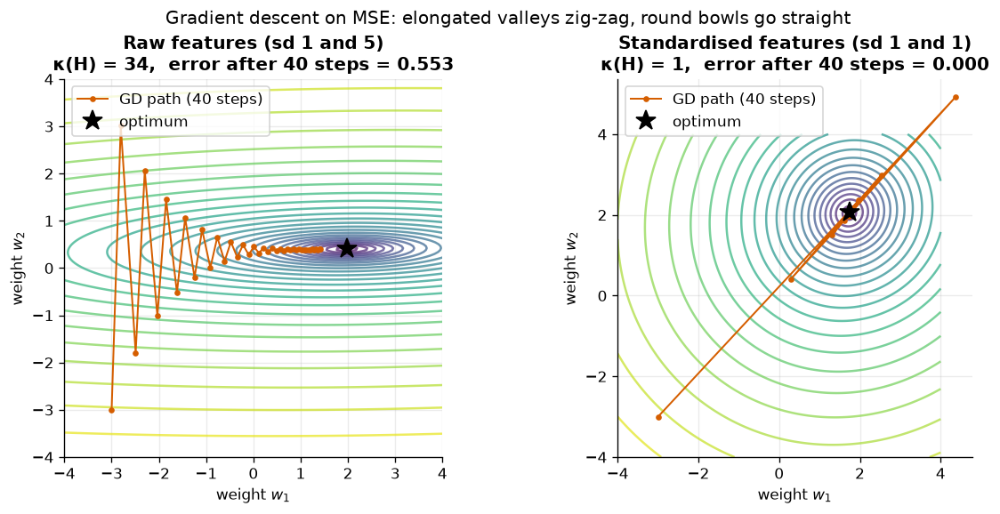

*Left: with feature standard deviations 1 and 5, the loss bowl is a narrow valley (κ = 34); GD bounces between the walls and is still 0.553 away from the optimum after 40 steps. Right: after standardising the bowl is round (κ ≈ 1) and GD heads straight for the minimum.*

> [!IMPORTANT]
> Fit the scaler on the **training** data only and reuse its $\mu,\sigma$ on validation/test data. The easiest way to guarantee this is to put the scaler inside a `Pipeline` (section 8), which cross-validation then refits on every training fold.

---

## 2. Power transforms: changing the shape

Scaling cannot fix skew. Right-skewed features (prices, incomes, counts) put most observations in a tiny range and let a few extreme values dominate linear fits. Non-linear, **monotone** transforms pull in the long tail:

- **Log:** $x' = \log(1+x)$ (`np.log1p`) — the everyday choice for non-negative skewed data.
- **Box-Cox** (requires $x>0$):

$$
x^{(\lambda)} = \begin{cases} \dfrac{x^\lambda - 1}{\lambda}, & \lambda \ne 0 \\[4pt] \log x, & \lambda = 0 \end{cases}
$$

- **Yeo-Johnson:** a Box-Cox extension that also accepts zero and negative values.

`PowerTransformer` estimates $\lambda$ by maximum likelihood (the $\lambda$ that makes the result most Gaussian) and standardises the output.

```python
bc = PowerTransformer(method="box-cox").fit(fare + 1)   # 15 passengers paid £0 → shift
yj = PowerTransformer(method="yeo-johnson").fit(fare)
```

| Transform | Skewness |
|---|---|
| raw fare | 4.779 |
| `log1p(fare)` | 0.394 |
| Box-Cox(fare + 1), λ = −0.10 | −0.040 |
| Yeo-Johnson, λ = −0.10 | −0.040 |

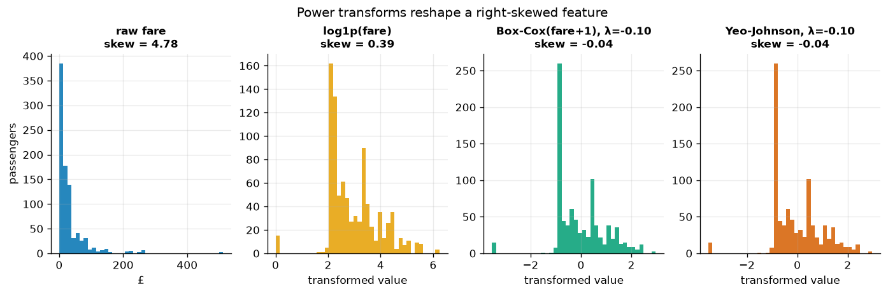

*The fitted λ ≈ −0.1 is close to 0, i.e. close to a plain log. The isolated spike on the left of each transformed histogram is the 15 zero fares — no monotone transform can spread out identical values.*

> [!TIP]
> Box-Cox and Yeo-Johnson coincide here because for $x \ge 0$ Yeo-Johnson is exactly Box-Cox applied to $x+1$. Trees don't care about any of this (the transforms are monotone); linear and distance-based models often care a lot.

---

## 3. Encoding categorical features

### One-hot vs ordinal

- **One-hot** creates one 0/1 column per category. No order is implied, which is correct for nominal features like `embarked` ∈ {C, Q, S}.
- **Ordinal** maps categories to $0,1,2,\dots$. Correct for genuinely ordered categories such as `class` ∈ {Third < Second < First}; also often acceptable for trees on nominal data.

```python
OrdinalEncoder(categories=[["Third", "Second", "First"]])   # → 0, 1, 2
```

> [!WARNING]
> Without `categories=`, sklearn orders categories **alphabetically** (First=0, Second=1, Third=2) — backwards here, and meaningless for `["low", "medium", "high"]`. Always give ordinal encoders an explicit order.

### Unknown and rare categories

Production data will contain categories that never appeared in training. By default `OneHotEncoder` raises `ValueError: Found unknown categories ['tesla']`. Options:

| Setting | Unseen category at predict time | Rare categories in training |
|---|---|---|
| `handle_unknown="error"` (default) | raises | own column each |
| `handle_unknown="ignore"` | all-zero row | own column each |
| `handle_unknown="infrequent_if_exist", min_frequency=k` | mapped to the `infrequent` column | categories with < k rows merged into `infrequent` |

The car **brand** (first word of `name`) in Auto MPG has 37 levels, many seen only once. With `min_frequency=10` the encoder keeps 14 brands plus one `brand_infrequent_sklearn` column; an unseen `"tesla"` and a rare `"subaru"` both land in that column.

### Target encoding for high-cardinality features

One-hot encoding a feature with thousands of levels (zip codes, product IDs) produces thousands of sparse columns. **Target encoding** replaces each category $c$ with a *shrunk* average of the target in that category:

$$
\text{enc}(c) = \frac{n_c\,\bar y_c + m\,\bar y}{n_c + m}
$$

where $n_c$ is the number of rows in category $c$, $\bar y_c$ their mean target, $\bar y$ the global mean and $m$ the smoothing strength (`smooth="auto"` estimates it with empirical Bayes). Rare categories are pulled toward $\bar y$.

#### The leak

If you compute $\bar y_c$ from the **same rows** you train on, each row's own label is baked into its feature. For a category with a single row, $\bar y_c = y_i$ exactly. The model learns to trust the encoding, which then fails on new data.

#### The fix: cross-fitting

`TargetEncoder.fit_transform(X, y)` splits the training data into $K$ folds and encodes each fold with statistics computed from the **other** folds. At prediction time `transform` uses statistics from the full training set.

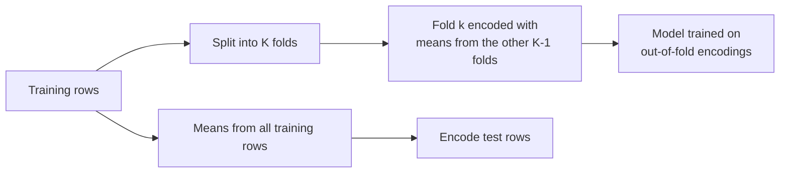

The notebook stress-tests this with a **pure-noise** feature: a random ID with 1 000 levels (about two training rows per level) and a target that depends only on a separate informative feature.

| Encoding of the noise ID | train R² | test R² | coefficient on the encoding |
|---|---|---|---|
| naive per-category mean | 0.824 | 0.746 | 0.286 |
| `TargetEncoder` (cross-fitted) | 0.802 | 0.800 | −0.004 |

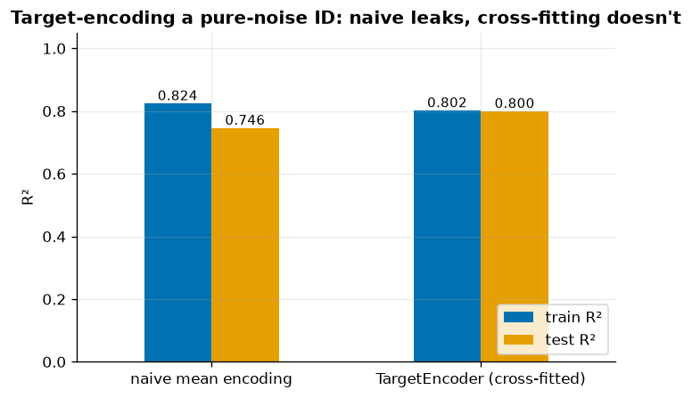

*The naive encoding makes random noise look predictive: train R² goes up, test R² goes down. Cross-fitting correctly tells the model the feature is worthless (coefficient ≈ 0), and train and test scores agree.*

> [!WARNING]
> `te.fit(X, y).transform(X)` is **not** the same as `te.fit_transform(X, y)`: only `fit_transform` cross-fits. Inside a `Pipeline` sklearn calls `fit_transform` during training, so pipelines are safe by construction.

On a real feature — car brand for a Ridge model on Auto MPG (5-fold CV R²):

| Brand handling | CV R² |
|---|---|
| dropped | 0.801 ± 0.022 |
| one-hot (`min_frequency=5`) | 0.808 ± 0.028 |
| target-encoded | 0.819 ± 0.016 |

---

## 4. Binning (discretisation)

`KBinsDiscretizer` turns a continuous feature into $k$ intervals, which lets a **linear** model express step-shaped or non-monotone effects (a separate coefficient per bin). The price is lost within-bin resolution and arbitrary boundaries.

- `strategy="uniform"` — equal-width bins
- `strategy="quantile"` — equal-count bins
- `strategy="kmeans"` — boundaries from 1-D k-means

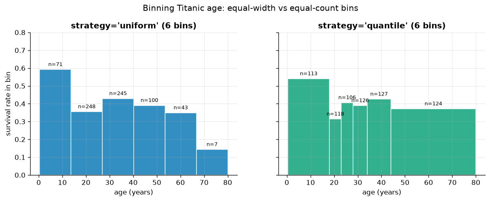

*Uniform bins leave only 7 passengers in the oldest bin (a noisy estimate); quantile bins have ~105–130 passengers each but become very wide where data are sparse. Both reveal that children survived far more often than adults.*

Trees choose their own thresholds, so binning is mainly a tool for linear models — and for communicating results.

---

## 5. Polynomial and interaction features

A model that is **linear in its parameters** can still be non-linear in its inputs if we expand the inputs. For one feature, degree 3:

$$
\hat y = w_0 + w_1 x + w_2 x^2 + w_3 x^3 .
$$

With several inputs, `PolynomialFeatures` also adds **interaction** terms. For `weight` and `horsepower` at degree 2 it outputs `1, weight, horsepower, weight^2, weight horsepower, horsepower^2`.

```python
model = make_pipeline(PolynomialFeatures(degree), LinearRegression())
```

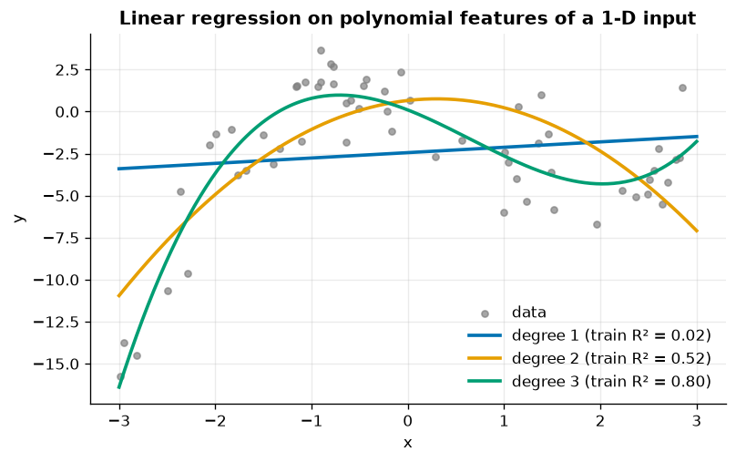

*The data come from a cubic. A straight line explains almost nothing (train R² = 0.02), a parabola gets half-way (0.52), and degree 3 captures the shape (0.80; the rest is noise).*

### The feature explosion

With $d$ inputs and degree $k$, the number of monomials of total degree $\le k$ (including the bias) is

$$
\binom{d+k}{k}.
$$

| input features $d$ | degree 2 | degree 3 | degree 4 |
|---|---|---|---|
| 5 | 21 | 56 | 126 |
| 10 | 66 | 286 | 1 001 |
| 20 | 231 | 1 771 | 10 626 |
| 50 | 1 326 | 23 426 | 316 251 |

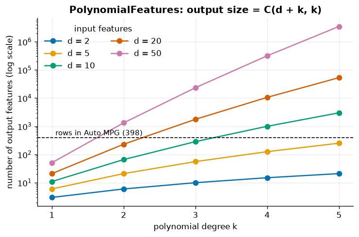

*Growth is roughly $d^k$. With 10 inputs, degree 3 already gives nearly as many columns (286) as Auto MPG has rows (398) — a recipe for overfitting unless you regularise (chapter 05).*

> [!TIP]
> Prefer degree 2, try `interaction_only=True`, always scale after expanding, and pair polynomial features with Ridge or Lasso.

---

## 6. Domain features

The most valuable features usually come from understanding the problem. Fuel economy depends on how much mass the engine must move, so for Auto MPG we add:

```python
out["power_to_weight"] = out["horsepower"] / out["weight"]    # hp per lb
out["disp_per_cyl"]    = out["displacement"] / out["cylinders"]
```

| Features (linear model, target $\log(\text{mpg})$) | 5-fold CV R² |
|---|---|
| raw specs | 0.867 ± 0.016 |
| raw + 2 domain features | 0.881 ± 0.012 |

Two lines of code, a measurable gain, and features a mechanic would recognise. Ratios, differences, rates ("per capita", "per day"), durations and counts are the usual suspects.

---

## 7. Dates, times and cyclical features

From a timestamp extract parts (`.dt.year`, `.dt.month`, `.dt.dayofweek`, `.dt.hour`), flags (`is_weekend`, `is_holiday`) and elapsed times ("days since signup"). Periodic parts need care: 23:00 and 00:00 are one hour apart, but as integers they are 23 apart. Map them onto a circle:

$$
\text{hour}_{\sin} = \sin\!\Big(\tfrac{2\pi\,\text{hour}}{24}\Big), \qquad
\text{hour}_{\cos} = \cos\!\Big(\tfrac{2\pi\,\text{hour}}{24}\Big).
$$

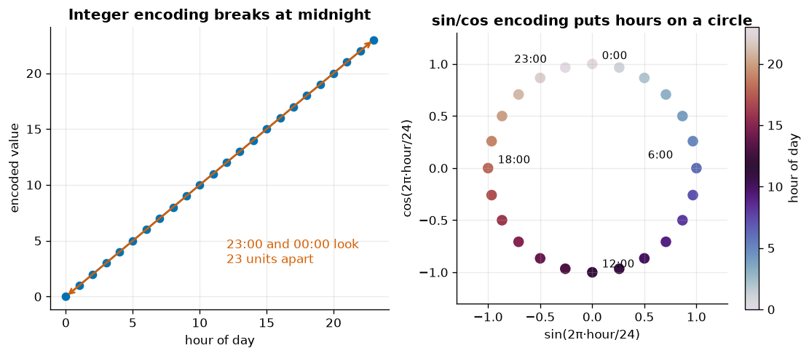

*Left: integer hours put midnight's two sides at opposite ends. Right: with sin/cos, every hour is equidistant from its neighbours, including 23:00 → 00:00.*

You need **both** coordinates — sin alone maps 3:00 and 9:00 to the same value. The same trick works for day-of-week (period 7), month (12) and wind direction (360°). `SplineTransformer(extrapolation="periodic")` is a smoother alternative.

---

## 8. Pipelines: putting it all together

Hand-rolled preprocessing invites two classic bugs: forgetting a step at prediction time, and **leaking** test-set statistics (means, category lists, target means) into training. `Pipeline` fixes both: `fit` fits each step on training data only, `predict` replays the fitted steps. `ColumnTransformer` sends different columns to different sub-pipelines, and `make_column_selector` chooses columns by dtype or regex, so the pipeline adapts to the dataframe it is given.

The notebook's Titanic model:

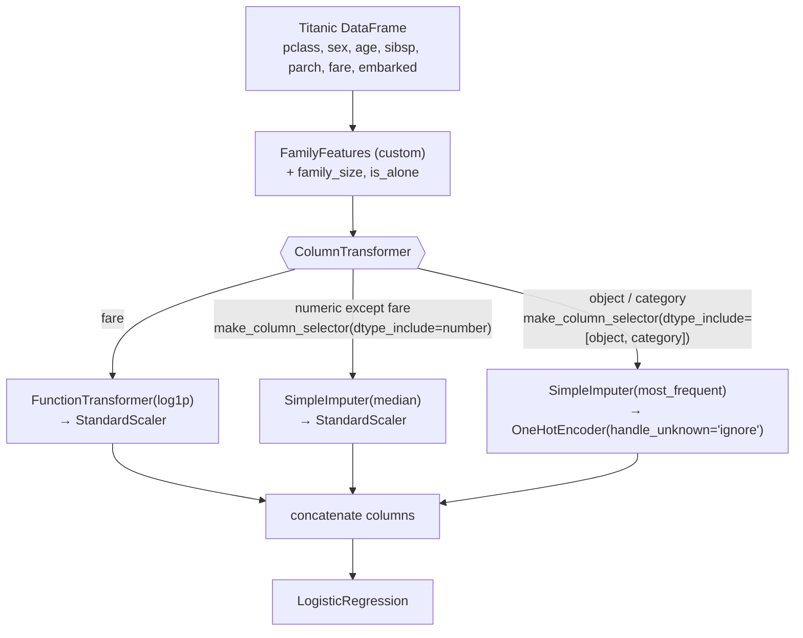

*(Jupyter shows an interactive HTML diagram of the same pipeline, but GitHub can't render it — hence the Mermaid version.)*

### A custom transformer class

Inherit from `BaseEstimator` (gives `get_params`/`set_params`, so grid search works) and `TransformerMixin` (gives `fit_transform`). Store hyper-parameters unchanged in `__init__`, learn things in `fit`, return `self`:

```python
class FamilyFeatures(BaseEstimator, TransformerMixin):
    def __init__(self, add_is_alone=True):
        self.add_is_alone = add_is_alone

    def fit(self, X, y=None):
        self.feature_names_in_ = np.asarray(X.columns, dtype=object)
        return self                                   # nothing to learn

    def transform(self, X):
        X = X.copy()
        X["family_size"] = X["sibsp"] + X["parch"] + 1
        if self.add_is_alone:
            X["is_alone"] = (X["family_size"] == 1).astype(int)
        return X

    def get_feature_names_out(self, input_features=None):
        extra = ["family_size"] + (["is_alone"] if self.add_is_alone else [])
        return np.asarray(list(self.feature_names_in_) + extra, dtype=object)
```

For a stateless function, `FunctionTransformer(np.log1p, feature_names_out="one-to-one")` is enough.

### Assembling and evaluating

```python
preprocess = ColumnTransformer([
    ("fare", make_pipeline(log_fare, StandardScaler()), ["fare"]),
    ("num", numeric, make_column_selector(pattern="^(?!fare$)", dtype_include=np.number)),
    ("cat", categorical, make_column_selector(dtype_include=["object", "category"])),
])
clf = Pipeline([("family", FamilyFeatures()), ("preprocess", preprocess),
                ("model", LogisticRegression(max_iter=1000))])
```

The whole pipeline is **one estimator**: `cross_val_score(clf, X, y)` refits imputers, scalers and encoders on every training fold. Result: test accuracy **0.785**, 5-fold CV accuracy **0.798 ± 0.011**.

### Reading the result: `get_feature_names_out` and `set_output`

`clf[:-1].get_feature_names_out()` traces column names through every step, so coefficients can be labelled:

| feature | coefficient |
|---|---|
| `cat__sex_female` | +1.302 |
| `cat__pclass_1` | +0.848 |
| `fare__fare` (log, scaled) | +0.385 |
| `num__age` | −0.519 |
| `cat__pclass_3` | −0.842 |
| `cat__sex_male` | −1.223 |

`clf.set_output(transform="pandas")` makes every transformer return a DataFrame with those names, so `clf[:-1].transform(X_te).head()` is a readable table instead of an anonymous array — very handy for debugging.

> [!NOTE]
> Nested parameters are addressed as `step__substep__param`, e.g. `preprocess__cat__onehot__min_frequency`. That is what makes whole-pipeline hyper-parameter tuning possible in chapter 09.

---

## Common pitfalls

- **Fitting preprocessing on the full dataset** before splitting — scalers, imputers and especially target encoders then leak test information. Use pipelines.
- **Leaving the target (or a proxy) in the features** — Titanic's `alive` column is `survived` spelled out.
- **Using `fit(X).transform(X)` with `TargetEncoder`** — bypasses cross-fitting.
- **Alphabetical ordinal encoding** of ordered categories.
- **MinMax-scaling data with outliers** — the bulk collapses into a narrow band; prefer `RobustScaler` or a power transform first.
- **Exploding polynomial features** without regularisation.
- **Encoding hours/months as plain integers** for linear or distance-based models.
- **Scaling for trees** — harmless but pointless; conversely, *not* scaling for k-NN/SVM/regularised models is harmful.

## Key takeaways

- Scaling is a change of units: crucial for distance-based, penalised and gradient-trained models; irrelevant for trees.
- Power transforms change the **shape** of a distribution; scalers don't.
- One-hot for nominal, ordinal with an explicit order for ordered categories; plan for unseen/rare levels.
- Target encoding is powerful for high-cardinality features but must be **cross-fitted**.
- Polynomial features grow as $\binom{d+k}{k}$; domain features are often the best value for effort.
- A `Pipeline` + `ColumnTransformer` makes preprocessing reproducible and leak-free, and custom transformers slot right in.

## Exercises

1. **Which scaler for k-NN?** Repeat the k-NN experiment with `MinMaxScaler` and `RobustScaler`. Which wins on Auto MPG, and why might they differ? *Hint: `make_pipeline(scaler, KNeighborsRegressor(5))` inside `cross_val_score`.*
2. **Leak it on purpose.** In the target-encoding demo, replace `te.fit_transform(Xtr, ytr)` with `te.fit(Xtr, ytr).transform(Xtr)`. What happens to the train/test gap? *Hint: that path skips cross-fitting.*
3. **Interactions on Titanic.** Add `PolynomialFeatures(2, interaction_only=True)` after the column transformer so the model can learn `sex × pclass`. Does CV accuracy change? *Hint: inspect the new `get_feature_names_out()` to find the interaction coefficients.*
4. **Your own transformer.** Write a class that adds `power_to_weight` and `disp_per_cyl` to Auto MPG and use it in a pipeline with `cross_val_score`. *Hint: copy the `FamilyFeatures` template, including `get_feature_names_out`.*
5. **Cyclical months.** Encode `month` (1–12) with sin/cos. Which two months are closest to December? *Hint: compute Euclidean distances between the encoded points.*

## Further reading

- scikit-learn User Guide — [Preprocessing data](https://scikit-learn.org/stable/modules/preprocessing.html), [Pipelines and composite estimators](https://scikit-learn.org/stable/modules/compose.html), [Target Encoder](https://scikit-learn.org/stable/modules/preprocessing.html#target-encoder).
- Zheng, A. & Casari, A. (2018). *Feature Engineering for Machine Learning*. O'Reilly.
- Kuhn, M. & Johnson, K. (2019). *Feature Engineering and Selection*. CRC Press — free online at [feat.engineering](http://www.feat.engineering/).
- Géron, A. (2022). *Hands-On Machine Learning with Scikit-Learn, Keras & TensorFlow*, 3rd ed., ch. 2.
- Micci-Barreca, D. (2001). A preprocessing scheme for high-cardinality categorical attributes. *SIGKDD Explorations* 3(1).
- Box, G. E. P. & Cox, D. R. (1964). An analysis of transformations. *JRSS B* 26(2); Yeo, I.-K. & Johnson, R. (2000). A new family of power transformations. *Biometrika* 87(4).
