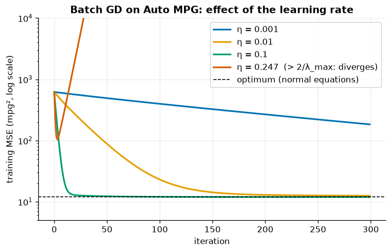
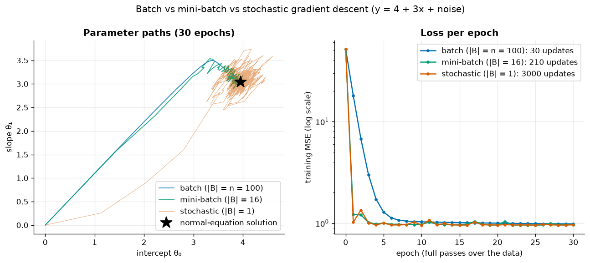
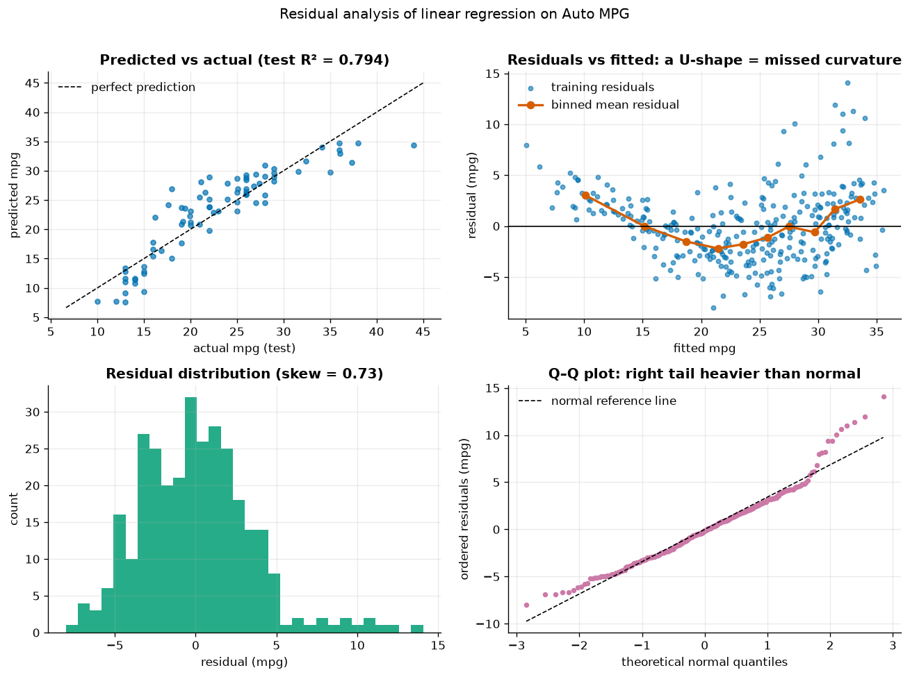
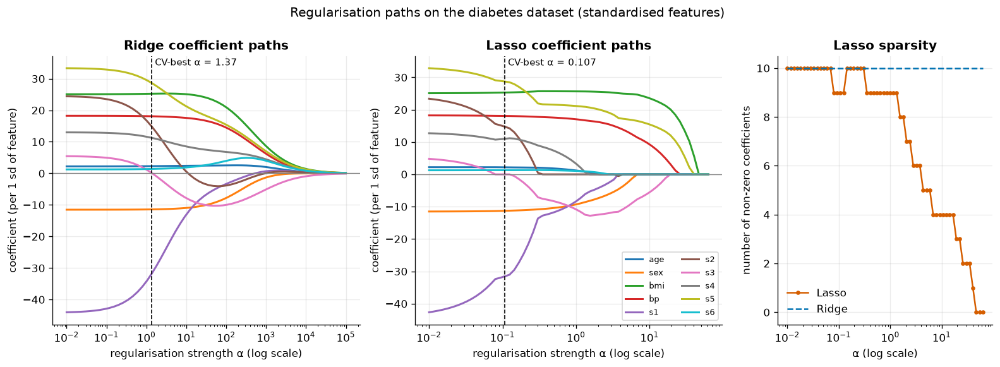
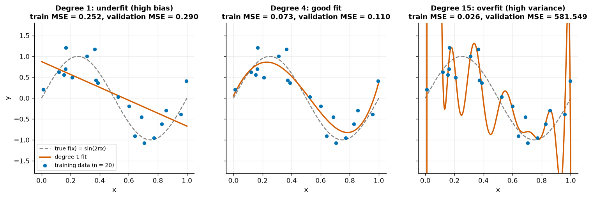
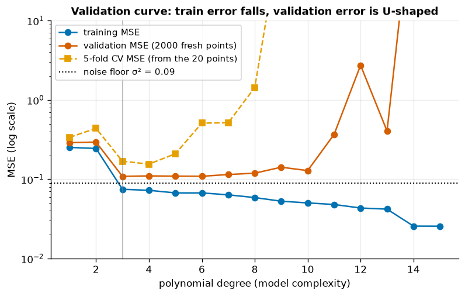
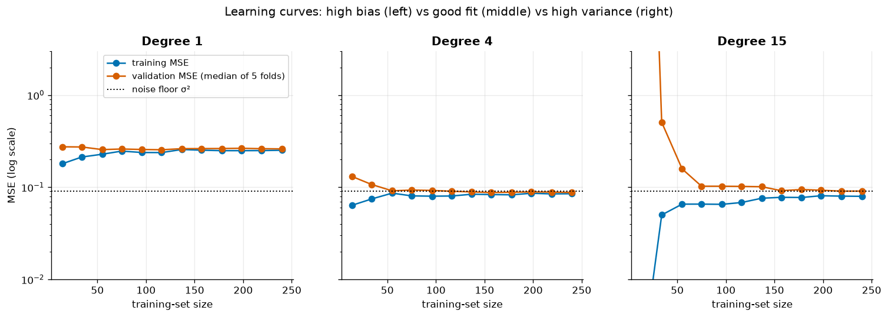
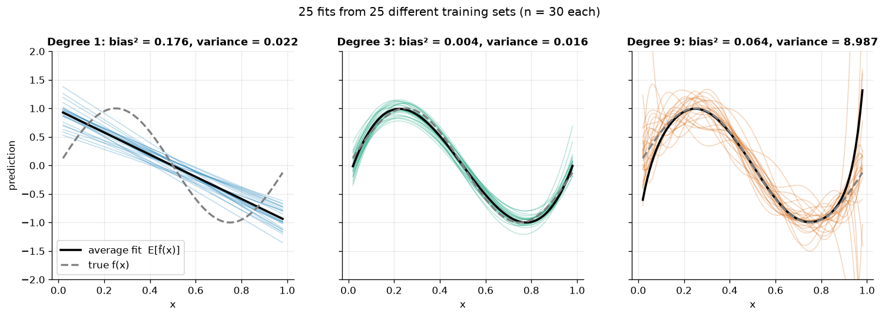
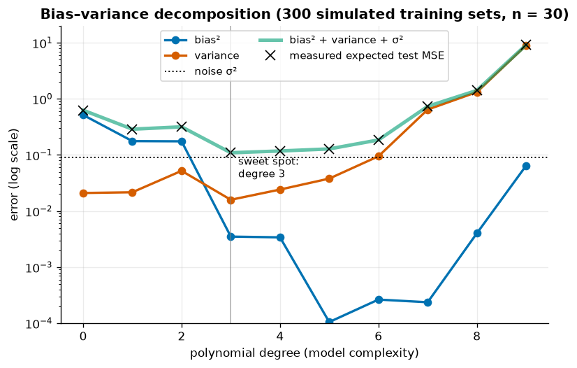

# 05 · Regression

> Build linear regression from first principles (closed form and gradient descent), evaluate it honestly, regularise it, and use it to see the bias–variance trade-off with your own eyes.

[← Previous](../04-feature-engineering/README.md) · [Course home](../README.md) · [Next →](../06-classification/README.md)

**Notebook:** [`05-regression.ipynb`](05-regression.ipynb) · **Datasets:** synthetic data, Auto MPG, scikit-learn diabetes · **Time:** ~3 h

---

## Learning objectives

- Derive and solve the **normal equations**, and explain why `lstsq`/`pinv` beat inverting $X^\top X$ (conditioning).
- Implement **batch, stochastic and mini-batch gradient descent**, choose a learning rate, and recognise divergence.
- Compute **MSE, RMSE, MAE and R²** and read **residual plots**.
- Derive **Ridge** in closed form, interpret **Ridge/Lasso coefficient paths**, and explain why penalised models need scaled features.
- Use **validation curves** and **learning curves** to diagnose under- and over-fitting.
- State the **bias–variance decomposition** and measure each term by simulation.

---

## 1. Linear regression and the normal equations

With $n$ examples and $d$ features, add a column of ones to get the design matrix $X\in\mathbb R^{n\times(d+1)}$. The model and its loss are

$$
\hat{\mathbf y} = X\boldsymbol\theta, \qquad
L(\boldsymbol\theta) = \frac1n \lVert X\boldsymbol\theta - \mathbf y \rVert^2 = \frac1n\sum_{i=1}^n\big(\mathbf x_i^\top\boldsymbol\theta - y_i\big)^2 .
$$

The gradient is $\nabla L = \frac2n X^\top (X\boldsymbol\theta - \mathbf y)$. Setting it to zero gives the **normal equations**

$$
X^\top X\,\hat{\boldsymbol\theta} = X^\top \mathbf y \quad\Longrightarrow\quad \hat{\boldsymbol\theta} = (X^\top X)^{-1} X^\top \mathbf y .
$$

Geometrically, $X\hat{\boldsymbol\theta}$ is the orthogonal projection of $\mathbf y$ onto the column space of $X$: the residual vector is perpendicular to every feature.

```python
Xb = np.column_stack([np.ones(n), x])
theta_solve = np.linalg.solve(Xb.T @ Xb, Xb.T @ y)     # normal equations
theta_lstsq = np.linalg.lstsq(Xb, y, rcond=None)[0]    # QR / SVD
theta_pinv  = np.linalg.pinv(Xb) @ y                   # pseudo-inverse
```

On 100 points from $y = 4 + 3x + \varepsilon$ all three (and `LinearRegression`) give $\hat\theta_0 = 3.9487$, $\hat\theta_1 = 3.0383$.

### Conditioning: why you should never compute `inv(X.T @ X)`

The **condition number** $\kappa(A) = \sigma_{\max}/\sigma_{\min}$ bounds how much relative errors are amplified when solving a linear system; roughly, you lose $\log_{10}\kappa$ significant digits. Forming $X^\top X$ **squares** it:

$$
\kappa(X^\top X) = \kappa(X)^2 .
$$

The notebook builds two nearly identical features ($x_2 = x_1 + 10^{-6}\cdot$noise):

| quantity | value |
|---|---|
| $\kappa(X)$ | $1.97\times10^{6}$ |
| $\kappa(X^\top X)$ | $3.89\times10^{12}$ |
| `solve` / `lstsq` coefficients | ≈ [1, **+14 729**, **−14 727**] |
| `pinv(X, rcond=1e-4)` coefficients | [1, 1.01, 1.01] |

The huge opposite-sign coefficients fit a $10^{-6}$ difference between the two columns; only their sum (≈ 2) matters for predictions. `pinv` with a cut-off discards singular values below `rcond`·$\sigma_{\max}$ and returns the **minimum-norm** solution, splitting the effect evenly. With an *exact* duplicate column, $X^\top X$ is singular and `np.linalg.solve` raises `LinAlgError: Singular matrix`, while `pinv` still works.

> [!TIP]
> Use `np.linalg.lstsq` (or scikit-learn, which does the same) rather than explicit inverses. If coefficients are unstable, the fix is statistical, not numerical: drop redundant features or **regularise** (section 5).

On Auto MPG (6 standardised specs, 80/20 split) the from-scratch solution matches `LinearRegression` exactly (`np.allclose → True`). The largest effects are `weight` (−5.51 mpg per sd) and `model_year` (+2.76 mpg per sd); the engine-size coefficients are small and unstable because those features are strongly collinear.

---

## 2. Gradient descent

The closed form costs $O(nd^2 + d^3)$ and needs all data in memory. **Gradient descent** repeats

$$
\boldsymbol\theta \leftarrow \boldsymbol\theta - \eta\,\nabla L(\boldsymbol\theta) = \boldsymbol\theta - \eta\,\frac{2}{n}X^\top(X\boldsymbol\theta - \mathbf y).
$$

For this quadratic loss the Hessian is constant, $H = \frac2n X^\top X$, and along each eigen-direction the error is multiplied by $(1-\eta\lambda_i)$ per step. Hence

$$
\text{GD converges} \iff 0 < \eta < \frac{2}{\lambda_{\max}(H)} .
$$

For standardised Auto MPG, $\lambda_{\max} = 8.51$, so the critical learning rate is $0.2350$.



*η = 0.001 crawls (train MSE still 183.8 after 300 steps); η = 0.01 gets there slowly; η = 0.1 converges within ~20 steps to the normal-equation optimum. At η = 0.247 — just 5 % above 2/λ_max — the loss first dips, then grows exponentially to 7 × 10²⁶.*

> [!WARNING]
> Feature scaling matters enormously here (chapter 04): with raw features $\lambda_{\max}$ is dominated by `weight` (values ≈ 3 000), the stable learning rate becomes tiny, and the other directions barely move.

### Stochastic and mini-batch GD

Instead of the full gradient, estimate it from a random mini-batch $B$:

$$
\boldsymbol\theta \leftarrow \boldsymbol\theta - \eta_t\,\frac{2}{|B|}X_B^\top(X_B\boldsymbol\theta - \mathbf y_B), \qquad \eta_t = \frac{\eta_0}{1 + t/t_0}.
$$

| Variant | batch size | updates per epoch | behaviour |
|---|---|---|---|
| Batch GD | $n$ | 1 | smooth, exact gradient, expensive per step |
| Mini-batch GD | 16–512 | $n/|B|$ | good compromise, vectorises well |
| Stochastic GD | 1 | $n$ | very noisy, cheapest steps, needs decaying $\eta_t$ |



*Left: in $(\theta_0,\theta_1)$ space, batch GD moves smoothly toward the optimum (★) while SGD jitters around it. Right: per epoch, SGD (3 000 updates in 30 epochs) and mini-batch (210 updates) reach the optimum's loss after one or two passes; batch GD (30 updates) needs about 8.*

**Verification.** On Auto MPG, our mini-batch GD, `SGDRegressor(learning_rate="adaptive")` and the normal equations give test RMSEs of 3.2327, 3.2474 and 3.2407 mpg. Coefficients on the collinear engine features differ between methods because the loss is almost flat in those directions — the same lesson as the conditioning demo.

---

## 3. Regression metrics

| Metric | Formula | Units | Use it when… |
|---|---|---|---|
| MSE | $\frac1n\sum(y_i-\hat y_i)^2$ | target² | optimising; penalises large errors heavily |
| RMSE | $\sqrt{\text{MSE}}$ | target | reporting a "typical" error in interpretable units |
| MAE | $\frac1n\sum\lvert y_i-\hat y_i\rvert$ | target | outliers shouldn't dominate |
| R² | $1 - \dfrac{\sum(y_i-\hat y_i)^2}{\sum(y_i-\bar y)^2}$ | — | comparing to the "predict the mean" baseline (R² = 0); can be negative on test data |

From-scratch implementations match `sklearn.metrics` exactly. Linear regression on Auto MPG: **test RMSE 3.24 mpg, MAE 2.50 mpg, R² 0.794**.

---

## 4. Residual analysis

A single score can't tell you *how* a model is wrong. Residuals $e_i = y_i - \hat y_i$ should be structureless noise: mean zero, constant spread, no pattern versus fitted values or any feature.



*Top-right is the key diagnostic: the binned mean residual is **U-shaped** — the model over-predicts in the middle and under-predicts at both ends — and the spread grows with the fitted value (heteroscedasticity). The histogram is right-skewed (skew 0.73) and the Q–Q plot's upper tail bends above the line.*

| Pattern in residuals vs fitted | Diagnosis | Typical fix |
|---|---|---|
| Curve (U / arch) | missed non-linearity | transform target/features, add polynomial terms |
| Funnel (spread grows) | heteroscedasticity | log-transform the target, weighted least squares |
| Isolated large points | outliers / data errors | investigate; robust loss (Huber, MAE) |
| Pattern vs time/order | autocorrelation | time-series features/models |

Acting on the diagnosis:

| Model | Test RMSE (mpg) |
|---|---|
| linear, raw target | 3.241 |
| linear, $\log(\text{mpg})$ target (predictions back-transformed with `exp`) | **2.653** |
| linear on degree-2 polynomial features | 2.724 |

---

## 5. Regularisation: Ridge, Lasso and Elastic Net

When features are numerous or collinear, OLS coefficients have high variance. Regularisation penalises coefficient size (never the intercept):

| Model | Objective (as in scikit-learn) | Effect |
|---|---|---|
| **Ridge** (L2) | $\lVert\mathbf y - X\mathbf w\rVert^2 + \alpha\lVert\mathbf w\rVert_2^2$ | shrinks all coefficients smoothly; never exactly 0 |
| **Lasso** (L1) | $\frac1{2n}\lVert\mathbf y - X\mathbf w\rVert^2 + \alpha\lVert\mathbf w\rVert_1$ | drives some coefficients to exactly 0 → feature selection |
| **Elastic Net** | $\frac1{2n}\lVert\mathbf y - X\mathbf w\rVert^2 + \alpha\rho\lVert\mathbf w\rVert_1 + \frac{\alpha(1-\rho)}{2}\lVert\mathbf w\rVert_2^2$ | sparsity + stability with groups of correlated features |

### Ridge from scratch

Centre $X$ and $\mathbf y$ so the intercept is unpenalised; setting the gradient of the Ridge objective to zero gives

$$
\hat{\mathbf w}_{\text{ridge}} = (X^\top X + \alpha I)^{-1} X^\top \mathbf y, \qquad \hat w_0 = \bar y - \bar{\mathbf x}^\top\hat{\mathbf w}.
$$

Adding $\alpha I$ raises every eigenvalue of $X^\top X$ by $\alpha$, so the system is always invertible and well conditioned — Ridge is the statistical cure for the collinearity of section 1.

```python
def ridge_closed_form(X, y, alpha):
    x_mean, y_mean = X.mean(axis=0), y.mean()
    Xc, yc = X - x_mean, y - y_mean
    w = np.linalg.solve(Xc.T @ Xc + alpha * np.eye(X.shape[1]), Xc.T @ yc)
    return y_mean - x_mean @ w, w
```

On the diabetes data this matches `sklearn.linear_model.Ridge` for α ∈ {0.1, 10, 1000}; $\lVert\mathbf w\rVert$ falls from 69.0 to 42.7 to 15.2.

### Coefficient paths



*Ridge (left) shrinks all ten coefficients smoothly toward 0 as α grows. Lasso (middle) removes them one by one — `bmi`, `s5` and `bp` survive longest, a rough importance ranking. Right: the number of non-zero Lasso coefficients steps down from 10 to 0, while Ridge keeps all 10. Dashed lines mark the α chosen by cross-validation.*

| Coefficient (diabetes, standardised) | OLS | Ridge α = 1.37 | Lasso α = 0.107 | Elastic Net ρ = 0.5 |
|---|---|---|---|---|
| `s1` (total cholesterol) | −44.1 | −31.7 | −31.6 | −9.2 |
| `s2` (LDL) | 24.5 | 14.8 | 14.8 | −2.0 |
| `s3` (HDL) | 5.5 | 0.1 | **0.0** | −9.4 |
| `bmi` | 25.1 | 25.2 | 25.3 | 24.7 |
| test R² | 0.485 | 0.486 | 0.487 | 0.490 |
| non-zero coefficients | 10 | 10 | 9 | 10 |

*OLS gives large opposite-sign coefficients to the correlated cholesterol measures `s1`/`s2`; regularisation tames them at essentially no cost in test R².*

### Why penalised models need scaled features

The penalty charges every coefficient the same price, but a coefficient's size depends on its feature's units. Re-expressing Auto MPG `weight` in 1 000 lb instead of lb should change nothing real:

| Model | test RMSE, weight in lb | test RMSE, weight in 1 000 lb |
|---|---|---|
| OLS | 3.241 | 3.241 |
| Ridge α = 100, raw features | 3.247 | **3.612** |
| Ridge α = 100, standardised | 3.373 | 3.373 |

> [!IMPORTANT]
> On raw features, Ridge's predictions depend on your arbitrary choice of units. Always put a `StandardScaler` in front of Ridge/Lasso/Elastic Net (in a pipeline), then tune α by cross-validation (`RidgeCV`, `LassoCV`).

---

## 6. Polynomial regression: under- and over-fitting

We fit polynomials to 20 noisy samples of $f(x) = \sin(2\pi x)$ with noise $\sigma = 0.3$:

```python
def poly_model(degree):
    return make_pipeline(FunctionTransformer(to_unit_interval),       # x ∈ [0,1] → [-1,1]
                         PolynomialFeatures(degree, include_bias=False),
                         StandardScaler(), LinearRegression())
```

> [!NOTE]
> Mapping $x$ to $[-1,1]$ before taking powers matters: on $[0,1]$ the columns $x^9,\dots,x^{15}$ are nearly identical, and `lstsq` quietly truncates those directions — hidden regularisation that would mask the overfitting we want to show. Conditioning strikes again.



*Degree 1 underfits (train MSE 0.252, validation MSE 0.290). Degree 4 follows the true curve (0.073 / 0.110). Degree 15 threads through the training points (train MSE 0.026) but oscillates wildly between and beyond them (validation MSE 581.5).*

### Validation curve



*Training MSE falls steadily with degree. Validation MSE (2 000 fresh points) is U-shaped with its minimum at degree 3; 5-fold CV on the 20 training points — what you'd use in practice — picks degree 4 and is noisier, because each fold trains on only 16 points. No model beats the noise floor σ² = 0.09.*

### Learning curves

A learning curve fixes the model and grows the training set (here up to 240 points).



*Degree 1 (high bias): train and validation errors meet quickly at ≈ 0.26, far above the noise floor — more data won't help, a richer model will. Degree 4: both curves converge to ≈ σ². Degree 15 (high variance): a large gap for small $n$ (validation error off the chart) that closes as data grows — more data or regularisation helps.*

| Symptom | Diagnosis | Remedies |
|---|---|---|
| high train error ≈ high validation error | **high bias** (underfitting) | more features / flexible model, less regularisation |
| low train error ≪ high validation error | **high variance** (overfitting) | more data, regularisation, simpler model, bagging |

---

## 7. The bias–variance decomposition

Imagine redrawing the training set $\mathcal D$ many times and refitting. For $y = f(x) + \varepsilon$ with $\mathbb E[\varepsilon]=0$, $\operatorname{Var}(\varepsilon) = \sigma^2$, and $\bar f(x) = \mathbb E_{\mathcal D}[\hat f_{\mathcal D}(x)]$ the average fit:

$$
\underbrace{\mathbb E_{\mathcal D,\varepsilon}\big[(y - \hat f_{\mathcal D}(x))^2\big]}_{\text{expected test error}}
= \underbrace{\big(f(x) - \bar f(x)\big)^2}_{\text{bias}^2}
+ \underbrace{\mathbb E_{\mathcal D}\big[(\hat f_{\mathcal D}(x) - \bar f(x))^2\big]}_{\text{variance}}
+ \underbrace{\sigma^2}_{\text{irreducible noise}} .
$$

*Proof sketch:* write $y - \hat f = (f - \bar f) + (\bar f - \hat f) + \varepsilon$ and square; every cross term has expectation zero because $\mathbb E_{\mathcal D}[\bar f - \hat f]=0$ and $\varepsilon$ is independent of $\mathcal D$.

Because we know $f$ and $\sigma$, we can **measure** all three terms: draw 300 training sets of 30 points, fit polynomials of degree 0–9 to each, and evaluate on a grid.

```python
preds = {d: np.array([fit_predict(d, xs, ys, x_grid) for xs, ys in train_sets]) for d in degrees}
mean_pred = P.mean(axis=0)
bias2     = np.mean((mean_pred - f_true(x_grid)) ** 2)
variance  = np.mean(P.var(axis=0))
```



*Each thin line is a model trained on a different sample. Degree 1: the fits agree with each other (low variance) but their average (black) is far from the truth (high bias). Degree 3: close to the truth and to each other. Degree 9: the average is right in the middle, but individual fits swing wildly, especially near the edges (high variance).*



*Bias² (blue) falls with complexity, variance (orange) rises, σ² is a constant floor. The crosses — test MSE measured directly on fresh noisy targets — sit on the green bias² + variance + σ² curve, confirming the identity. The sweet spot is degree 3.*

| degree | bias² | variance | σ² | sum | measured test MSE |
|---|---|---|---|---|---|
| 0 | 0.5155 | 0.0210 | 0.09 | 0.6265 | 0.6240 |
| 1 | 0.1763 | 0.0216 | 0.09 | 0.2880 | 0.2878 |
| 3 | 0.0035 | 0.0159 | 0.09 | 0.1094 | 0.1097 |
| 6 | 0.0003 | 0.0947 | 0.09 | 0.1849 | 0.1850 |
| 9 | 0.0644 | 8.9865 | 0.09 | 9.1409 | 9.1483 |

> [!NOTE]
> Degree 2 is no better than degree 1 (bias² 0.175 vs 0.176): $\sin(2\pi x)$ is antisymmetric about $x=0.5$, so a quadratic term can't help. The tiny non-monotone bias² values at high degree are Monte-Carlo noise from averaging extremely variable fits.

### With only one dataset: the bootstrap

In real life we can't redraw from nature. **Bootstrap** resamples (draw $n$ rows *with replacement*) stand in for new datasets; the spread of their predictions estimates the variance term (bias still needs the unknown $f$). From a single 30-point dataset:

| degree | bootstrap variance | true variance (300 datasets) |
|---|---|---|
| 1 | 0.0144 | 0.0216 |
| 3 | 0.0122 | 0.0159 |
| 5 | 0.0205 | 0.0379 |
| 7 | 0.8593 | 0.6434 |

*The bootstrap captures the pattern — flat, then exploding — but not exact values. Averaging many bootstrap fits to cut variance is exactly **bagging** (chapter 07).*

---

## Common pitfalls

- **Inverting $X^\top X$** explicitly — squares the condition number; use `lstsq`/sklearn.
- **Forgetting to scale** before gradient descent or penalised regression.
- **Learning rate too large** (divergence) or too small (apparent "convergence" that is really stagnation) — always plot the loss curve.
- **Judging a model by R² alone** — check residual plots and report errors in target units (RMSE/MAE).
- **Interpreting individual coefficients under collinearity** — they can flip sign between near-equivalent fits.
- **Choosing polynomial degree / α on the test set** — use validation curves or cross-validation, and keep the test set for the end.
- **Back-transforming a log-target model and forgetting** that `exp(E[log y])` estimates the median, not the mean, of $y$.

## Key takeaways

- OLS: $\hat{\boldsymbol\theta}=(X^\top X)^{-1}X^\top\mathbf y$, computed stably via QR/SVD (`lstsq`, `pinv`).
- Gradient descent needs $\eta < 2/\lambda_{\max}(H)$ and well-scaled features; SGD/mini-batch trade noise for cheap updates and need a decaying step size.
- Report RMSE/MAE and R², and let residual plots guide feature/target transformations.
- Ridge shrinks, Lasso selects, Elastic Net does both — all require standardised inputs and a cross-validated α.
- Training error always falls with complexity; validation error is U-shaped. Learning curves tell you whether more data will help.
- Expected test error = bias² + variance + σ²: complexity trades bias for variance, and the noise floor can't be beaten.

## Exercises

1. **Ridge fixes conditioning.** For the near-collinear `X_col`, compute $\kappa(X^\top X + \alpha I)$ and the Ridge coefficients for $\alpha\in\{10^{-6},10^{-3},1\}$. *Hint: reuse `ridge_closed_form` on `X_col[:, 1:]`.*
2. **Unscaled gradient descent.** Run `batch_gd` on the raw Auto MPG features. What is the critical learning rate, and how far from the optimum are you after 10 000 iterations? *Hint: recompute $\lambda_{\max}$ of $\frac2nX^\top X$ with raw columns.*
3. **Robust regression.** Add three large outliers to the synthetic data of section 1 and compare `LinearRegression` with `HuberRegressor`. *Hint: plot both fitted lines over the data.*
4. **Regularised polynomials.** Use `Ridge` instead of `LinearRegression` in `poly_model(15)` and draw the validation curve over α. *Hint: `validation_curve(..., param_name="ridge__alpha", param_range=np.logspace(-6, 2, 20))`.*
5. **More data, less variance.** Repeat the bias–variance simulation with $n = 100$. Which term changes, and where does the sweet spot move? *Hint: change `N_TRAIN`; variance should shrink roughly like $1/n$.*

## Further reading

- James, Witten, Hastie & Tibshirani, *An Introduction to Statistical Learning* (2nd ed.), ch. 3 (linear regression) and ch. 6 (Ridge/Lasso). Free at [statlearning.com](https://www.statlearning.com/).
- Hastie, Tibshirani & Friedman, *The Elements of Statistical Learning*, §3.4 (shrinkage) and §7.3 (bias–variance).
- Bishop, *Pattern Recognition and Machine Learning*, §1.1 (polynomial curve fitting) and §3.2 (bias–variance).
- Géron, *Hands-On Machine Learning* (3rd ed.), ch. 4 "Training Models".
- scikit-learn User Guide — [Linear models](https://scikit-learn.org/stable/modules/linear_model.html), [Validation & learning curves](https://scikit-learn.org/stable/modules/learning_curve.html).
- Tibshirani, R. (1996). Regression shrinkage and selection via the lasso. *JRSS B* 58(1). · Hoerl, A. & Kennard, R. (1970). Ridge regression. *Technometrics* 12(1).
- Trefethen & Bau, *Numerical Linear Algebra* (1997), lectures 11–12 & 18–19 on least squares and conditioning.
