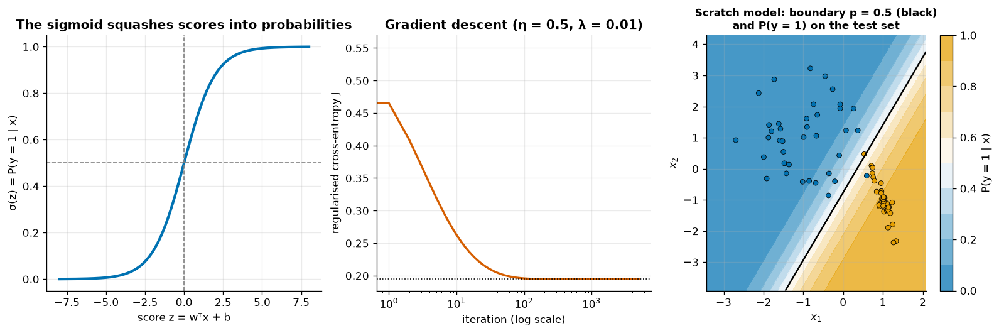
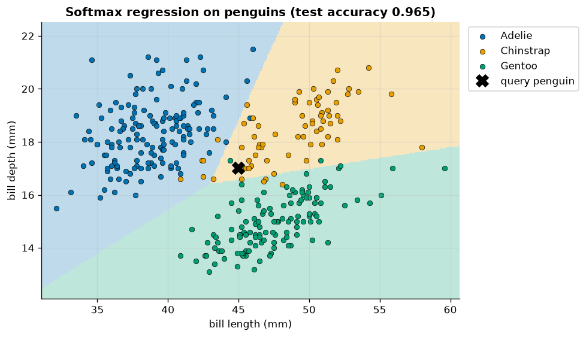
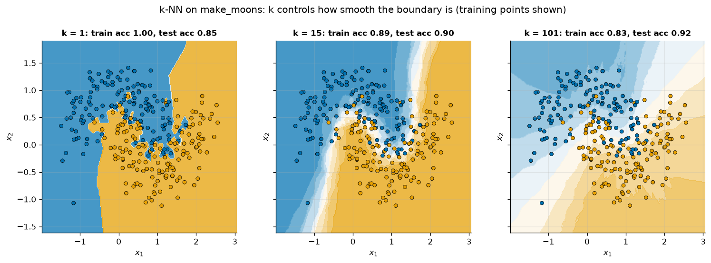
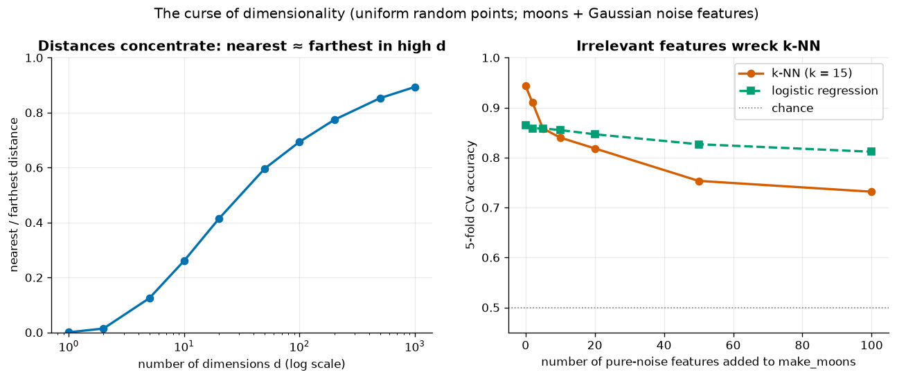
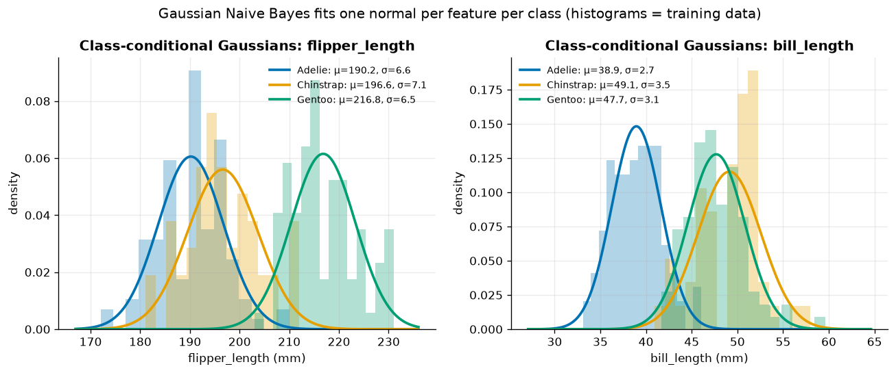
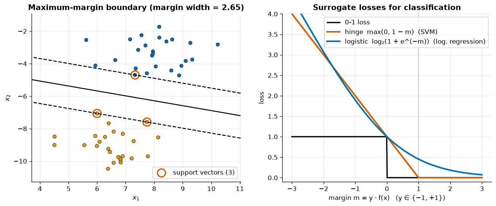
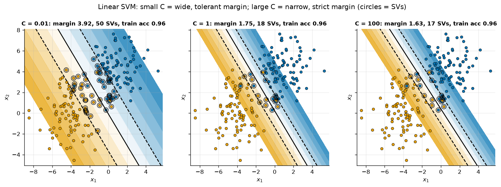
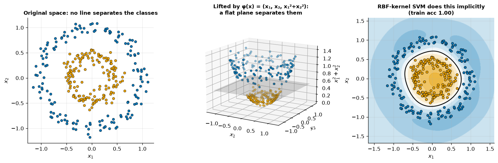
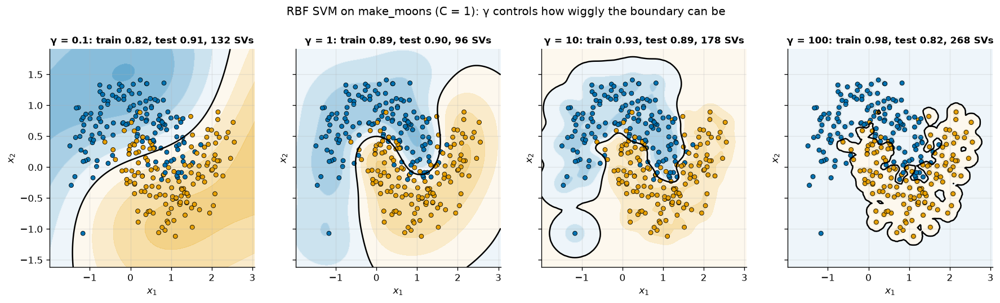
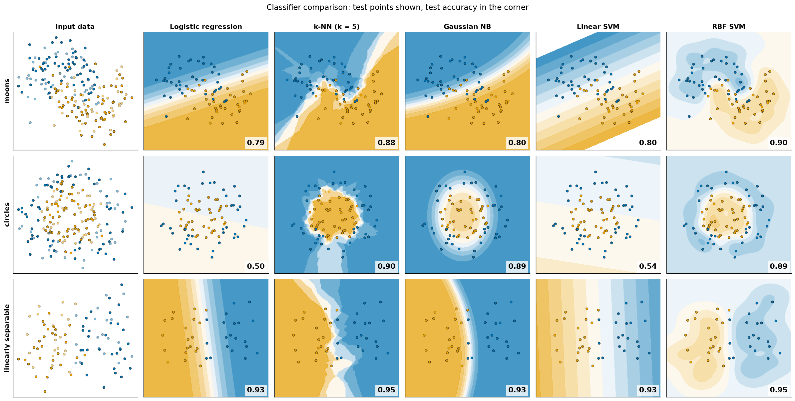

# 06 · Classification

> Four classic classifiers, four different ideas of a decision boundary: logistic regression, k-nearest neighbours, Naive Bayes and support vector machines, each built from scratch or derived, then compared side by side.

[← Previous](../05-regression/README.md) · [Course home](../README.md) · [Next →](../07-trees-and-ensembles/README.md)

**Notebook:** [`06-classification.ipynb`](06-classification.ipynb) · **Datasets:** synthetic 2-D data (`make_classification`, `make_moons`, `make_circles`, `make_blobs`), Palmer penguins, wine, breast cancer · **Time:** ~3.5 h

---

## Learning objectives

- Derive the **cross-entropy loss and its gradient** for logistic regression, implement it with L2 regularisation, and reproduce scikit-learn's coefficients exactly.
- Extend logistic regression to $K$ classes with **softmax**.
- Implement **k-NN** with vectorised NumPy distances, and explain the effect of $k$, the need for **scaling**, and the **curse of dimensionality**.
- Implement **Gaussian Naive Bayes** from priors, per-class means/variances and log-likelihoods.
- Explain the **maximum-margin** principle, the **hinge loss**, the role of **C**, the **kernel trick** and the RBF **γ**.
- Compare classifiers **visually** and with **repeated stratified cross-validation**.

| Model | Type | Boundary | Key hyper-parameters | Needs scaling? |
|---|---|---|---|---|
| Logistic regression | discriminative, parametric | linear (in the features) | `C` (inverse L2 strength) | yes, when regularised |
| k-NN | instance-based, non-parametric | any shape | `n_neighbors`, `weights`, metric | **yes** |
| Gaussian Naive Bayes | generative, parametric | quadratic | `var_smoothing` | no |
| SVM | discriminative, margin-based | linear or kernel-shaped | `C`, `kernel`, `gamma` | **yes** |

---

## 1. Logistic regression

### Model

A linear score is squashed into a probability by the **sigmoid**:

$$
z = \mathbf w^\top\mathbf x + b, \qquad p = P(y=1\mid\mathbf x) = \sigma(z) = \frac{1}{1+e^{-z}} .
$$

Equivalently the **log-odds** are linear: $\log\frac{p}{1-p} = \mathbf w^\top\mathbf x + b$. The boundary $p = 0.5$ is the hyperplane $\mathbf w^\top\mathbf x + b = 0$, and each coefficient $w_j$ is the change in log-odds per unit of $x_j$ ($e^{w_j}$ is an odds ratio).

### Loss: cross-entropy from maximum likelihood

Treat each label as a Bernoulli draw, $P(y_i\mid\mathbf x_i) = p_i^{y_i}(1-p_i)^{1-y_i}$. Maximising the likelihood is the same as minimising the average negative log-likelihood, the **binary cross-entropy**. With an L2 penalty:

$$
J(\mathbf w,b) = -\frac1n\sum_{i=1}^n\Big[y_i\log p_i + (1-y_i)\log(1-p_i)\Big] + \frac\lambda2\lVert\mathbf w\rVert^2 .
$$

### Gradient

Since $\sigma'(z) = \sigma(z)(1-\sigma(z))$, the derivative of one example's loss with respect to its score is simply $p_i - y_i$. The chain rule then gives

$$
\nabla_{\mathbf w}J = \frac1n X^\top(\mathbf p - \mathbf y) + \lambda\mathbf w, \qquad \frac{\partial J}{\partial b} = \frac1n\sum_i(p_i - y_i).
$$

It has the same "error × input" form as linear regression. $J$ is convex, so gradient descent reaches the global minimum, but unlike linear regression there is no closed form.

```python
def _grad(self, w, b, X, y):
    p = expit(X @ w + b)                           # stable sigmoid
    return X.T @ (p - y) / len(y) + self.lam * w, np.mean(p - y)
```

The notebook checks this analytic gradient against central finite differences (they agree to 6 decimals). It computes the loss in the stable form $\log(1+e^{z}) - yz$ via `np.logaddexp`.

### Matching scikit-learn

sklearn minimises $\tfrac12\lVert\mathbf w\rVert^2 + C\sum_i\ell_i$. Dividing by $Cn$ gives our objective with $\lambda = 1/(Cn)$, so we set `C = 1 / (n * lam)`:

| | from scratch | sklearn |
|---|---|---|
| $w_1$ | 2.5090 | 2.5090 |
| $w_2$ | −1.3911 | −1.3911 |
| $b$ | −0.6068 | −0.6068 |

Coefficients and test-set probabilities pass `np.allclose`, and test accuracy is 0.973.



*Left: the sigmoid maps any score to (0, 1). Middle: the regularised cross-entropy falls smoothly and flattens after ~100 iterations (convex problem, so nothing can go wrong but speed). Right: the scratch model's decision boundary (black) is a straight line, and $P(y=1)$ changes gradually across it. $\lVert\mathbf w\rVert$ sets how steep that transition is.*

> [!TIP]
> On perfectly separable data, unregularised logistic regression has no finite optimum: $\lVert\mathbf w\rVert \to \infty$ as the model becomes ever more confident. The L2 penalty (sklearn's default `C=1.0`) keeps the solution finite.

### Multiclass: softmax regression

With $K$ classes, learn one weight vector per class and normalise with the **softmax**:

$$
P(y=k\mid\mathbf x) = \frac{\exp(\mathbf w_k^\top\mathbf x + b_k)}{\sum_{j=1}^{K}\exp(\mathbf w_j^\top\mathbf x + b_j)} .
$$

The loss is the multiclass cross-entropy $-\frac1n\sum_i\log P(y_i\mid\mathbf x_i)$ and the gradient is again (predicted probabilities − one-hot targets) × inputs. `LogisticRegression` uses this multinomial formulation automatically for $K>2$, and `coef_` has shape `(3, 2)` for 3 species × 2 features.



*Pairwise boundaries are straight lines where two classes' scores tie. Test accuracy is 0.965 from just two bill measurements. The query penguin (45 mm × 17 mm, ✖) sits near the three-way junction: P(Adelie, Chinstrap, Gentoo) = 0.192, 0.566, 0.242.*

---

## 2. k-nearest neighbours

k-NN stores the training set and nothing else. To classify $\mathbf x$, it finds the $k$ nearest training points and takes a majority vote (or averages their labels to get probabilities). It is **non-parametric**: the boundary can take any shape the data support.

### From scratch

All query-to-training squared distances in one vectorised line, using $\lVert\mathbf a-\mathbf b\rVert^2 = \lVert\mathbf a\rVert^2 + \lVert\mathbf b\rVert^2 - 2\mathbf a^\top\mathbf b$:

```python
def knn_predict(X_train, y_train, X_query, k=5):
    d2 = (X_query**2).sum(1)[:, None] + (X_train**2).sum(1)[None, :] - 2 * X_query @ X_train.T
    nearest = np.argsort(d2, axis=1)[:, :k]
    votes = y_train[nearest]
    counts = np.apply_along_axis(np.bincount, 1, votes, minlength=y_train.max() + 1)
    return counts.argmax(axis=1)
```

The predictions are identical to `KNeighborsClassifier` for $k$ = 1, 15 and 51 on `make_moons`.

### The effect of k



*$k=1$ memorises the training set (train accuracy 1.00, test 0.85) and builds islands around noisy points. $k=15$ follows the moons smoothly (test 0.90). $k=101$ is nearly linear and its probabilities are washed out. It happens to score 0.92 on this noisy 120-point test set, which is a reminder that single small test sets are noisy. Choose $k$ by cross-validation.*

Small $k$ means low bias and high variance. Large $k$ means high bias and low variance. It is the same trade-off as polynomial degree in [chapter 05](../05-regression/README.md), but in reverse.

### Scaling is not optional

Distance adds up squared differences across features, so the feature with the largest range dominates. In the **wine** dataset `proline` spans 1 402 units while `hue` spans 1.23:

| Model | 5-fold CV accuracy |
|---|---|
| k-NN ($k=5$), raw features | 0.680 ± 0.043 |
| k-NN ($k=5$), `StandardScaler` in a pipeline | **0.972 ± 0.018** |

### The curse of dimensionality

k-NN assumes "near" means "similar". In high dimensions that assumption fails:

1. **Distances concentrate.** For uniform random points the ratio *nearest / farthest* distance rises from 0.001 (1-D) to 0.261 (10-D) to 0.893 (1000-D). Every point ends up roughly equally far from every other.
2. **Neighbourhoods stop being local.** A sub-cube that captures 1 % of uniform data needs edge length $0.01^{1/d}$: 0.01 in 1-D, 0.10 in 2-D, 0.63 in 10-D, 0.95 in 100-D.
3. **Irrelevant features drown the signal.** Every noise dimension adds to every distance.



*Left: nearest/farthest distance ratio approaches 1 as $d$ grows. Right: on `make_moons` with pure-noise features added, k-NN falls from 0.943 to 0.732 CV accuracy (100 noise features), while logistic regression, which can give useless features ~0 weight, only drops from 0.865 to 0.812.*

> [!WARNING]
> Before k-NN (or any distance-based method) on many features, scale, then select features or reduce dimensionality (PCA, [chapter 10](../10-unsupervised-learning/README.md)).

---

## 3. Naive Bayes

Naive Bayes is a **generative** classifier. It models how each class produces its features, $P(\mathbf x\mid y)$, then inverts that with Bayes' rule:

$$
P(y=k\mid\mathbf x) = \frac{\pi_k\,P(\mathbf x\mid y=k)}{\sum_j \pi_j\,P(\mathbf x\mid y=j)} .
$$

The **naive** part is the assumption that features are conditionally independent given the class, so $P(\mathbf x\mid y=k) = \prod_j P(x_j\mid y=k)$. **Gaussian NB** gives every (class, feature) pair its own 1-D normal distribution. In log space:

$$
\log P(y=k\mid\mathbf x) = \log\pi_k - \sum_{j=1}^d\left[\tfrac12\log(2\pi\sigma_{kj}^2) + \frac{(x_j-\mu_{kj})^2}{2\sigma_{kj}^2}\right] - \log Z(\mathbf x) .
$$

Training is just counting and averaging: priors $\pi_k$, means $\mu_{kj}$ and variances $\sigma^2_{kj}$. There is no optimisation.

```python
self.class_prior_ = np.array([np.mean(y == c) for c in self.classes_])
self.theta_ = np.array([X[y == c].mean(axis=0) for c in self.classes_])
eps = self.var_smoothing * X.var(axis=0).max()          # sklearn's stabiliser
self.var_ = np.array([X[y == c].var(axis=0) for c in self.classes_]) + eps
...
jll = np.log(self.class_prior_) + log_likelihoods       # (n, K)
proba = np.exp(jll - logsumexp(jll, axis=1, keepdims=True))
```

> [!NOTE]
> Multiplying many small densities underflows to 0, so we sum **log**-densities and normalise with the **log-sum-exp** trick: $\log\sum_k e^{a_k} = m + \log\sum_k e^{a_k - m}$ with $m=\max_k a_k$.

On the four numeric penguin measurements, the scratch model's priors, means, variances and `predict_proba` all match `GaussianNB` (`np.allclose`), and test accuracy is 0.988.



*Each curve is one fitted $\mathcal N(\mu_{kj},\sigma_{kj}^2)$. Flipper length separates Gentoo (μ = 216.8 mm) from the others, and bill length separates Adelie (μ = 38.9 mm) from Chinstrap (49.1 mm). NB combines the two pieces of evidence by multiplication.*

Because the features are in fact correlated (big penguins have long flippers *and* heavy bodies), NB double-counts evidence and its probabilities are **over-confident**. Its class *ranking* is often still good, and it trains very fast from little data.

### Multinomial NB for text

For word counts, `MultinomialNB` models each class as a bag of words with per-class word probabilities. Laplace smoothing gives $\hat\theta_{kw} = \frac{N_{kw}+\alpha}{N_k+\alpha V}$, so unseen words don't zero out a class. On an 8-sentence toy spam corpus, `"free cash prize"` gets P(spam) = 0.944 and `"report for the monday meeting"` gets P(ham) = 0.964. It remains a strong, fast baseline for text classification (use `CountVectorizer`/`TfidfVectorizer` in a pipeline).

| Variant | Feature type | Typical use |
|---|---|---|
| `GaussianNB` | continuous | quick baseline on numeric data |
| `MultinomialNB` | counts | text (word counts / tf-idf) |
| `BernoulliNB` | binary | presence/absence features |
| `CategoricalNB` | categorical | label-encoded categories |

---

## 4. Support vector machines

### Maximum margin

Many hyperplanes separate two separable classes. The SVM picks the one with the widest **margin**, the gap to the nearest points. With labels $y_i\in\{-1,+1\}$ and the scale fixed so the closest points satisfy $y_i(\mathbf w^\top\mathbf x_i+b)=1$, the margin width is $2/\lVert\mathbf w\rVert$:

$$
\min_{\mathbf w,b}\ \tfrac12\lVert\mathbf w\rVert^2 \quad \text{s.t.}\quad y_i(\mathbf w^\top\mathbf x_i + b) \ge 1\ \ \forall i .
$$

Only the points on the margin, the **support vectors**, determine the solution.

### Soft margin and the hinge loss

Overlapping classes need slack. The soft-margin SVM minimises

$$
\tfrac12\lVert\mathbf w\rVert^2 + C\sum_{i=1}^n \max\big(0,\ 1 - y_i(\mathbf w^\top\mathbf x_i + b)\big),
$$

where $\max(0, 1-m)$, with margin $m = y\,f(\mathbf x)$, is the **hinge loss**. It has the same "penalty + loss" structure as regularised logistic regression, just with a different loss.



*Left: on separable blobs, the SVM boundary (solid) sits midway between the margins (dashed). Only 3 support vectors (circled) define it, and the margin width is 2.65. Right: the hinge loss is exactly zero for $m\ge1$, so points safely beyond the margin have no influence. The logistic loss never reaches zero, so every point has some pull.*

### The C trade-off

$C$ is the price of a margin violation. Like `LogisticRegression`'s `C`, it is an *inverse* regularisation strength.



*C = 0.01: wide margin (3.92) with 50 support vectors. The model tolerates violations. C = 1 and 100: the margin narrows (1.75 → 1.63) and fewer points (18 → 17) become support vectors. All three reach train accuracy 0.96 here. The difference is how much the boundary depends on a few points near it.*

### The kernel trick

A line can't separate concentric circles. But map each point to $\phi(x_1,x_2) = (x_1, x_2, x_1^2+x_2^2)$ and a flat plane can. The SVM's dual problem and its predictions use the data only through inner products $\langle\phi(\mathbf x_i),\phi(\mathbf x_j)\rangle$, so we can substitute a **kernel** $K(\mathbf x_i,\mathbf x_j)$ and never compute $\phi$:

$$
f(\mathbf x) = \sum_{i\in \text{SV}}\alpha_i y_i\,K(\mathbf x_i,\mathbf x) + b, \qquad
K_{\text{RBF}}(\mathbf x,\mathbf x') = \exp\big(-\gamma\lVert\mathbf x-\mathbf x'\rVert^2\big).
$$



*Left: no straight line works in the original space. Middle: adding $x_1^2+x_2^2$ as a third coordinate lifts the outer ring above the inner one, and a horizontal plane separates them. Right: an RBF-kernel SVM finds the equivalent circular boundary implicitly (train accuracy 1.00).*

| Kernel | $K(\mathbf x,\mathbf x')$ | Notes |
|---|---|---|
| linear | $\mathbf x^\top\mathbf x'$ | use `LinearSVC` for large data |
| polynomial | $(\gamma\,\mathbf x^\top\mathbf x' + r)^d$ | explicit interactions up to degree $d$ |
| RBF (Gaussian) | $\exp(-\gamma\lVert\mathbf x-\mathbf x'\rVert^2)$ | default; infinite-dimensional feature map |

### The effect of γ

Each support vector contributes a Gaussian bump of width $\propto 1/\sqrt\gamma$ to $f(\mathbf x)$.



*γ = 0.1: broad bumps give a smooth, nearly linear boundary (train 0.82, test 0.91). γ = 1: follows the moons (0.89 / 0.90). γ = 10: starts to wrap around individual points (0.93 / 0.89). γ = 100: every point gets its own island (train 0.98, test 0.82, 268 of 280 training points are support vectors). This is textbook overfitting.*

> [!IMPORTANT]
> Tune `C` and `gamma` **together** on a log-scale grid ([chapter 09](../09-hyperparameter-tuning/README.md)): large `C` and large `gamma` both increase variance. Always scale features first. `SVC` training scales roughly as $O(n^2)$–$O(n^3)$. Beyond a few tens of thousands of rows, use `LinearSVC`, `SGDClassifier(loss="hinge")` or kernel approximations (`Nystroem`). `SVC` has no `predict_proba` unless `probability=True`, which is slow (internal CV + Platt scaling).

---

## 5. Head-to-head comparison

### Decision boundaries on three toy datasets

This follows scikit-learn's classic *classifier comparison*: every model sits in a `StandardScaler` pipeline, trains on 60 % of the data, and is scored on the other 40 % (shown as points).



*Rows: datasets. Columns: classifiers. Test accuracy is in each corner. Linear models fail on circles (0.50, 0.54), while k-NN, Gaussian NB and the RBF SVM all reach ~0.9. Gaussian NB's boundaries are conics (ellipses/parabolas), which suits "small blob inside a big blob" perfectly. On the linearly separable data everyone does well.*

| | moons | circles | linearly separable |
|---|---|---|---|
| Logistic regression | 0.79 | 0.50 | 0.93 |
| k-NN ($k=5$) | 0.88 | 0.90 | 0.95 |
| Gaussian NB | 0.80 | 0.89 | 0.93 |
| Linear SVM | 0.80 | 0.54 | 0.93 |
| RBF SVM | **0.90** | 0.89 | **0.95** |

With 80 test points, one misclassified point is 1.25 %, so don't over-read small gaps.

### A proper benchmark: breast cancer (569 tumours, 30 features)

Here we use **repeated stratified 5-fold CV** (3 repeats, 15 fits per model), every model inside a pipeline, and report mean ± standard deviation over folds:

```python
rcv = RepeatedStratifiedKFold(n_splits=5, n_repeats=3, random_state=42)
res = cross_validate(model, X, y, cv=rcv, scoring=["accuracy", "roc_auc", "f1"])
```

| Model | Accuracy | ROC AUC | F1 |
|---|---|---|---|
| Logistic regression | **0.976 ± 0.013** | **0.995 ± 0.005** | 0.981 ± 0.010 |
| RBF SVM (C = 1, γ = 'scale') | **0.976 ± 0.014** | **0.995 ± 0.005** | 0.981 ± 0.011 |
| Linear SVM (C = 1) | 0.972 ± 0.018 | 0.994 ± 0.006 | 0.978 ± 0.014 |
| k-NN ($k=5$) | 0.967 ± 0.014 | 0.984 ± 0.010 | 0.974 ± 0.011 |
| Gaussian NB | 0.931 ± 0.018 | 0.988 ± 0.005 | 0.946 ± 0.014 |
| k-NN ($k=5$), **unscaled** | 0.930 ± 0.016 | 0.961 ± 0.018 | 0.945 ± 0.012 |
| Dummy (most frequent) | 0.627 ± 0.004 | 0.500 ± 0.000 | 0.771 ± 0.003 |

*The top four are within about one standard deviation of each other. On this dataset, correct preprocessing and evaluation matter more than which classifier you pick. Forgetting to scale k-NN costs ~4 points of accuracy. Gaussian NB has a high AUC (good ranking) but lower accuracy, which fits its over-confident, correlated-feature probabilities. The dummy baseline shows that 62.7 % accuracy is free.*


---

## Common pitfalls

- **Forgetting to scale** for k-NN and SVMs. It is the single most common reason these models "don't work".
- **Scaling outside the pipeline**, which fits the scaler on test folds (leakage).
- **Reading k-NN / SVM hyper-parameters off a single split.** Small test sets are noisy, so use (repeated) CV.
- **Trusting Naive Bayes probabilities** as calibrated. They are usually over-confident (see chapter 08 for calibration).
- **Confusing C's direction.** In both `LogisticRegression` and `SVC`, *larger* `C` means *less* regularisation.
- **Using `SVC` on very large datasets**, where training time explodes. Use linear models or kernel approximations.
- **Adding many weak features to k-NN.** Irrelevant dimensions dilute distances (curse of dimensionality).

## Key takeaways

- **Logistic regression**: linear log-odds + cross-entropy; gradient $X^\top(\mathbf p-\mathbf y)/n$; convex; interpretable; softmax for multiclass.
- **k-NN**: no training, arbitrary boundaries; $k$ controls smoothness; scale features; suffers in high dimensions.
- **Naive Bayes**: generative, trains by counting, very fast; conditional independence gives over-confident probabilities; Gaussian for continuous, Multinomial for text.
- **SVM**: widest margin; hinge loss means only support vectors matter; $C$ prices violations; kernels (RBF with $\gamma$) give non-linear boundaries implicitly.
- Evaluate with pipelines and repeated stratified CV, and always include a dummy baseline.

## Exercises

1. **Regularisation path.** Fit the scratch logistic regression with $\lambda\in\{0, 0.01, 0.1, 1\}$ and plot the boundary and $\lVert\mathbf w\rVert$. What happens with $\lambda=0$ on separable data? *Hint: without a penalty the weights grow without bound.*
2. **Weighted k-NN.** Add a distance-weighted vote ($1/d$) to `knn_predict` and compare with `KNeighborsClassifier(weights="distance")`. *Hint: `np.add.at` accumulates weighted votes per class.*
3. **When "naive" hurts.** Generate two classes with equal variances but opposite correlation using `rng.multivariate_normal`. Compare `GaussianNB` with `QuadraticDiscriminantAnalysis`. *Hint: NB assumes a diagonal covariance per class.*
4. **SVM by sub-gradient descent.** Minimise $\tfrac\lambda2\lVert\mathbf w\rVert^2 + \frac1n\sum_i\max(0, 1-y_if(\mathbf x_i))$ and compare with `SVC(kernel="linear", C=1/(n*lam))`. *Hint: the hinge sub-gradient is $-y_i\mathbf x_i$ when $y_if(\mathbf x_i)<1$, else 0.*
5. **Tune the RBF SVM.** Grid-search $C\in\{0.1,1,10,100\}$ × $\gamma\in\{0.001,0.01,0.1,1\}$ on breast cancer with *nested* CV. Does tuning beat the defaults? *Hint: put `GridSearchCV` inside `cross_val_score`.*

## Further reading

- James, Witten, Hastie & Tibshirani, *An Introduction to Statistical Learning* (2nd ed.), ch. 4 (logistic regression, NB, k-NN) and ch. 9 (SVMs). Free at [statlearning.com](https://www.statlearning.com/).
- Hastie, Tibshirani & Friedman, *The Elements of Statistical Learning*, §4.4 (logistic regression), §6.6.3 (Naive Bayes), ch. 12 (SVMs), §13.3 (k-NN), §2.5 (curse of dimensionality).
- Bishop, *Pattern Recognition and Machine Learning*, §4.3 (logistic/softmax) and ch. 7 (sparse kernel machines).
- Géron, *Hands-On Machine Learning* (3rd ed.), ch. 4 (logistic & softmax regression) and ch. 5 (SVMs).
- scikit-learn User Guide: [Linear models: logistic regression](https://scikit-learn.org/stable/modules/linear_model.html#logistic-regression), [Nearest neighbors](https://scikit-learn.org/stable/modules/neighbors.html), [Naive Bayes](https://scikit-learn.org/stable/modules/naive_bayes.html), [SVMs](https://scikit-learn.org/stable/modules/svm.html), [Classifier comparison example](https://scikit-learn.org/stable/auto_examples/classification/plot_classifier_comparison.html).
- Cortes, C. & Vapnik, V. (1995). Support-vector networks. *Machine Learning* 20(3).
- Cover, T. & Hart, P. (1967). Nearest neighbor pattern classification. *IEEE Trans. Information Theory* 13(1).
- Beyer, K. et al. (1999). When is "nearest neighbor" meaningful? *ICDT*.
- Domingos, P. & Pazzani, M. (1997). On the optimality of the simple Bayesian classifier under zero-one loss. *Machine Learning* 29.
