# 07 · Trees and Ensembles

> Decision trees split the feature space into boxes; bagging and random forests average many trees to cut variance, and boosting adds small trees one after another to cut bias.

[← Previous](../06-classification/README.md) · [Course home](../README.md) · [Next →](../08-model-evaluation/README.md)

**Notebook:** [`07-trees-and-ensembles.ipynb`](07-trees-and-ensembles.ipynb) · **Datasets:** breast cancer (sklearn), diabetes (sklearn), Palmer penguins (`data/raw/penguins.csv`), `make_moons`, `make_classification` · **Time:** ~3 h

---

## Learning objectives

By the end of this chapter you will be able to:

1. Explain how a decision tree picks a split with **Gini**, **entropy** or **MSE** impurity, and write the split search yourself.
2. Read a fitted tree (`plot_tree`, `export_text`) and explain why its decision boundaries are **axis-aligned**.
3. Control overfitting with `max_depth` and with **cost-complexity pruning** (`ccp_alpha`).
4. Explain why single trees are **unstable** and how **bagging** and **random forests** reduce variance. Use the **out-of-bag (OOB)** score.
5. Describe **AdaBoost**, and implement **gradient boosting for regression from scratch** so that it matches `GradientBoostingRegressor` exactly.
6. Tune the **learning rate** and **number of trees** together, and use **early stopping** with `HistGradientBoosting*`.
7. Compare tree-based models fairly with cross-validation.

---

## 1 · Impurity: measuring how mixed a node is

A classification tree asks yes/no questions of the form *"is $x_j \le t$?"*. At each node it picks the question whose two child nodes are as **pure** as possible. Purity is measured with an impurity function of the class proportions $p_k$ in the node:

$$
\text{Gini}(p) = \sum_k p_k(1-p_k) = 1-\sum_k p_k^2
\qquad
\text{Entropy}(p) = -\sum_k p_k\log_2 p_k
$$

For **regression trees** the impurity is the node variance, i.e. the MSE around the node mean $\bar y$:

$$
\text{MSE}(\text{node}) = \frac1n\sum_{i\in\text{node}}(y_i-\bar y)^2 .
$$

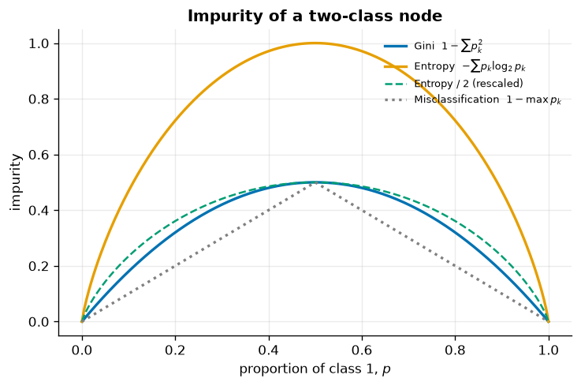

*All three measures are 0 for a pure node and largest at p = 0.5. Gini and entropy/2 have almost the same shape, so in practice they usually choose the same split. Both are strictly concave, and misclassification error is not. That is why they still reward a split that makes a node purer even when the majority class stays the same.*

| Criterion | Formula | sklearn `criterion=` | Notes |
|---|---|---|---|
| Gini | $1-\sum p_k^2$ | `"gini"` (default) | Slightly faster (no log) |
| Entropy | $-\sum p_k\log_2 p_k$ | `"entropy"` / `"log_loss"` | Information gain |
| MSE | $\frac1n\sum(y-\bar y)^2$ | `"squared_error"` (regression default) | Leaf prediction = mean |
| MAE | $\frac1n\sum\lvert y-\tilde y\rvert$ | `"absolute_error"` | Leaf prediction = median, slower |

## 2 · Finding the best split from scratch

When a parent node $P$ is split into children $L$ and $R$, the tree maximises the **weighted impurity decrease**:

$$
\Delta I = I(P) - \frac{n_L}{n_P}I(L) - \frac{n_R}{n_P}I(R).
$$

For one numeric feature, sort its values and try every midpoint between consecutive distinct values. Cumulative class counts give the impurity of every candidate split in a single $O(n)$ pass after the $O(n\log n)$ sort:

```python
order = np.argsort(x)
xs, ys = x[order], y[order]
onehot = (ys[:, None] == classes).astype(float)
left_counts = np.cumsum(onehot, axis=0)[:-1]          # class counts left of each cut
right_counts = onehot.sum(0) - left_counts
decrease = gini(total/n) - n_left/n*gini(left_counts/n_left) - n_right/n*gini(right_counts/n_right)
thresholds = (xs[1:] + xs[:-1]) / 2                    # midpoints, like sklearn
```

We ran this search over all 30 breast-cancer features and compared the result with a `DecisionTreeClassifier(max_depth=1)`, a **decision stump**:

| | feature | threshold | ΔGini |
|---|---|---|---|
| from scratch (tied #1) | worst perimeter | 112.80 | 0.32538 |
| from scratch (tied #1) | worst radius | 16.795 | 0.32538 |
| scikit-learn stump | worst radius | 16.795 | 0.32538 |

There is a tie. Perimeter is roughly $2\pi\times$radius, so the two features put the tumours in the same order and produce *the same partition* of the training set. scikit-learn goes through the features in a random order (set by `random_state`) and keeps the first best split it finds, so which of the tied features wins is arbitrary. When we compare **single-feature** searches, every threshold matches sklearn exactly (the notebook checks 8 features).

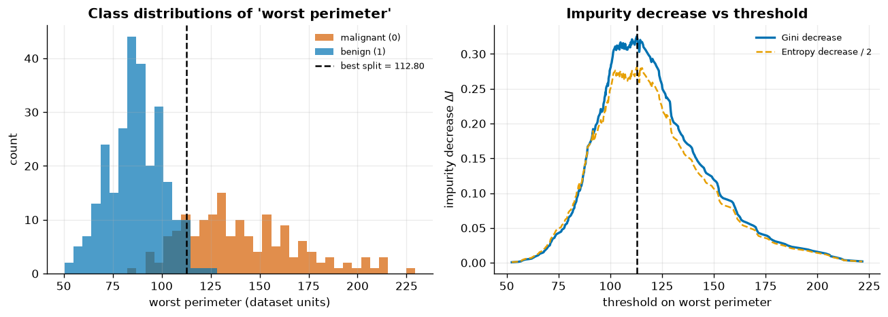

*Left: malignant vs benign tumours along the winning feature. Right: the impurity decrease for each candidate threshold. The tree takes the peak. The Gini and (rescaled) entropy curves nearly overlap.*

> [!NOTE]
> The tree is **greedy**. It picks the best split *now* and never reconsiders it. Finding the globally optimal tree is NP-hard, so every practical algorithm (CART, C4.5, sklearn) uses this greedy recursion.

## 3 · Reading a tree

We fit a depth-3 tree to penguins using only two features (bill length and flipper length). It reaches **94.1 %** training accuracy and **97.1 %** test accuracy.

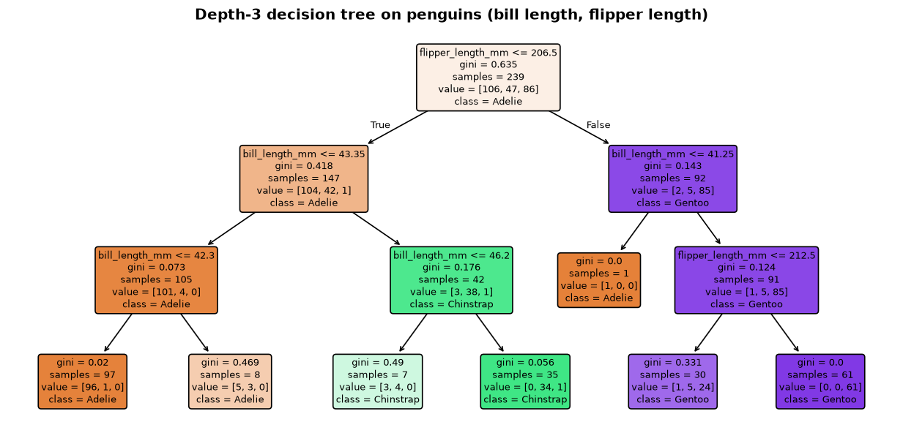

*Each node shows the question, its Gini impurity, the number of samples, the class counts (`value`) and the majority class. The first split is flipper length ≤ 206.5 mm, which separates Gentoo from the other two species. Some sibling leaves predict the same class. Those splits still lowered the impurity, even though they change no prediction.*

`export_text(tree, feature_names=...)` gives the same information as indented text. It is handy in logs and code reviews.

## 4 · Axis-aligned boundaries and overfitting

Each split thresholds **one** feature, so the decision regions are unions of axis-aligned rectangles. A diagonal boundary can only be approximated by a staircase.

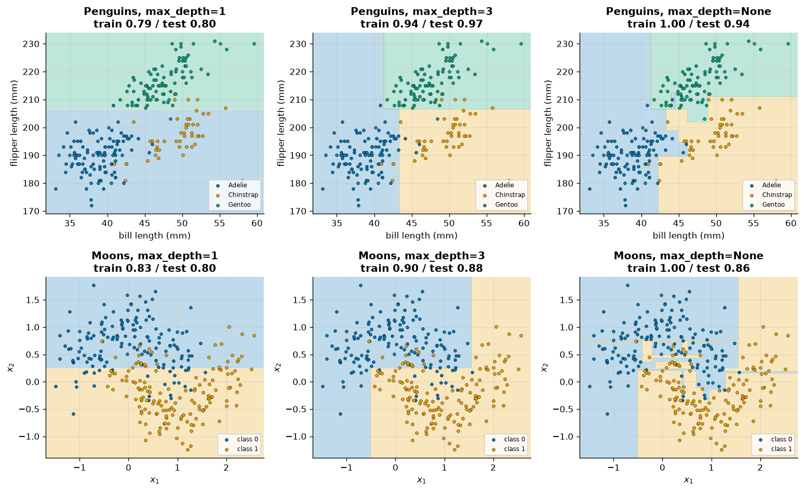

*Depth 1 underfits (a single cut). Depth 3 captures the main structure. With unlimited depth every leaf is pure: training accuracy is 1.00, and the model builds tiny islands around individual noisy points. On moons the test accuracy drops from 0.88 (depth 3) to 0.86 (unlimited).*

We can sweep `max_depth` with 5-fold cross-validation:

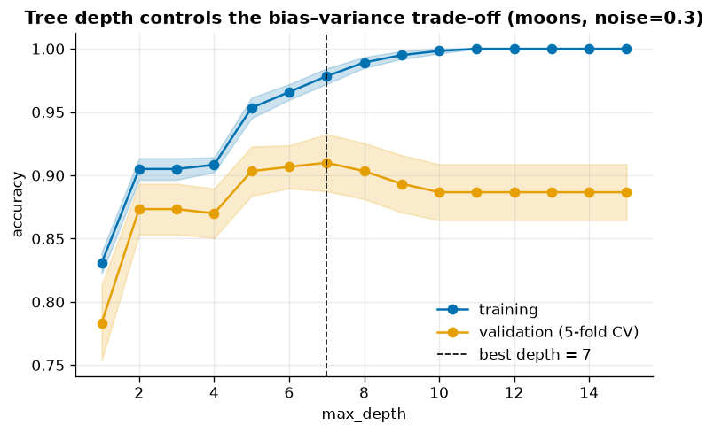

*Training accuracy keeps rising with depth. Validation accuracy peaks (depth 7, CV accuracy 0.910) and then falls to 0.887 at depth 15. This is the bias–variance trade-off in one picture.*

Other pre-pruning knobs: `min_samples_leaf`, `min_samples_split`, `max_leaf_nodes`, `min_impurity_decrease`. `min_samples_leaf` (for example 5–20) is often the most robust one, because it guarantees that every prediction is an average over several samples.

## 5 · Cost-complexity pruning

Pruning grows the full tree first and then cuts back its weakest branches. CART's minimal cost-complexity pruning minimises

$$
R_\alpha(T) = R(T) + \alpha\,|T|,
$$

where $R(T)$ is the total sample-weighted impurity of the leaves and $|T|$ is the number of leaves. As $\alpha$ grows, subtrees whose impurity reduction per extra leaf is smallest ("weakest links") collapse one after another. `cost_complexity_pruning_path` returns the exact $\alpha$ values at which the tree changes:

```python
path = DecisionTreeClassifier(random_state=42).cost_complexity_pruning_path(X_train, y_train)
for a in path.ccp_alphas:
    score = cross_val_score(DecisionTreeClassifier(ccp_alpha=a, random_state=42), X_train, y_train, cv=5).mean()
```

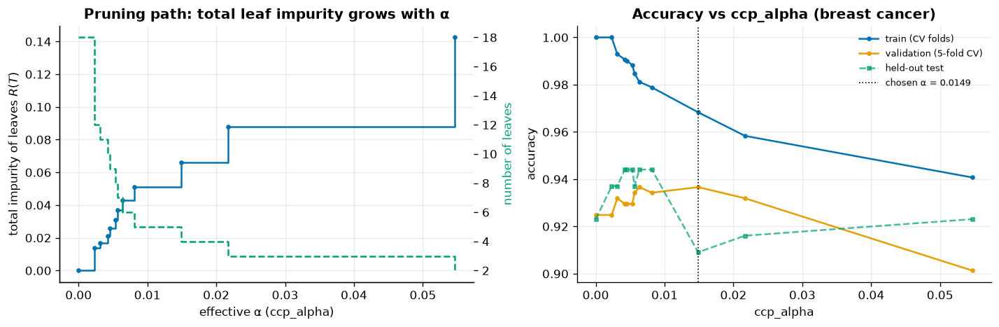

*Left: as α grows, the total leaf impurity rises and the number of leaves falls from 18 to 2. Right: training accuracy falls steadily. CV accuracy is highest at α = 0.0149 (4 leaves, 0.937 vs 0.925 for the unpruned tree).*

> [!WARNING]
> On the held-out test set the pruned tree scored 0.909 and the unpruned tree 0.923. That gap is **two tumours out of 143**. One small test set is a noisy measure. Choose hyperparameters with CV and use the test score as a final sanity check, not as a tuning signal (see [chapter 08](../08-model-evaluation/README.md)).

## 6 · Trees are unstable

Trees have **low bias and high variance**. A small change in the training data can move the root split, and every split below it changes too.

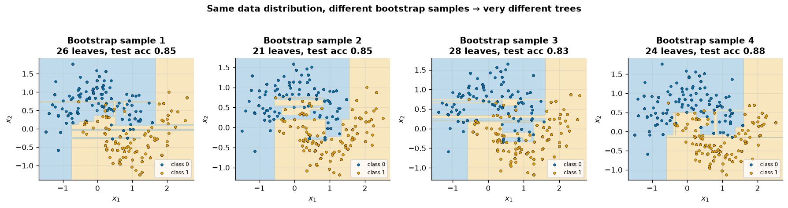

*Four fully grown trees, each trained on a different bootstrap sample of the same 300 moon points. They have 21–28 leaves, the boundaries look very different, and test accuracy ranges from 0.83 to 0.88. This variance is what ensembles average away.*

## 7 · Bagging and random forests

### Bagging

**Bootstrap aggregating** (Breiman, 1996):

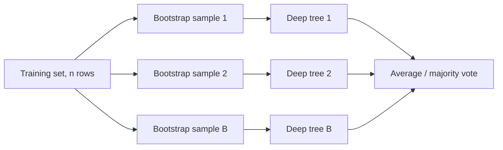

Suppose each tree has variance $\sigma^2$ and any two trees have correlation $\rho$. The average of $B$ trees then has variance

$$
\operatorname{Var}\Big(\frac1B\sum_{b=1}^B T_b(x)\Big) = \rho\,\sigma^2 + \frac{1-\rho}{B}\,\sigma^2 .
$$

A quick simulation in the notebook confirms it. With $\rho=0.3$, averaging 100 "trees" cuts the variance from 1.0 to 0.30 (formula: 0.307), and it can never go below the floor of $\rho\sigma^2$.

### Random forests: decorrelating the trees

Adding trees only shrinks the second term. To lower the floor $\rho\sigma^2$, a **random forest** (Breiman, 2001) considers only a random subset of `max_features` features **at every split**. The default is $\sqrt p$ for classification and all features for regression. The trees become less alike, and their average improves.

### Out-of-bag (OOB) estimate

A bootstrap sample leaves out each row with probability $(1-1/n)^n\approx e^{-1}\approx 36.8\%$. If you predict each row using only the trees that did not see it, you get a free validation score: `oob_score=True`.

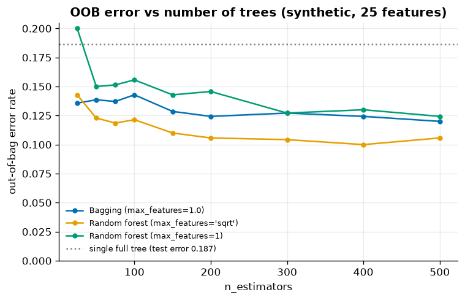

*A synthetic problem with 25 features, of which only 6 are informative. All ensembles beat a single full tree (test error 0.187) by a wide margin. The error settles after roughly 200 trees. `max_features="sqrt"` gives the lowest OOB error (0.106 at 500 trees, vs 0.120 for plain bagging). `max_features=1` is too random: each tree gets too weak (0.124).*

On breast cancer, a 300-tree random forest has **OOB accuracy 0.962** against **test accuracy 0.958**. The OOB score is a good stand-in for a validation set.

> [!TIP]
> More trees never make a random forest *less* accurate. They only cost time and memory. Tune `max_features` and `min_samples_leaf`, and set `n_estimators` "large enough" (a few hundred).

| Knob | Effect | Typical values |
|---|---|---|
| `n_estimators` | More trees → less variance, no overfitting | 200–1000 |
| `max_features` | Lower → trees less correlated but individually weaker | `"sqrt"`, 0.3–0.5, 1.0 |
| `min_samples_leaf` | Smooths leaves (useful for regression/noisy data) | 1–10 |
| `max_samples` | Fraction of rows per bootstrap | 0.5–1.0 |
| `oob_score` | Free validation estimate | `True` |

## 8 · Boosting

Bagging trains strong, low-bias trees **in parallel** and averages them to reduce variance. Boosting trains weak, high-bias learners (shallow trees) **sequentially**. Each new learner focuses on what the ensemble so far gets wrong, which mainly reduces **bias**.

### 8.1 · AdaBoost (briefly)

AdaBoost (Freund & Schapire, 1997) keeps a weight on every training sample:

1. Fit a weak learner $h_m$ with weighted error $\varepsilon_m$.
2. Give it a say of $\alpha_m=\tfrac12\ln\frac{1-\varepsilon_m}{\varepsilon_m}$.
3. Multiply the weights of misclassified samples by $e^{\alpha_m}$, then renormalise.
4. Predict with $\operatorname{sign}\big(\sum_m\alpha_m h_m(x)\big)$.

On breast cancer, one stump reaches 0.923 test accuracy and 200 stumps reach **0.972**. AdaBoost is forward stagewise additive modelling with the exponential loss. Gradient boosting generalises this idea to any differentiable loss.

### 8.2 · Gradient boosting from scratch

Gradient boosting (Friedman, 2001) builds an additive model

$$
F_M(x) = F_0 + \nu\sum_{m=1}^M h_m(x),
$$

where each tree $h_m$ is fitted to the **negative gradient** of the loss at the current predictions. For squared loss $L=\tfrac12(y-F)^2$ that gradient is simply the **residual**:

$$
r_{im} = -\frac{\partial L(y_i,F)}{\partial F}\Big|_{F=F_{m-1}(x_i)} = y_i - F_{m-1}(x_i).
$$

The entire algorithm:

```python
class ScratchGBR:
    def fit(self, X, y):
        self.init_ = y.mean()                        # F_0 minimises squared loss
        F = np.full(len(y), self.init_)
        self.trees_ = []
        for _ in range(self.n_estimators):
            residuals = y - F                         # negative gradient
            tree = DecisionTreeRegressor(max_depth=self.max_depth).fit(X, residuals)
            F += self.learning_rate * tree.predict(X) # shrinkage ν
            self.trees_.append(tree)
        return self
```

With 200 depth-2 trees and $\nu=0.1$ on a noisy 1-D sine-plus-trend problem, the maximum absolute difference from `GradientBoostingRegressor` over a 500-point grid is **0.0**. The two implementations are the same algorithm.

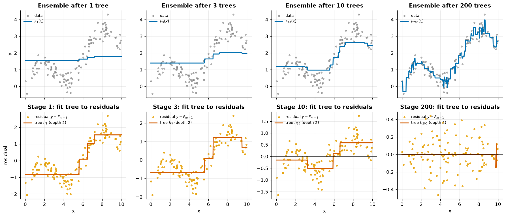

*Top: the ensemble prediction after 1, 3, 10 and 200 trees. Bottom: the residuals each tree was fitted to, and the depth-2 tree that fitted them. Early trees capture the broad trend. By stage 200 the residuals look like noise and the fit starts to get jagged, a sign of beginning to overfit.*

> [!IMPORTANT]
> The **learning rate** $\nu$ (shrinkage) is a regulariser. Each tree corrects only a fraction of the remaining error, so more trees are needed, but the ensemble generalises better. `learning_rate` and `n_estimators` have to be tuned **together**.

### 8.3 · Learning rate vs number of trees, and early stopping

We evaluate every ensemble size in one pass with `staged_predict` on a validation split of the diabetes data:

| learning_rate | best n_estimators | best val RMSE | val RMSE at 600 trees |
|---|---|---|---|
| 1.0 | 1 | 56.57 | 83.69 |
| 0.3 | 23 | 53.56 | 65.14 |
| 0.1 | 65 | 51.83 | 59.80 |
| 0.03 | 183 | 51.85 | 54.85 |

`HistGradientBoostingRegressor` (sklearn's fast, LightGBM-style implementation) bins each feature into at most 255 buckets, handles missing values natively and supports categorical features. It can stop by itself: with `early_stopping=True` it holds out `validation_fraction` of the training data and stops when the validation loss has not improved for `n_iter_no_change` iterations.

```python
hgb = HistGradientBoostingRegressor(max_iter=1000, learning_rate=0.05, max_depth=3,
                                    early_stopping=True, validation_fraction=0.2,
                                    n_iter_no_change=20, random_state=42)
```

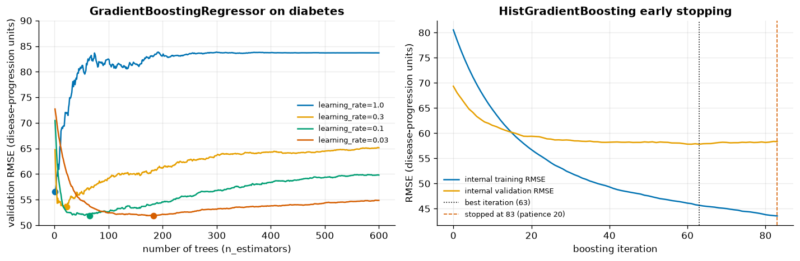

*Left: with learning_rate = 1.0 the validation error is lowest after a single tree and then rises steeply. Smaller rates descend more slowly, reach lower minima and overfit more gently. Right: HGB's internal training loss keeps falling, but validation loss flattens. The best validation score was at iteration 63, so after 20 more iterations without improvement it stopped at iteration 83 (validation RMSE 51.07 on our separate split).*

**Rule of thumb:** fix a small learning rate (0.05–0.1), give the model plenty of iterations, and let early stopping choose how many trees to keep.

## 9 · Head-to-head comparison

5-fold cross-validation with near-default settings (mean ± std across folds):

**Breast cancer** (569 tumours, binary):

| Model | Accuracy | ROC AUC | Fit time (s) |
|---|---|---|---|
| Decision tree (depth 4) | 0.923 ± 0.030 | 0.915 ± 0.037 | 0.04 |
| Random forest (300) | 0.953 ± 0.013 | 0.989 ± 0.008 | 0.98 |
| Gradient boosting | 0.949 ± 0.024 | 0.993 ± 0.004 | 0.58 |
| HistGradientBoosting | 0.967 ± 0.013 | 0.992 ± 0.006 | 0.31 |

**Diabetes** (442 patients, regression):

| Model | $R^2$ | RMSE | Fit time (s) |
|---|---|---|---|
| Decision tree (depth 3) | 0.326 ± 0.076 | 62.57 ± 2.46 | 0.007 |
| Random forest (300, min_samples_leaf=5) | 0.442 ± 0.091 | 56.84 ± 3.40 | 0.81 |
| Gradient boosting (lr 0.05, 200 trees) | 0.454 ± 0.088 | 56.19 ± 3.07 | 0.30 |
| HistGradientBoosting (lr 0.05, 200 iter) | 0.439 ± 0.091 | 56.93 ± 3.30 | 0.14 |

The single tree is clearly the weakest model. The three ensembles are within about one standard deviation of each other. On small, noisy data like diabetes, a linear model is also competitive, so always keep a simple baseline. Fit times are for this small data and a 4-core machine. On large data, `HistGradientBoosting` is orders of magnitude faster than `GradientBoosting`.

| | Decision tree | Random forest | Gradient boosting / HGB |
|---|---|---|---|
| Reduces | – | variance | bias (and variance via shrinkage/subsampling) |
| Trees | one, deep or pruned | many deep, in parallel | many shallow, sequential |
| Key knobs | `max_depth`, `ccp_alpha`, `min_samples_leaf` | `max_features`, `min_samples_leaf` | `learning_rate`, `n_estimators`/early stopping, `max_depth`/`max_leaf_nodes` |
| Overfits with more trees? | n/a | no | yes (without early stopping) |
| Needs scaling? | no | no | no |
| Interpretability | high | low (use chapter 11 tools) | low |

---

## Common pitfalls

- **Letting a tree grow unrestricted.** 100 % training accuracy is a warning sign, not an achievement. Limit depth or leaf size, or prune.
- **Choosing a pruning level or depth on the test set.** Use CV or the OOB score. The test set is noisy and becomes optimistic once you use it for tuning.
- **Trusting impurity-based `feature_importances_` blindly.** They are computed on training data and favour high-cardinality or continuous features. Prefer permutation importance ([chapter 11](../11-interpretability/README.md)).
- **Assuming correlated features are "chosen" meaningfully.** As the perimeter/radius tie showed, which of two redundant features a tree uses can be arbitrary.
- **Boosting with a large learning rate and many trees.** Unlike a forest, boosting *does* overfit as trees are added. Use early stopping.
- **Tuning `n_estimators` of a random forest by grid search.** It is not a real hyperparameter. Use "enough" trees and tune `max_features` / `min_samples_leaf` instead.
- **Extrapolation.** Tree predictions are piecewise constant and stay flat outside the training range. A tree cannot follow a trend beyond the data it saw.

## Key takeaways

- A tree greedily maximises the weighted impurity decrease. Its boundaries are axis-aligned and its predictions are piecewise constant.
- Control tree complexity with `max_depth` / `min_samples_leaf` or with cost-complexity pruning (`ccp_alpha`), chosen by cross-validation.
- Trees have high variance. Bagging averages bootstrap trees, and random forests also subsample features per split to decorrelate them: $\rho\sigma^2+(1-\rho)\sigma^2/B$. The OOB score is a free validation estimate.
- Gradient boosting fits shallow trees one after another to the negative gradient, which is the residual for squared loss. It is about 20 lines of code on top of a regression tree.
- `learning_rate` and the number of trees trade off against each other. Pick a small rate and use early stopping. `HistGradientBoosting*` is scikit-learn's go-to model for tabular data.

## Exercises

1. **Entropy split.** Re-run the from-scratch split search with `impurity=entropy` and compare it with `DecisionTreeClassifier(criterion="entropy", max_depth=1)`. *Hint:* `best_split` takes the impurity function as an argument.
2. **Regression split from scratch.** Write `best_split_mse(x, y)` using cumulative sums of $y$ and $y^2$, and check it against `DecisionTreeRegressor(max_depth=1)` on one diabetes feature. *Hint:* $n\,\mathrm{Var} = \sum y^2 - (\sum y)^2/n$.
3. **`max_features` sweep.** Plot the random-forest OOB error against `max_features` ∈ {1, 2, 5, 10, 20, 25} at 300 trees on the synthetic data. Where is the sweet spot? *Hint:* reuse the `oob_score=True` loop.
4. **Absolute-loss boosting.** Change `ScratchGBR` to minimise absolute error. The negative gradient is $\operatorname{sign}(y-F)$, and each leaf value should be the **median** residual in that leaf. Compare with `GradientBoostingRegressor(loss="absolute_error")`. *Hint:* `tree.apply(X)` gives each sample's leaf.
5. **Stochastic boosting.** Add a `subsample` parameter to `ScratchGBR` so that each tree is fitted on a random fraction of the rows, and show its effect on the diabetes validation curve. *Hint:* this is Friedman's *stochastic gradient boosting* (2002).

## Further reading

- James, Witten, Hastie & Tibshirani, *An Introduction to Statistical Learning* (2nd ed.), ch. 8 "Tree-Based Methods".
- Hastie, Tibshirani & Friedman, *The Elements of Statistical Learning*, ch. 9.2 (trees), 10 (boosting), 15 (random forests).
- Géron, *Hands-On Machine Learning*, ch. 6 (decision trees) and 7 (ensembles).
- Breiman, Friedman, Olshen & Stone (1984), *Classification and Regression Trees*.
- Breiman (1996), "Bagging predictors", *Machine Learning* 24; Breiman (2001), "Random forests", *Machine Learning* 45.
- Freund & Schapire (1997), "A decision-theoretic generalization of on-line learning and an application to boosting".
- Friedman (2001), "Greedy function approximation: a gradient boosting machine", *Annals of Statistics* 29(5).
- scikit-learn user guide: [Decision trees](https://scikit-learn.org/stable/modules/tree.html), [Ensembles](https://scikit-learn.org/stable/modules/ensemble.html), [Post pruning with cost complexity pruning](https://scikit-learn.org/stable/auto_examples/tree/plot_cost_complexity_pruning.html).
- Beyond scikit-learn (not installed here): **XGBoost** (Chen & Guestrin, 2016), **LightGBM** (Ke et al., 2017) and **CatBoost** (Prokhorenkova et al., 2018). They are highly optimised gradient-boosting libraries with regularised objectives, second-order gradients, GPU training and native categorical handling. Everything in this chapter carries over directly.
