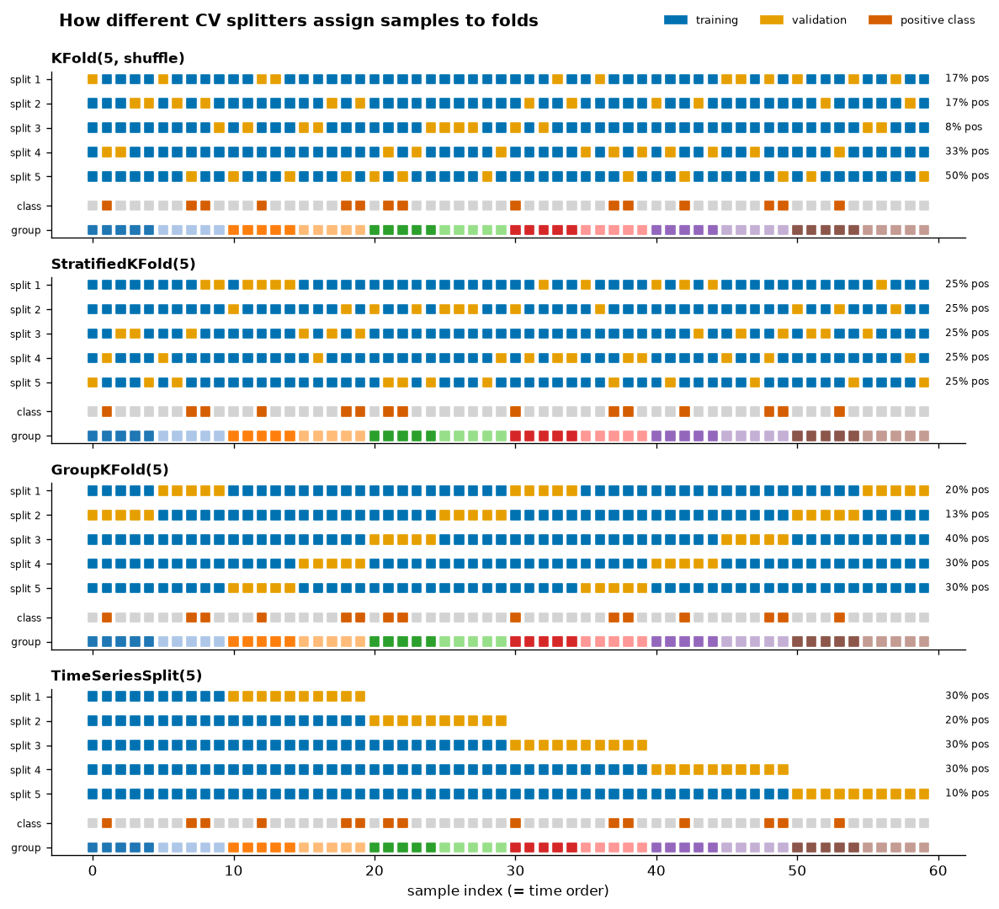
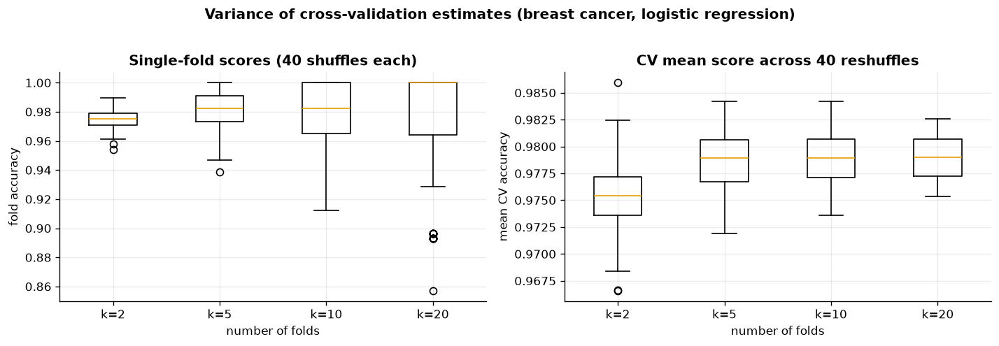
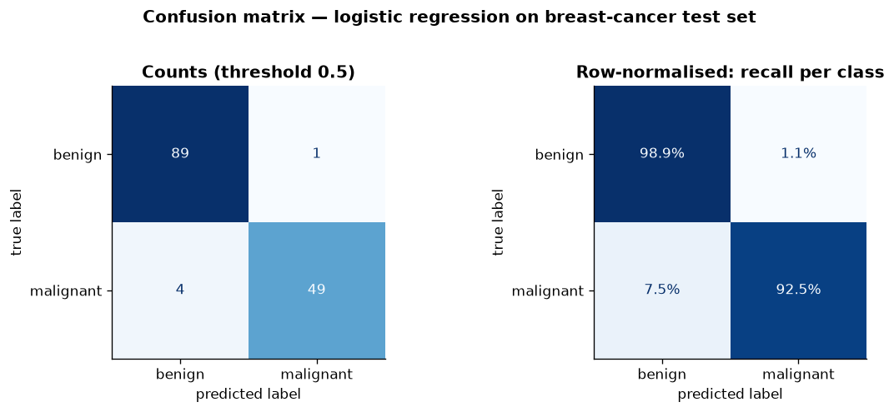
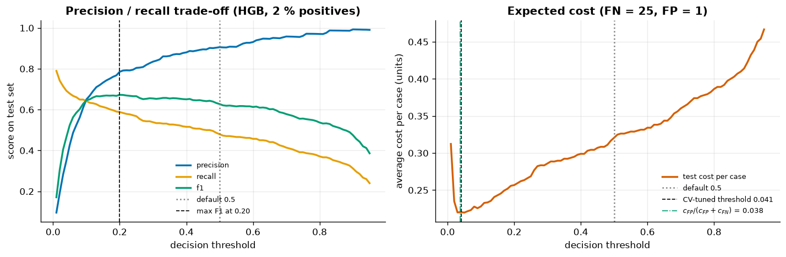
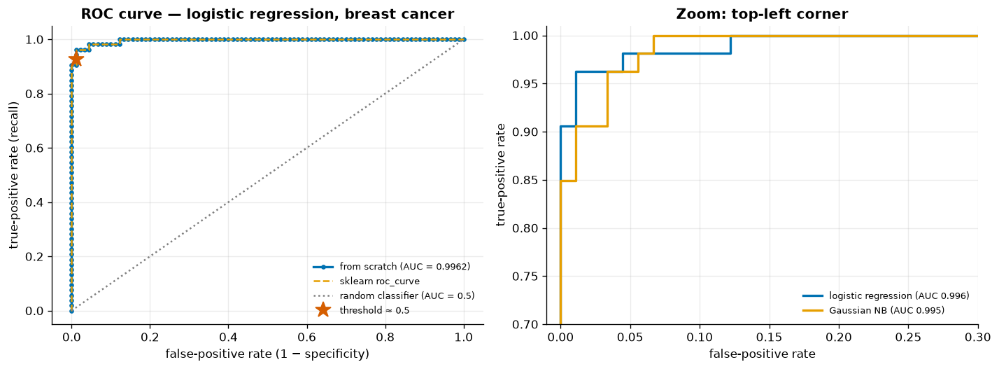
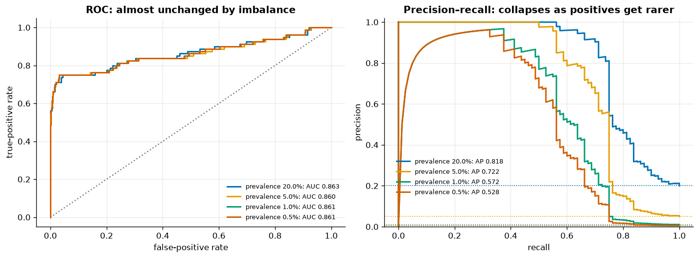
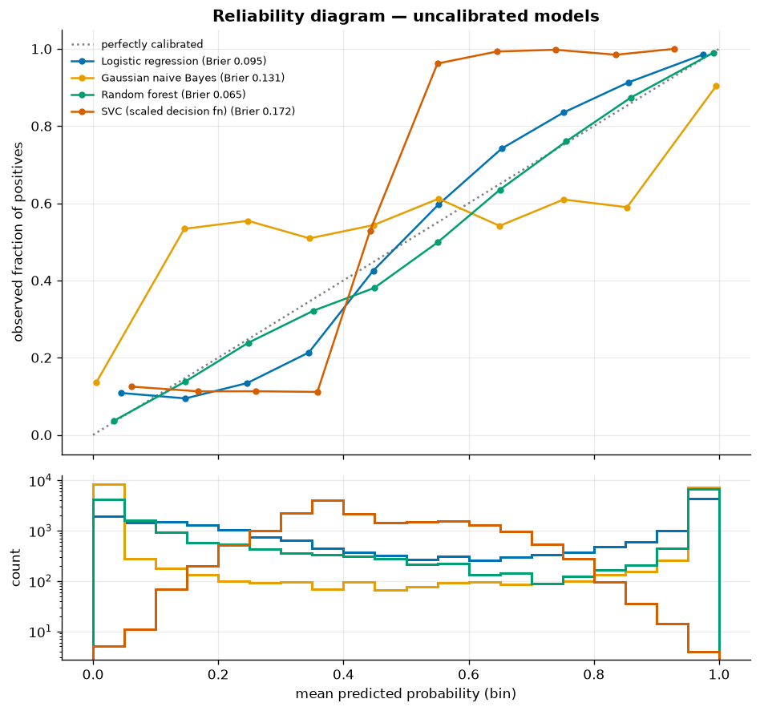
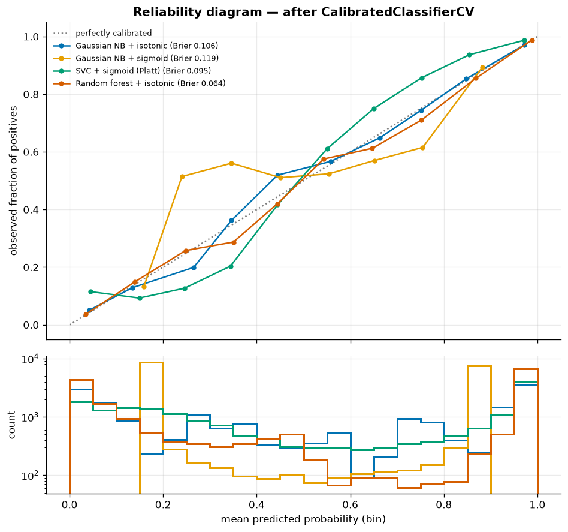
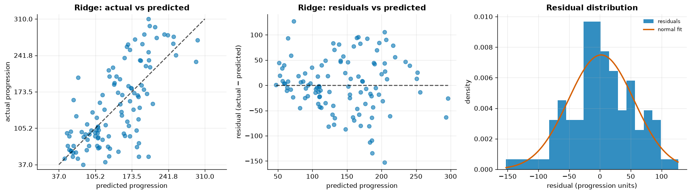
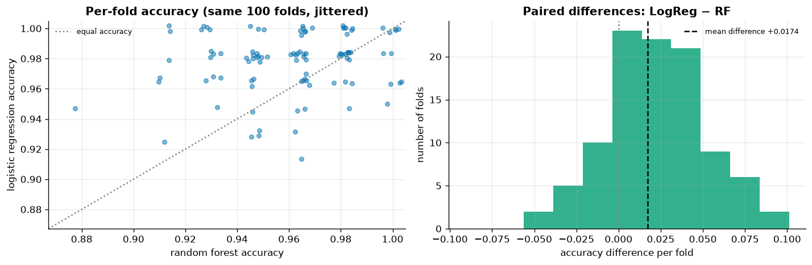

# 08 · Model Evaluation

> How to measure a model honestly: the right cross-validation splitter, the right metric for the question you are asking, a threshold that reflects real costs, probabilities you can trust, and differences between models that are more than noise.

[← Previous](../07-trees-and-ensembles/README.md) · [Course home](../README.md) · [Next →](../09-hyperparameter-tuning/README.md)

**Notebook:** [`08-model-evaluation.ipynb`](08-model-evaluation.ipynb) · **Datasets:** breast cancer and diabetes (sklearn), imbalanced `make_classification` (~2.5 % positives), synthetic calibration data · **Time:** ~3 h

---

## Learning objectives

1. Choose between `KFold`, `StratifiedKFold`, `RepeatedStratifiedKFold`, `GroupKFold` and `TimeSeriesSplit`, and picture how each one builds its folds.
2. Quantify the **variance of a CV estimate**, and report several metrics at once with `cross_validate`.
3. Compute the confusion matrix, precision, recall, specificity and F1 from scratch, and explain the **accuracy paradox**.
4. Move the **decision threshold**, and pick it from **misclassification costs** with `TunedThresholdClassifierCV`.
5. Build a **ROC curve from scratch**, interpret AUC as a probability, and know when to prefer **precision–recall** curves.
6. Diagnose and fix **calibration** with reliability diagrams, the Brier score and `CalibratedClassifierCV`.
7. Choose regression metrics and read **residual plots**.
8. Compare two models with **paired** CV differences and a **corrected** t-test.

---

## 1 · Cross-validation splitters

One train/test split gives one noisy number. **k-fold CV** trains on $k-1$ folds, validates on the remaining fold, repeats this $k$ times and averages the scores:

$$
\widehat{\text{CV}}_k = \frac1k\sum_{j=1}^k \text{score}\big(\hat f^{(-j)},\ \text{fold}_j\big).
$$

The number of folds matters. **How the folds are formed** matters just as much:

| Splitter | Use when | Guarantees |
|---|---|---|
| `KFold(shuffle=True)` | i.i.d. regression data | each row validated once |
| `StratifiedKFold` | classification (the default for classifiers in `cross_val_score`) | class ratio preserved per fold |
| `RepeatedStratifiedKFold` | small data | averages out "split luck" |
| `GroupKFold` / `StratifiedGroupKFold` | several rows per patient / user / site | a group never appears in both train and validation |
| `TimeSeriesSplit` | temporal data | train always precedes validation |



*Blue = training and orange = validation. The two bottom rows of each panel show the class labels and the 12 groups. With plain KFold the share of positives in a validation fold ranges from 8 % to 50 %. StratifiedKFold keeps it at 25 % in every fold. GroupKFold puts each group entirely in one validation fold. TimeSeriesSplit uses an expanding window that always trains on the past.*

### Why groups matter: a leakage demo

Take 100 simulated patients with 10 scans each. The scans of one patient look alike, and the label is a **random** coin flip per patient, so there is nothing to learn. A 1-nearest-neighbour model scores:

| CV scheme | Accuracy |
|---|---|
| `KFold(5, shuffle=True)` | **1.000** (it just recognises the patient) |
| `GroupKFold(5)` | 0.587 (≈ chance, honest) |

> [!WARNING]
> If rows are not independent (repeated measurements, several images of one object, many sessions of one user), ordinary k-fold **leaks** information from validation into training and can make pure noise look perfect. Use `GroupKFold` and pass `groups=`.

## 2 · How noisy is a CV estimate?

A CV score is a random variable. We repeated stratified k-fold CV of a scaled logistic regression on breast cancer with 40 different shuffles for each k:

| k | mean of CV means | std of CV mean | std of single folds | range of CV means |
|---|---|---|---|---|
| 2 | 0.9754 | 0.0042 | 0.0072 | 0.967 – 0.986 |
| 5 | 0.9782 | 0.0030 | 0.0125 | 0.972 – 0.984 |
| 10 | 0.9786 | 0.0025 | 0.0178 | 0.974 – 0.984 |
| 20 | 0.9791 | 0.0019 | 0.0263 | 0.975 – 0.983 |



*Left: individual folds become much noisier as they get smaller. At k = 20 a fold holds about 28 tumours, so one mistake moves the fold's accuracy by 3.6 %. Right: the CV mean still shifts by about 1 % depending on the shuffle. k = 2 is also slightly pessimistic (0.975), because each model sees only half the data.*

**Consequences:**

- Report **mean ± std** and do not rank models on differences smaller than this noise.
- k = 5 or 10 is the usual compromise between bias (too little training data), variance and compute.
- `RepeatedStratifiedKFold` averages away the shuffle noise. No resampling can remove the noise that comes from having only 569 samples.

### `cross_validate` with multiple metrics

```python
scoring = ["accuracy", "precision", "recall", "f1", "roc_auc", "neg_log_loss"]
res = cross_validate(model, X, y, cv=RepeatedStratifiedKFold(n_splits=5, n_repeats=3, random_state=42),
                     scoring=scoring, return_train_score=True, n_jobs=-1)
res["test_roc_auc"].mean()
```

| Model (malignant = positive) | Accuracy | Precision | Recall | F1 | ROC AUC | Log loss |
|---|---|---|---|---|---|---|
| Logistic regression | 0.976 ± 0.013 | 0.984 ± 0.014 | 0.951 ± 0.036 | 0.967 ± 0.018 | 0.995 ± 0.005 | 0.079 ± 0.028 |
| Random forest | 0.960 ± 0.020 | 0.958 ± 0.036 | 0.934 ± 0.049 | 0.945 ± 0.028 | 0.990 ± 0.009 | 0.174 ± 0.132 |
| Gaussian NB | 0.939 ± 0.017 | 0.945 ± 0.031 | 0.888 ± 0.049 | 0.915 ± 0.025 | 0.988 ± 0.006 | 0.612 ± 0.300 |

> [!NOTE]
> scikit-learn scorers always follow "greater is better", so losses appear as `neg_log_loss`, `neg_root_mean_squared_error` and so on. Flip the sign when you report them.

## 3 · The confusion matrix and its metrics

sklearn encodes the breast-cancer target with malignant = 0. We flip it so that **malignant = 1 = positive**, the class we want to detect. Counting the four cells by hand on the 143-tumour test set (threshold 0.5) gives TP = 49, FP = 1, FN = 4, TN = 89. This matches `confusion_matrix`, which uses the layout `[[TN, FP], [FN, TP]]`.

$$
\text{precision}=\frac{TP}{TP+FP}\quad
\text{recall}=\frac{TP}{TP+FN}\quad
\text{specificity}=\frac{TN}{TN+FP}\quad
F_1=\frac{2PR}{P+R}
$$

| Metric | Question it answers | From scratch = sklearn |
|---|---|---|
| Accuracy | How many predictions are right? | 0.9650 |
| Precision | Of the tumours we flagged, how many were malignant? | 0.9800 |
| Recall (sensitivity, TPR) | Of the malignant tumours, how many did we catch? | 0.9245 |
| Specificity (TNR) | Of the benign tumours, how many did we clear? | 0.9889 |
| F1 | Harmonic mean of precision and recall | 0.9515 |

Specificity is simply the recall of the negative class: `recall_score(y, pred, pos_label=0)`.



*`ConfusionMatrixDisplay.from_predictions`. Right: with `normalize="true"` the diagonal shows the recall of each class. Four malignant tumours (7.5 %) were missed, and in a screening setting that is the number that matters.*

## 4 · The accuracy paradox

On a fraud-like dataset with ~2.5 % positives (60 000 samples), a model that **always predicts negative** looks excellent by accuracy:

| Model (threshold 0.5) | Accuracy | Precision | Recall | F1 |
|---|---|---|---|---|
| Always negative (dummy) | **0.975** | 0.000 | 0.000 | 0.000 |
| Logistic regression | 0.977 | 0.818 | 0.061 | 0.114 |
| HistGradientBoosting | 0.986 | 0.906 | 0.480 | 0.627 |

All three models are within about 1 % accuracy of each other. Recall shows the real difference: the dummy catches nothing, and logistic regression at the default threshold catches only 6 % of the positives.

> [!IMPORTANT]
> On imbalanced problems, always compare against `DummyClassifier`, and report metrics that focus on the positive class (precision, recall, F1, average precision) rather than accuracy.

## 5 · Threshold moving and cost-based thresholds

`predict()` applies a fixed 0.5 threshold to `predict_proba`. **The threshold is a business decision, not part of the model.** Lowering it catches more positives (higher recall) at the price of more false alarms (lower precision).

Suppose a missed positive costs $c_{FN}=25$ and a false alarm costs $c_{FP}=1$. The average cost per case at threshold $t$ is

$$
\text{cost}(t)=\frac1n\big(c_{FP}\,FP(t)+c_{FN}\,FN(t)\big).
$$

If the probabilities were perfectly calibrated, flagging a case would pay off whenever $p\,c_{FN}>(1-p)\,c_{FP}$, i.e. above $t^*=c_{FP}/(c_{FP}+c_{FN})=0.038$. In practice we let cross-validation on the **training data** find the threshold:

```python
cost_scorer = make_scorer(cost_per_case, greater_is_better=False)
tuned = TunedThresholdClassifierCV(HistGradientBoostingClassifier(random_state=42),
                                   scoring=cost_scorer, cv=5).fit(X_train, y_train)
tuned.best_threshold_   # 0.041
```



*Left: precision rises and recall falls as the threshold increases. F1 peaks at 0.20 (F1 0.673 vs 0.627 at 0.5), but that threshold was read off the test set and is for illustration only. Right: expected cost. The CV-tuned threshold (0.041) lands right next to the theoretical 0.038 and near the minimum of the test cost curve.*

| Policy | Test cost per case |
|---|---|
| Flag nobody | 0.614 |
| Default threshold 0.5 | 0.321 |
| CV-tuned threshold 0.041 | **0.220** |

## 6 · ROC curve from scratch

The ROC curve plots TPR (recall) against FPR (1 − specificity) for **every** threshold. Building it takes a few lines:

```python
def roc_from_scratch(y_true, scores):
    P, N = y_true.sum(), (1 - y_true).sum()
    thr = np.r_[np.inf, np.unique(scores)[::-1]]           # every distinct score, high -> low
    tpr = np.array([np.sum((scores >= t) & (y_true == 1)) / P for t in thr])
    fpr = np.array([np.sum((scores >= t) & (y_true == 0)) / N for t in thr])
    return fpr, tpr, thr
```

With `drop_intermediate=False`, the output matches `roc_curve` point for point. The trapezoidal area is **0.996226**, identical to `roc_auc_score`.

### AUC is a probability

$$
\text{AUC}=P\big(s(X^+)>s(X^-)\big)=\frac1{PN}\sum_{i:y_i=1}\sum_{j:y_j=0}\Big[\mathbb 1(s_i>s_j)+\tfrac12\mathbb 1(s_i=s_j)\Big]
$$

Comparing all 53 × 90 = 4 770 positive–negative pairs gives 0.996226 again, and so does the Mann–Whitney $U$ statistic divided by $PN$. AUC is a pure **ranking** metric. It ignores the threshold and whether the scores are calibrated.



*Left: the from-scratch curve (dots) and sklearn's `roc_curve` (dashes) coincide exactly. The star marks the default 0.5 threshold. Right: zoomed into the top-left corner, where logistic regression and Gaussian NB differ.*

## 7 · Precision–recall under heavy imbalance

FPR divides by the number of **negatives**. When negatives vastly outnumber positives, thousands of false alarms still give a small FPR, so the ROC curve can look great while most flagged cases are false. Precision is hit directly by false positives. The summary of the PR curve is **average precision**:

$$
\text{AP}=\sum_n (R_n-R_{n-1})\,P_n,\qquad \text{AP of a random classifier}\approx\text{prevalence}.
$$

To isolate the effect of imbalance, we scored **one** fitted model on test subsets that all contain the same 80 positives and 320 to 15 920 negatives:

| Prevalence | Negatives | ROC AUC | Average precision |
|---|---|---|---|
| 20 % | 320 | 0.863 | 0.818 |
| 5 % | 1 520 | 0.860 | 0.722 |
| 1 % | 7 920 | 0.862 | 0.572 |
| 0.5 % | 15 920 | 0.862 | 0.528 |



*Left: the ROC curves lie on top of each other, because ROC does not depend on prevalence. Right: the PR curves (dotted lines = no-skill baseline = prevalence) collapse as positives become rarer. The rising curve at very low recall comes from a negative (label noise) that the model scores above every positive. Precision starts at 0 and climbs as positives are found.*

> [!TIP]
> Use ROC AUC to compare the *ranking* quality of models on the same data. Use the PR curve / AP when positives are rare and what matters is the quality of the cases you flag (fraud, disease screening, retrieval).

## 8 · Calibration

A model is **calibrated** if $P(Y=1\mid\hat p=p)=p$: of all cases predicted at 70 %, about 70 % are positive. Calibration matters whenever the probability *itself* is used, for example in expected-cost decisions, risk communication or combining models.

- **Reliability diagram** (`calibration_curve`): bin the predictions and plot the observed fraction of positives against the mean predicted probability in each bin.
- **Brier score**: $\frac1n\sum(\hat p_i-y_i)^2$. It is the MSE of the probabilities (lower is better) and reflects both calibration and discrimination.

Following the classic scikit-learn example, four models are trained on 2 000 samples and evaluated on 18 000. The data have 2 informative and 10 redundant features. `SVC` has no probabilities by default, so we min–max scale its `decision_function`.



*Top: reliability curves. Bottom: histograms of the predicted probabilities (log scale). Gaussian NB is badly over-confident. Almost all of its predictions sit at 0 or 1, and its mid-range predictions are close to coin flips, because the redundant features violate the independence assumption and the same evidence is counted many times. The rescaled SVC margin is a steep S-curve (a distance, not a probability). Logistic regression is roughly diagonal, and the random forest is almost perfectly calibrated in this setup.*

**`CalibratedClassifierCV`** learns a monotone map from scores to probabilities on held-out folds:

| `method=` | Map | When |
|---|---|---|
| `"sigmoid"` (Platt) | $p=\sigma(a s+b)$, 2 parameters | small data, S-shaped distortion |
| `"isotonic"` | any non-decreasing step function | ≳ 1 000 calibration samples, arbitrary distortion |

```python
CalibratedClassifierCV(make_pipeline(StandardScaler(), SVC(kernel="linear")), method="sigmoid", cv=5)
```



*Platt scaling fixes the SVC's S-curve almost completely. NB + isotonic comes close to the diagonal, but NB + sigmoid does not: NB's probabilities are saturated at 0 and 1, and a sigmoid cannot "un-squash" them.*

| Model | Brier (before → after) | Log loss (before → after) | ROC AUC (before → after) |
|---|---|---|---|
| Gaussian NB → + isotonic | 0.1315 → **0.1064** | 0.848 → **0.362** | 0.928 → 0.928 |
| Gaussian NB → + sigmoid | 0.1315 → 0.1189 | 0.848 → 0.395 | 0.928 → 0.928 |
| SVC (scaled) → + sigmoid | 0.1715 → **0.0951** | 0.530 → **0.333** | 0.927 → 0.927 |
| Random forest → + isotonic | 0.0649 → 0.0645 | 0.269 → 0.221 | 0.965 → 0.966 |
| Logistic regression (reference) | 0.0948 | 0.332 | 0.927 |

The ROC AUC barely changes, because a monotone map cannot change the ranking. The tiny differences come from averaging the five fold models.

> [!WARNING]
> Never calibrate on the data you trained on. `CalibratedClassifierCV(cv=5)` handles this internally. With a pre-fitted model, calibrate on a separate held-out set (`FrozenEstimator` + `CalibratedClassifierCV`).

## 9 · Regression metrics and residual plots

| Metric | Formula | Units | Notes |
|---|---|---|---|
| MAE | $\frac1n\sum\lvert y-\hat y\rvert$ | target | robust; minimised by the median |
| RMSE | $\sqrt{\frac1n\sum(y-\hat y)^2}$ | target | punishes large errors; minimised by the mean |
| $R^2$ | $1-\frac{\sum(y-\hat y)^2}{\sum(y-\bar y)^2}$ | — | share of variance explained; can be < 0 |
| MAPE | $\frac1n\sum\frac{\lvert y-\hat y\rvert}{\lvert y\rvert}$ | % | explodes near $y=0$ |
| Median AE | $\text{median}\lvert y-\hat y\rvert$ | target | very robust |

Results on the diabetes test set (111 patients, target = disease progression after one year):

| Model | MAE | RMSE | $R^2$ | MAPE | Median AE |
|---|---|---|---|---|---|
| RidgeCV (scaled) | 41.5 | 53.3 | 0.486 | 37.2 % | 35.5 |
| Random forest | 41.8 | 52.9 | 0.494 | 38.5 % | 35.9 |
| Predict the training mean | 65.5 | 74.9 | −0.014 | 64.3 % | 64.3 |



*`PredictionErrorDisplay` for Ridge. Good residuals are centred on zero, show no pattern and have constant spread. A curve would suggest a missing non-linearity, and a funnel would suggest heteroscedasticity (try a log target). Here the spread grows somewhat for mid-to-high predictions, and the residual histogram is roughly normal.*

## 10 · Is model A really better than model B?

Logistic regression and a random forest were evaluated on **the same** 100 folds (10 × 10-fold `RepeatedStratifiedKFold`). Because the folds are shared, compare the **paired** differences $d_j=s^A_j-s^B_j$.

A naive t-test on CV differences is over-confident because the training sets overlap and the $d_j$ are correlated. The **corrected resampled t-test** of Nadeau & Bengio (2003) inflates the variance:

$$
t=\frac{\bar d}{\sqrt{\left(\frac1J+\frac{n_\text{test}}{n_\text{train}}\right)\hat\sigma_d^2}},\qquad \text{df}=J-1.
$$

| | Value |
|---|---|
| LogReg accuracy | 0.9781 ± 0.0201 |
| RF accuracy | 0.9606 ± 0.0254 |
| Mean paired difference | +0.0174 (LogReg wins 60 % of folds, 23 % ties) |
| Naive paired t-test | t = 5.86, **p = 6·10⁻⁸** |
| Corrected t-test | t = 1.68, **p = 0.095** |



*Left: per-fold accuracies of the two models (jittered, since fold accuracies are multiples of about 1/57). Right: the paired differences are mostly positive, but they spread widely around their mean of +0.017.*

The naive test claims overwhelming evidence. The corrected test says the evidence is only suggestive. Pairing helps when fold difficulty is shared by both models. Here the per-fold correlation is weak (0.17), so the gain is modest: the std of the differences is 0.030, vs 0.033 for an unpaired comparison.

---

## Common pitfalls

- **Tuning on the test set.** That includes picking a threshold, a calibration method or "the best of 10 models" by test score. Anything chosen on the test set makes the test score optimistic. See [chapter 09](../09-hyperparameter-tuning/README.md) for nested CV.
- **Preprocessing outside the CV loop.** Scaling, imputation, feature selection and resampling (e.g. SMOTE) must go *inside* a `Pipeline`, or the validation folds leak into training.
- **Plain k-fold on grouped or temporal data.** The group demo scored 100 % on pure noise.
- **Accuracy on imbalanced data.** Always compare against a `DummyClassifier`.
- **Reading ROC AUC as "the probability of being right".** It is the probability of *ranking* a random positive above a random negative. It says nothing about calibration or about any particular threshold.
- **Comparing PR curves / AP across datasets with different prevalence.** The baseline changes with prevalence.
- **Treating `predict_proba` outputs as probabilities without checking.** SVM margins, naive Bayes and boosted trees are often mis-calibrated.
- **Declaring a winner from overlapping CV scores** with a naive t-test.

## Key takeaways

- Match the splitter to the data-generating process: **stratify** classification, **group** repeated measurements, respect **time**.
- CV estimates have variance. Report mean ± std, use repeated CV for small data, and compare models on the **same folds**.
- The confusion matrix is the source of every threshold metric. Pick metrics that answer your question (precision vs recall vs specificity).
- The threshold is a decision. Choose it from **costs** on training/validation data (`TunedThresholdClassifierCV`).
- ROC AUC = P(positive ranked above negative), and it does not depend on prevalence. Under heavy imbalance, prefer **PR curves / AP**.
- Check **calibration** with reliability diagrams and the Brier score, and fix it with `CalibratedClassifierCV` (sigmoid for small data, isotonic for large).
- For regression, report errors in target units (MAE/RMSE) plus $R^2$, and look at the residuals.

## Exercises

1. **Stratification and tiny folds.** Subsample the imbalanced dataset to 500 rows and compare the positive rate per fold under `KFold(10)` and `StratifiedKFold(10)`. *Hint:* some KFold folds may contain zero positives. What does recall do then?
2. **PR curve from scratch.** Extend `roc_from_scratch` to also return precision, check it against `precision_recall_curve`, and compute AP with the step-sum formula. *Hint:* sklearn's curve ends with precision = 1, recall = 0.
3. **Cost-sensitive training vs threshold moving.** Fit `LogisticRegression(class_weight={0: 1, 1: 25})` on the imbalanced data. Compare its test cost and its reliability diagram with the tuned-threshold model. *Hint:* class weights shift the probabilities.
4. **Isotonic overfitting.** Repeat the calibration experiment with only 200 training samples and compare sigmoid and isotonic Brier scores. *Hint:* `train_test_split(..., train_size=200)`.
5. **Time-series leakage.** Simulate a random walk, predict the next value from the last 5 with a random forest, and compare `KFold(shuffle=True)` with `TimeSeriesSplit`. *Hint:* `np.cumsum(rng.normal(size=1000))`.

## Further reading

- James et al., *An Introduction to Statistical Learning* (2nd ed.), ch. 4.4.2 (ROC) and ch. 5 (resampling methods).
- Hastie, Tibshirani & Friedman, *The Elements of Statistical Learning*, ch. 7 "Model Assessment and Selection".
- Géron, *Hands-On Machine Learning*, ch. 3 (classification metrics, precision/recall trade-off, ROC).
- Fawcett (2006), "An introduction to ROC analysis", *Pattern Recognition Letters* 27.
- Saito & Rehmsmeier (2015), "The precision-recall plot is more informative than the ROC plot when evaluating binary classifiers on imbalanced datasets", *PLoS ONE*.
- Niculescu-Mizil & Caruana (2005), "Predicting good probabilities with supervised learning", *ICML*.
- Nadeau & Bengio (2003), "Inference for the generalization error", *Machine Learning* 52.
- Dietterich (1998), "Approximate statistical tests for comparing supervised classification learning algorithms".
- scikit-learn user guide: [Cross-validation](https://scikit-learn.org/stable/modules/cross_validation.html), [Metrics and scoring](https://scikit-learn.org/stable/modules/model_evaluation.html), [Tuning the decision threshold](https://scikit-learn.org/stable/modules/classification_threshold.html), [Probability calibration](https://scikit-learn.org/stable/modules/calibration.html), [Statistical comparison of models](https://scikit-learn.org/stable/auto_examples/model_selection/plot_grid_search_stats.html).
