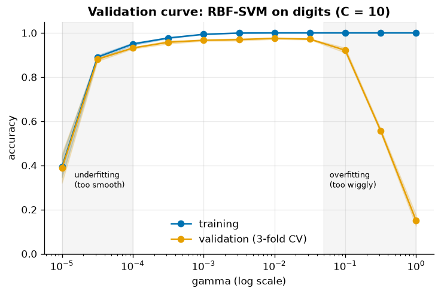
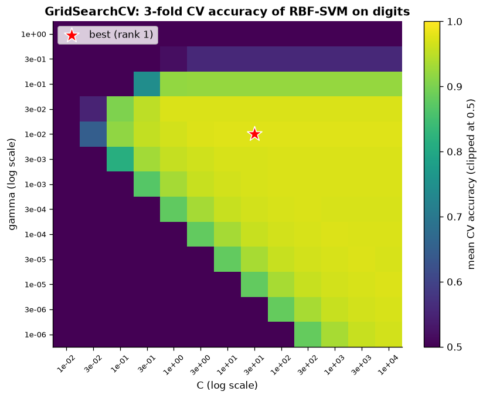
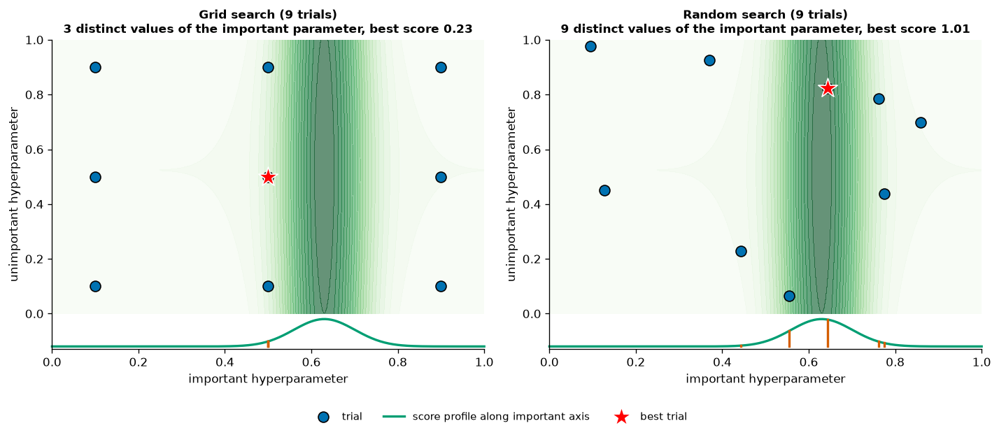
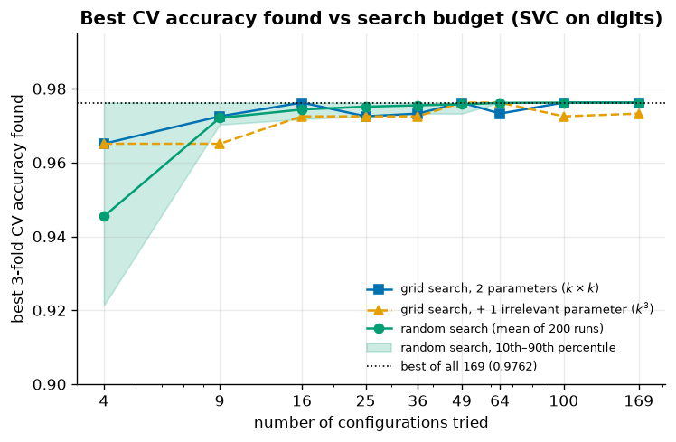
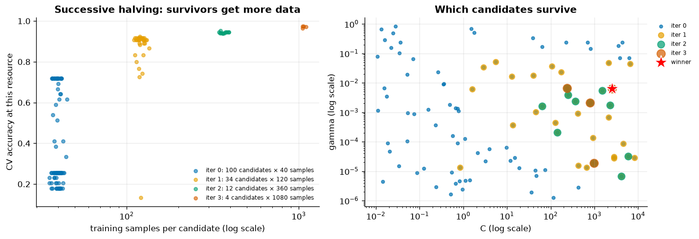
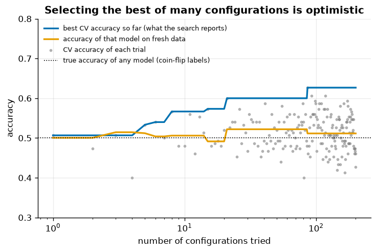
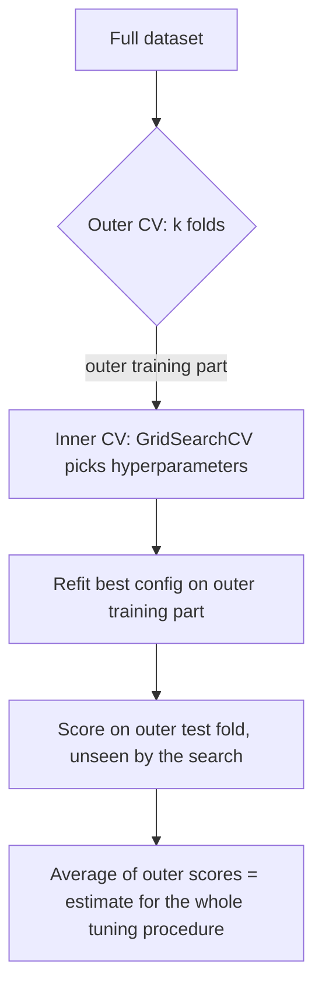
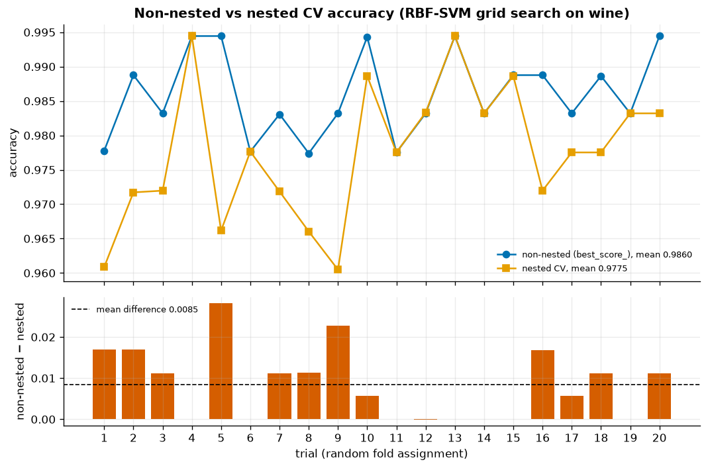
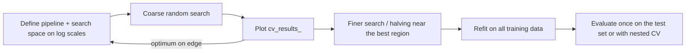

# 09 · Hyperparameter Tuning

> Choose hyperparameters by cross-validated performance, search efficiently (random search and successive halving often beat a grid), and never report the score that selected the model as its expected performance: use nested CV or a held-out test set.

[← Previous](../08-model-evaluation/README.md) · [Course home](../README.md) · [Next →](../10-unsupervised-learning/README.md)

**Notebook:** [`09-hyperparameter-tuning.ipynb`](09-hyperparameter-tuning.ipynb) · **Datasets:** digits, breast cancer, wine (all bundled with sklearn) · **Time:** ~2.5 h

---

## Learning objectives

1. Tell **parameters** (learned by `fit`) apart from **hyperparameters** (set before fitting), and address pipeline hyperparameters as `step__param`.
2. Read a **validation curve** and recognise underfitting and overfitting.
3. Run `GridSearchCV`, analyse `cv_results_`, and visualise a 2-D search as a heat-map.
4. Use `RandomizedSearchCV` with `scipy.stats.loguniform`, and explain **why random search beats grid search** when only a few hyperparameters matter.
5. Use **successive halving** (`HalvingRandomSearchCV`) and compare search budgets.
6. Customise `refit`, e.g. with the **one-standard-error rule**.
7. Explain the **optimistic bias** of `best_score_` and remove it with **nested cross-validation**.

---

## 1 · Parameters vs hyperparameters

| | Parameters | Hyperparameters |
|---|---|---|
| Set by | `fit` (optimisation on training data) | you, before `fit` |
| Examples | `coef_`, `intercept_`, tree thresholds, support vectors | `C`, `gamma`, `max_depth`, `learning_rate`, `n_neighbors` |
| In sklearn | attributes ending in `_` | constructor arguments, `get_params()` |
| Chosen by | minimising training loss | estimated **generalisation** performance (CV) |

Hyperparameters cannot be chosen by training loss, because training loss always prefers the most flexible model. We choose them by cross-validation instead.

Inside a pipeline, a hyperparameter is named `<step>__<param>` (double underscore). `make_pipeline` names each step after its class in lower case:

```python
pipe = make_pipeline(StandardScaler(), LogisticRegression())
pipe.get_params()["logisticregression__C"]        # 1.0
pipe.set_params(logisticregression__C=0.1)
# deeper nesting: "columntransformer__num__imputer__strategy"
```

## 2 · Validation curves

A validation curve shows the training score and the CV score as one hyperparameter varies. Here we use an RBF-SVM on the 8×8 **digits** images (1 797 images, 10 classes), where $K(\mathbf x,\mathbf x')=\exp(-\gamma\lVert\mathbf x-\mathbf x'\rVert^2)$:

```python
train_scores, val_scores = validation_curve(
    Pipeline([("scale", StandardScaler()), ("svc", SVC(C=10))]), X_train, y_train,
    param_name="svc__gamma", param_range=np.logspace(-5, 0, 11), cv=3)
```



*With a small γ the kernel is very wide and the model is almost linear, so it underfits. With a large γ every training point becomes its own island: training accuracy is 100 % and validation accuracy collapses to 15 %. The sweet spot is around γ = 0.01 (CV accuracy 0.976). The useful range spans five orders of magnitude, so always search on a **log scale**.*

## 3 · Grid search

`GridSearchCV` cross-validates **every combination** in a grid. With `refit=True` (the default) it then retrains the best combination on the whole training set, so the search object can `predict` directly.

```python
param_grid = {"svc__C": np.logspace(-2, 4, 13), "svc__gamma": np.logspace(-6, 0, 13)}
grid = GridSearchCV(svc_pipe, param_grid, cv=StratifiedKFold(3, shuffle=True, random_state=42),
                    n_jobs=-1, return_train_score=True).fit(X_train, y_train)
grid.best_params_, grid.best_score_, grid.score(X_test, y_test)
```

13 × 13 = 169 candidates × 3 folds = 507 fits, which took about 28 s. Best: C = 31.6, γ = 0.01, **CV accuracy 0.9762**, test accuracy 0.9822.

`cv_results_` is a dict of arrays. Load it into a DataFrame with `pd.DataFrame(grid.cv_results_)` and look at `mean_test_score`, `std_test_score`, `rank_test_score`, `mean_fit_time` and `mean_train_score`. Six candidates tie for rank 1: γ = 0.01 with any C ≥ 31.6. A tie like that is typical. The top of the score surface is usually a broad plateau, not a sharp peak.



*A diagonal ridge of good models: larger C (weaker regularisation) can be offset by smaller γ (a smoother kernel). The bottom-left corner underfits and the top rows (γ ≥ 0.3) overfit. Always plot the search. If the best cell sits on the edge of the grid, extend the grid.*

## 4 · Random search, and why it beats grid search

`RandomizedSearchCV` draws `n_iter` candidates from **distributions**. For scale parameters, use `scipy.stats.loguniform(a, b)`. It is uniform in $\log$ space, so each decade gets the same share of samples (≈ 1/6 per decade for 10⁻⁶ to 1):

```python
from scipy.stats import loguniform
RandomizedSearchCV(svc_pipe, {"svc__C": loguniform(1e-2, 1e4), "svc__gamma": loguniform(1e-6, 1e0)},
                   n_iter=25, cv=3, random_state=42)
```

Integer parameters use `scipy.stats.randint`, and categorical ones can be given as plain lists.

### Bergstra & Bengio's argument

Usually only a few hyperparameters really matter ("low effective dimensionality"), and we don't know in advance which ones. With a 3 × 3 grid, 9 trials test just **3** distinct values of the important parameter. 9 random trials test **9** distinct values.



*The score depends almost only on the horizontal parameter (green ridge; its profile is drawn below each panel). The grid wastes six of its nine trials repeating the same three x-values and misses the peak (best score 0.23). Random search tries nine different x-values and lands on the ridge (best 1.01).*

### Budget vs best score on the real problem

The full 13 × 13 grid tells us the CV accuracy of every lattice point, so we can simulate searches cheaply. A grid with budget $k^2$ takes $k$ evenly spaced values of each parameter. A random search takes $n$ random lattice points, and we repeat it 200 times. We also add a variant with one *irrelevant* third parameter, which forces a grid to spend $k^3$ trials:

| Budget | Grid (2 params) | Grid (+1 irrelevant) | Random (mean) | Random (10th pct) |
|---|---|---|---|---|
| 4 | 0.9651 | 0.9651 | 0.9454 | 0.9213 |
| 9 | 0.9725 | 0.9651 | 0.9721 | 0.9703 |
| 16 | 0.9762 | 0.9725 | 0.9744 | 0.9718 |
| 25 | 0.9725 | 0.9725 | 0.9751 | 0.9725 |
| 49 | 0.9762 | 0.9762 | 0.9758 | 0.9733 |
| 100 | 0.9762 | 0.9725 | 0.9762 | 0.9762 |
| 169 | 0.9762 | 0.9733 | 0.9762 | 0.9762 |



*With a couple of dozen trials, random search is within about 0.1 points of the best of all 169 configurations, and it keeps improving smoothly as the budget grows. Grid search depends on whether the lattice happens to hit the ridge, so it is not even monotone (16 trials beat 25). An irrelevant parameter wastes a factor k of its budget. Random search's cost does not depend on the number of parameters, and you can stop it at any time.*

The real `RandomizedSearchCV` with 25 continuous candidates found C = 40.4, γ = 0.0177: CV 0.9733, **test 0.9800**, in about 2 s.

> [!TIP]
> Use grid search for 1–2 parameters when you want a picture like the heat-map. Use random search (or halving) for anything larger.

## 5 · Successive halving

Most candidates are clearly bad after a cheap look. **Successive halving** (Jamieson & Talwalkar, 2016; the building block of Hyperband) gives many candidates a small resource, keeps the best $1/\eta$ of them, multiplies the resource by $\eta$, and repeats:

$$
n_i=\Big\lceil\frac{n_0}{\eta^{\,i}}\Big\rceil\ \text{candidates},\qquad r_i=r_0\,\eta^{\,i}\ \text{resource each}.
$$

```python
from sklearn.experimental import enable_halving_search_cv  # noqa: F401 (still experimental)
from sklearn.model_selection import HalvingRandomSearchCV

halving = HalvingRandomSearchCV(svc_pipe, param_distributions, n_candidates=100, factor=3,
                                resource="n_samples", min_resources=40, cv=3, random_state=42)
```

| Iteration | Candidates | Training samples each |
|---|---|---|
| 0 | 100 | 40 |
| 1 | 34 | 120 |
| 2 | 12 | 360 |
| 3 | 4 | 1 080 |



*Left: at 40 samples the scores are crude, but they are good enough to discard the hopeless candidates (many score about 0.2). Survivors get 3× more data at each step. Right: the survivors (larger markers) concentrate on the diagonal ridge from the heat-map. The winner is C = 2 530, γ = 0.0063.*

The resource can also be the number of boosting iterations or trees (`resource="max_iter"` / `"n_estimators"`).

### Budget comparison

| Search | Candidates | CV fits | ≈ full-data fits | Time (s) | Best CV | Test |
|---|---|---|---|---|---|---|
| `GridSearchCV` (13×13) | 169 | 507 | 507 | ~28 | 0.9762 | 0.9822 |
| `RandomizedSearchCV` | 25 | 75 | 75 | ~2.3 | 0.9733 | 0.9800 |
| `HalvingRandomSearchCV` | 100 | 450 | ~37 | ~2.8 | 0.9741 | 0.9822 |

All three reach essentially the same test accuracy (the differences are 0–3 of 450 test digits). Random search used ~15 % of the grid's fits. Halving screened 100 candidates for the cost of about 37 full-data fits. Times vary by machine.

## 6 · `refit` and the one-standard-error rule

`refit` can also be a **callable**. It receives `cv_results_` and returns the index of the candidate to refit. The **one-standard-error rule** takes the *simplest* model whose score is within one standard error of the best:

```python
def one_standard_error(cv_results):
    r = pd.DataFrame(cv_results)
    best = r.mean_test_score.idxmax()
    threshold = r.mean_test_score[best] - r.std_test_score[best] / np.sqrt(n_splits)
    ok = r[r.mean_test_score >= threshold]
    return int(ok.param_logisticregression__C.astype(float).idxmin())   # smallest C = simplest

GridSearchCV(pipe_lr, {"logisticregression__C": np.logspace(-3, 2, 21)}, cv=10, refit=one_standard_error)
```

On breast cancer (logistic regression, 10-fold CV):

| Rule | C | CV accuracy | Test accuracy |
|---|---|---|---|
| argmax (default) | 0.178 | 0.9790 | 0.9860 |
| one-standard-error | 0.056 | 0.9766 | 0.9650 |

The 1-SE rule chose a model regularised 3× more strongly and gave up 0.24 points of CV accuracy. On this particular test set it did worse, but 0.986 vs 0.965 is only 3 of the 143 tumours. The rule is a heuristic that trades a little estimated accuracy for simplicity and stability. It is not guaranteed to win. With a callable `refit`, `best_score_` is undefined, so read the score from `cv_results_["mean_test_score"][search.best_index_]`.

## 7 · Tuning overfits the validation data

`best_score_` is the **maximum** of many noisy estimates, so it is **optimistically biased**. The more configurations you try, the more likely one of them looks good by luck.

Here is an extreme demo. The labels are **coin flips** (150 training samples, 20 noise features). We try 200 random k-NN configurations (random `n_neighbors` and a random feature subset) and keep the best by 5-fold CV:



*The best CV accuracy the search reports rises steadily to **0.627** after 200 configurations. On 2 000 fresh samples the chosen model scores **0.511**, i.e. chance. Nothing was learned. The winner was simply the luckiest configuration.*

> [!WARNING]
> Never report `best_score_` (or any score used to *select* a model, threshold or feature set) as the expected performance. You need data that played **no role in the selection**: a held-out test set, or nested cross-validation.

## 8 · Nested cross-validation



The **inner** loop picks hyperparameters. The **outer** loop evaluates the *whole procedure* ("grid-search an RBF-SVM"). Explicitly, on **wine** (178 wines, 13 chemical features, 3 cultivars):

```python
for tr, te in outer.split(X):
    search = GridSearchCV(pipe, p_grid, cv=inner).fit(X[tr], y[tr])   # the search only sees tr
    outer_scores.append(search.score(X[te], y[te]))
```

| Outer fold | Inner best score | Chosen C | Chosen γ | Outer test score |
|---|---|---|---|---|
| 0 | 0.9790 | 1 | 0.01 | 1.0000 |
| 1 | 0.9859 | 10 | 0.1 | 0.9722 |
| 2 | 0.9861 | 1 | 0.01 | 0.9722 |
| 3 | 0.9931 | 10 | 0.1 | 0.9714 |
| 4 | 0.9861 | 10 | 0.1 | 0.9714 |

Nested estimate: **0.9775 ± 0.0126**. Different outer folds chose different hyperparameters, because nested CV evaluates the *procedure*, not one configuration. Note also that every inner best score is at least as high as the mean outer score. The same computation in one line (identical numbers):

```python
cross_val_score(GridSearchCV(pipe, p_grid, cv=inner), X, y, cv=outer)
```

### Nested vs non-nested over repeated trials

Following scikit-learn's classic example, we repeated both estimates with 20 different random fold assignments (6 × 6 grid, 4 inner and 4 outer folds):



*The non-nested score (`best_score_` of one search over all the data) averages **0.9860**. The nested score averages **0.9775**. The optimistic bias is 0.0085 on average, and the non-nested score was higher in 65 % of trials and never meaningfully lower (the worst case was −0.0001). On an easy dataset the bias is small, but it is systematic. It grows with smaller data, larger search spaces and noisier targets (§7 is the extreme case).*

> [!NOTE]
> **Which model do I deploy?** Nested CV *estimates* performance. It does not produce a model. Afterwards, run the search once on all the data and deploy `search.best_estimator_`. The nested score is your honest estimate of how that procedure performs.

## 9 · Practical tips

A **coarse-to-fine** search on digits: a 4 × 4 log grid (16 candidates) found C = 100, γ = 0.01. A 5 × 5 grid spanning one decade around that point (25 candidates) found C = 31.6, γ = 0.01. Both reach CV 0.9762, the same as the 169-candidate grid, with a quarter of the budget.

| Tip | Why |
|---|---|
| Search scale parameters (`C`, `alpha`, `gamma`, `learning_rate`) on a **log scale** | their effects are multiplicative |
| Tune the few parameters that matter first (SVM: `C`, `gamma`; GBM: `learning_rate`, `max_leaf_nodes`/`max_depth`, `min_samples_leaf`; RF: `max_features`, `min_samples_leaf`) | low effective dimensionality |
| Don't tune `n_estimators` of a random forest. Set it large enough, and use early stopping for boosting | no overfitting risk / automatic |
| Put **all** preprocessing in the pipeline and tune it too | prevents leakage; preprocessing is a hyperparameter |
| Random search or halving for > 2 parameters; a grid for 1–2 when you want a picture | budget independent of dimension |
| Plot the results; widen the range if the optimum is on the edge | the "best" may be outside your grid |
| Consider the 1-SE rule when many candidates tie | prefer the simpler of statistically tied models |
| Report a held-out test or nested-CV score, never `best_score_` | optimistic bias |
| Beyond this course: Bayesian optimisation (Optuna, scikit-optimize), Hyperband | model the score surface to choose the next trial |



---

## Common pitfalls

- **Reporting `best_score_` as the model's performance.** It is optimistic. Use a test set or nested CV.
- **Tuning on the test set**, for example by checking the test score after every change. The test set then becomes part of the validation data.
- **Preprocessing outside the search.** Fitting a scaler, imputer or feature selector on all the data before `GridSearchCV` leaks validation information. Put it in the pipeline.
- **Linear grids for scale parameters.** `C in [1, 2, 3, ..., 10]` never explores 0.01 or 1000.
- **Too-narrow grids.** The best value sits on the edge and nobody notices.
- **Huge grids.** The cost grows as $k^d$ and the optimistic bias grows with the number of candidates.
- **Over-interpreting ties.** Many configurations are within noise of each other (six-way tie in §3).
- **Forgetting `enable_halving_search_cv`.** `HalvingGridSearchCV` and `HalvingRandomSearchCV` fail to import without it.

## Key takeaways

- Hyperparameters are chosen by estimated generalisation performance (CV), never by training loss. Address them as `step__param`.
- Validation curves and search heat-maps show under- and overfitting. Search scale parameters on log scales.
- Random search beats grid search for the same budget when only a few parameters matter. Successive halving screens many candidates cheaply.
- `refit` retrains the chosen configuration on all training data. A callable `refit` enables rules such as one-standard-error.
- `best_score_` is optimistically biased. Nested CV (or an untouched test set) estimates how the whole tuning procedure will perform.

## Exercises

1. **Validation curve for C.** Draw the validation curve of `svc__C` at γ = 10⁻³ on digits. Where does it underfit and where does it overfit? *Hint:* `param_name="svc__C", param_range=np.logspace(-3, 4, 15)`.
2. **Tune gradient boosting.** Use `RandomizedSearchCV` on breast cancer over `learning_rate` (loguniform 0.01–1), `max_leaf_nodes` (randint 4–64) and `min_samples_leaf` (randint 5–50) with 30 candidates. Which parameter matters most? *Hint:* scatter `mean_test_score` against each `param_*` column.
3. **Irrelevant parameters.** Add `svc__tol` (loguniform 10⁻⁵–10⁻²) to the random search and confirm that the best score does not change. What happens to the number of fits of a grid search if you add 4 values of it? *Hint:* multiply.
4. **Optimistic bias vs sample size.** Repeat the noise experiment with n = 50, 150, 500 and 2 000. How does the reported best CV accuracy change? *Hint:* the standard error of an accuracy is about $\sqrt{0.25/n}$.
5. **Nested CV with preprocessing.** Run nested CV on digits with `StandardScaler → PCA → SVC`, tuning `pca__n_components` and `svc__C`. *Hint:* a 3 × 3 grid with 3 inner and 3 outer folds keeps it fast.

## Further reading

- Bergstra & Bengio (2012), "Random search for hyper-parameter optimization", *JMLR* 13.
- Jamieson & Talwalkar (2016), "Non-stochastic best arm identification and hyperparameter optimization"; Li et al. (2018), "Hyperband", *JMLR* 18.
- Cawley & Talbot (2010), "On over-fitting in model selection and subsequent selection bias in performance evaluation", *JMLR* 11.
- Varma & Simon (2006), "Bias in error estimation when using cross-validation for model selection", *BMC Bioinformatics* 7.
- Hastie, Tibshirani & Friedman, *The Elements of Statistical Learning*, ch. 7.10 (cross-validation, including the one-standard-error rule).
- Géron, *Hands-On Machine Learning*, ch. 2 ("Fine-tune your model").
- scikit-learn user guide: [Tuning the hyper-parameters of an estimator](https://scikit-learn.org/stable/modules/grid_search.html), [Validation curves](https://scikit-learn.org/stable/modules/learning_curve.html), [Nested versus non-nested cross-validation](https://scikit-learn.org/stable/auto_examples/model_selection/plot_nested_cross_validation_iris.html), [Successive halving](https://scikit-learn.org/stable/modules/grid_search.html#successive-halving-user-guide).
