# 10 · Unsupervised Learning: Clustering & Dimensionality Reduction

> Find structure without a target: group similar rows with k-means, Gaussian mixtures, DBSCAN and hierarchical clustering, and compress/visualise high-dimensional data with PCA and t-SNE.

[← Previous](../09-hyperparameter-tuning/README.md) · [Course home](../README.md) · [Next →](../11-interpretability/README.md)

**Notebook:** [`10-unsupervised-learning.ipynb`](10-unsupervised-learning.ipynb) · **Datasets:** synthetic blobs & moons (`make_blobs`, `make_moons`), Palmer penguins, handwritten digits (`load_digits`) · **Time:** ~3 h

---

## Learning objectives

By the end of this chapter you can:

1. Implement **k-means** (Lloyd's algorithm + k-means++ seeding) in NumPy and check it against `sklearn.cluster.KMeans`.
2. Choose the number of clusters with the **elbow** curve, **silhouette** scores and **silhouette plots**.
3. Recognise the situations in which k-means fails and reach for **Gaussian mixtures** or **DBSCAN** instead.
4. Build and read a **dendrogram**, explain the four common **linkage** criteria and cut the tree into flat clusters.
5. Implement **PCA via the SVD**, handle the **sign ambiguity** when comparing with scikit-learn, and use scree plots, projections and reconstructions.
6. Explain why PCA needs **standardised** features when units differ.
7. Use **t-SNE** for visualisation — and list what a t-SNE plot does *not* tell you.
8. Use the **Adjusted Rand Index** as a sanity check when ground-truth labels exist.

---

## 1 · What "unsupervised" means

In chapters 05–09 every row had a label $y$ and we learned $f(x)\approx y$. Here we only have $X$. Two big families of questions:

| Question | Task | Algorithms in this chapter |
|---|---|---|
| *Which rows belong together?* | **Clustering** | k-means, Gaussian mixture, DBSCAN, agglomerative |
| *Can I describe each row with fewer numbers?* | **Dimensionality reduction** | PCA (linear), t-SNE (non-linear, visualisation only) |

Because there is no $y$, there is also no test-set accuracy. Evaluation relies on **internal** criteria (inertia, silhouette), **stability** (do results survive re-sampling / re-seeding?) and — above all — **domain sense**. When benchmark labels happen to exist we can additionally use **external** criteria such as the ARI, purely as a sanity check.

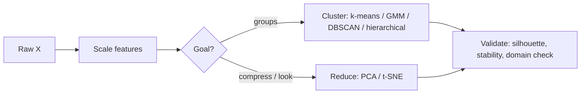

---

## 2 · k-means from scratch

### The objective

k-means chooses $k$ centroids $\mu_1,\dots,\mu_k$ and an assignment $c_i\in\{1..k\}$ of each point to minimise the **inertia** (within-cluster sum of squares):

$$
J(\mu, c) = \sum_{i=1}^{n} \lVert x_i - \mu_{c_i} \rVert^2 .
$$

### Lloyd's algorithm

Minimising $J$ exactly is NP-hard, but alternating two easy sub-problems works well:

1. **Assignment step** — fix the centroids, give each point to its nearest one: $c_i \leftarrow \arg\min_j \lVert x_i-\mu_j\rVert^2$.
2. **Update step** — fix the assignment, move each centroid to the mean of its points: $\mu_j \leftarrow \frac{1}{|C_j|}\sum_{i\in C_j} x_i$ (the mean is exactly the minimiser of a sum of squared distances).

Each step can only lower $J$, and there are finitely many partitions, so the algorithm **always converges — to a local minimum**.

```python
def lloyd(X, C, max_iter=300, tol=1e-8):
    for it in range(max_iter):
        d2 = ((X[:, None, :] - C[None, :, :]) ** 2).sum(axis=2)  # (n, k)
        labels = d2.argmin(axis=1)                                # assignment
        C_new = np.array([X[labels == j].mean(axis=0) for j in range(len(C))])  # update
        if ((C_new - C) ** 2).sum() < tol:
            break
        C = C_new
    return C, labels
```

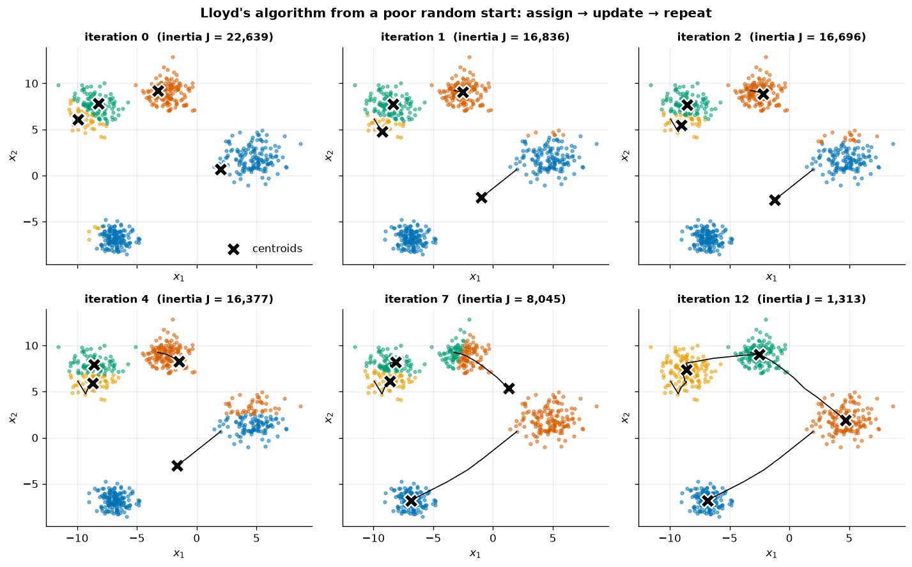
*Starting from a deliberately bad random initialisation (two centroids in the same top-left blob, none in the bottom one), the inertia drops from 22,639 to 1,313 over 12 iterations. The black trails show a centroid "migrating" across empty space to the unclaimed blob — it takes several iterations because it has to be pulled over by the points it gradually captures.*

### k-means++ seeding

Bad starts cost iterations and can trap Lloyd in a poor local minimum. **k-means++** (Arthur & Vassilvitskii, 2007) seeds smartly:

1. Pick the first centre uniformly at random from the data.
2. For every point compute $D(x)^2$, the squared distance to its nearest already-chosen centre.
3. Pick the next centre with probability $D(x)^2 / \sum_{x'} D(x')^2$ — far-away points are likely to be chosen.
4. Repeat until $k$ centres exist, then run Lloyd.

This gives an expected inertia within $O(\log k)$ of optimal. scikit-learn uses it by default, **and** runs several restarts (`n_init`) keeping the best.

### Verifying against scikit-learn

| Check | Result |
|---|---|
| Same initial centres → `KMeans(init=C0, n_init=1)` | centres `allclose`, inertia 1313.330 in both |
| k-means++ with 10 restarts (different RNGs) | inertia 1313.33 in both, ARI between the two partitions = 1.0 |
| Agreement with the true blob labels | ARI = 0.9955 (a few points in overlapping tails) |

> [!NOTE]
> Cluster IDs are arbitrary — "cluster 0" in one run may be "cluster 2" in another (**label switching**). Never compare labels with `==`; compare *partitions* with a relabelling-invariant score such as the Adjusted Rand Index.

---

## 3 · Choosing $k$

Inertia decreases monotonically in $k$ (it is 0 when every point is its own cluster), so "minimise inertia" is not an answer.

**Elbow method.** Plot inertia vs $k$ and look for the knee after which additional clusters buy little.

**Silhouette.** For point $i$ with mean intra-cluster distance $a(i)$ and mean distance to the *nearest other* cluster $b(i)$:

$$
s(i) = \frac{b(i) - a(i)}{\max\{a(i),\, b(i)\}} \in [-1, 1].
$$

$s\approx 1$ → comfortably inside its cluster, $s\approx 0$ → on a boundary, $s<0$ → closer to another cluster than its own. The mean silhouette is a single number to maximise.

| $k$ | 2 | 3 | **4** | 5 | 6 | 8 | 10 |
|---|---|---|---|---|---|---|---|
| inertia | 18 789 | 4 315 | **1 313** | 1 151 | 1 016 | 811 | 666 |
| mean silhouette | 0.592 | 0.751 | **0.774** | 0.659 | 0.565 | 0.481 | 0.344 |

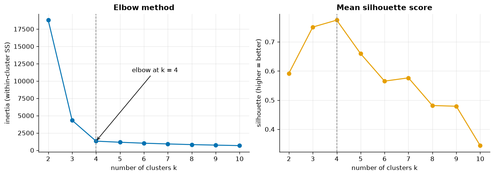
*Both criteria agree on k = 4 here: the inertia curve bends sharply at 4 and the silhouette peaks at 0.774. On real data the elbow is often much softer — which is why you look at several criteria.*

### Silhouette plots

The mean can hide a bad cluster, so plot every $s(i)$, sorted within each cluster:

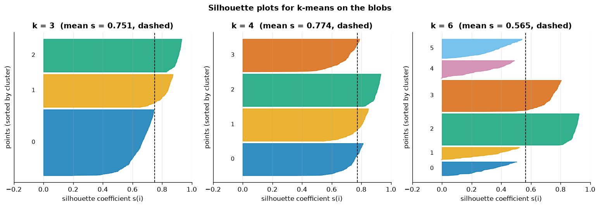
*With k = 3, one "knife" is fat (two real blobs merged) and has lower values. With k = 6 two real blobs are each split in two, producing thin knives whose values rarely exceed 0.5 (mean drops to 0.565). k = 4 gives four similar knives, almost all well above zero.*

> [!TIP]
> Silhouette uses Euclidean distances like k-means, so it also inherits k-means' bias toward convex, similarly sized clusters. On moons-like data it can prefer the "wrong" answer. Use it as evidence, not as a verdict.

---

## 4 · When k-means fails — Gaussian mixtures and DBSCAN

Each k-means point goes to the nearest centroid, so the boundaries between clusters are **straight lines halfway between centroids** (a Voronoi diagram). Implicit assumptions: clusters are convex, roughly spherical, of similar spread.

| Method | Model | Needs $k$ | Shapes it can find | Extras |
|---|---|---|---|---|
| **k-means** | nearest centroid | yes | convex, isotropic, similar spread | fast, scales to millions |
| **Gaussian mixture** | $p(x)=\sum_j \pi_j\,\mathcal N(x\mid\mu_j,\Sigma_j)$, fitted with EM | yes | ellipses of any size & orientation | soft (probabilistic) membership, BIC for choosing $k$ |
| **DBSCAN** | a *core* point has ≥ `min_samples` neighbours within radius `eps`; clusters are connected core regions | no | arbitrary shapes | flags **noise** (label −1); sensitive to `eps` and scale |

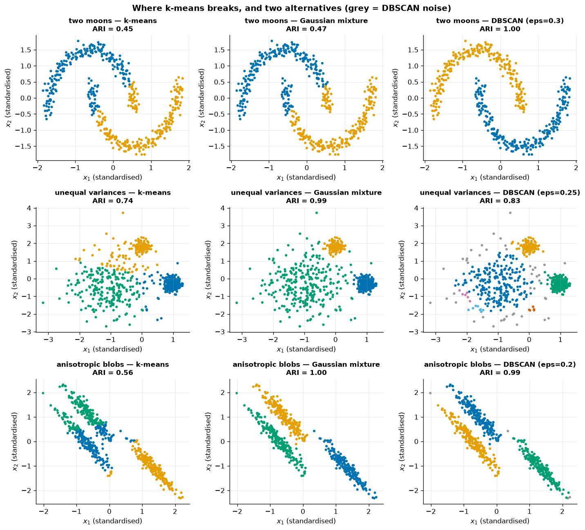
*Rows are datasets, columns methods; titles show the ARI with the generating labels. Grey points are DBSCAN "noise".*

| ARI | k-means | Gaussian mixture | DBSCAN |
|---|---|---|---|
| two moons | 0.450 | 0.472 | **1.000** |
| unequal variances | 0.736 | **0.993** | 0.834 |
| anisotropic blobs | 0.564 | **1.000** | 0.990 |

- **Moons** are not convex: only density-based DBSCAN follows the crescents.
- **Unequal variances**: the halfway boundary makes k-means hand the wide cluster's outskirts to the compact neighbours; a GMM learns a separate covariance per component. DBSCAN, with a single `eps`, splits the sparse cluster into fragments and noise.
- **Anisotropic** (stretched) clusters break the "round" assumption; full-covariance GMMs model them exactly.

> [!WARNING]
> DBSCAN's `eps` is a distance, so it is meaningless without **scaling** (we standardised first), and a single `eps` cannot fit clusters of very different density. HDBSCAN (`sklearn.cluster.HDBSCAN`) relaxes this.

---

## 5 · Hierarchical (agglomerative) clustering

Start with $n$ singleton clusters and repeatedly **merge the two closest clusters** until one remains. The merge history is a binary tree, the **dendrogram**; the height of each merge is the distance at which it happened.

### Linkage: the distance between two *sets*

| Linkage | $d(A,B)$ | Tends to produce |
|---|---|---|
| **single** | $\min_{a\in A,b\in B}\lVert a-b\rVert$ | long chains; finds non-convex shapes but "chains" through bridges and outliers |
| **complete** | $\max_{a,b}\lVert a-b\rVert$ | compact clusters of similar diameter; sensitive to outliers |
| **average** (UPGMA) | $\frac{1}{\lvert A\rvert\lvert B\rvert}\sum_{a,b}\lVert a-b\rVert$ | a compromise |
| **ward** | increase in total within-cluster SS caused by merging $A$ and $B$ | k-means-like compact clusters; the usual default (Euclidean only) |

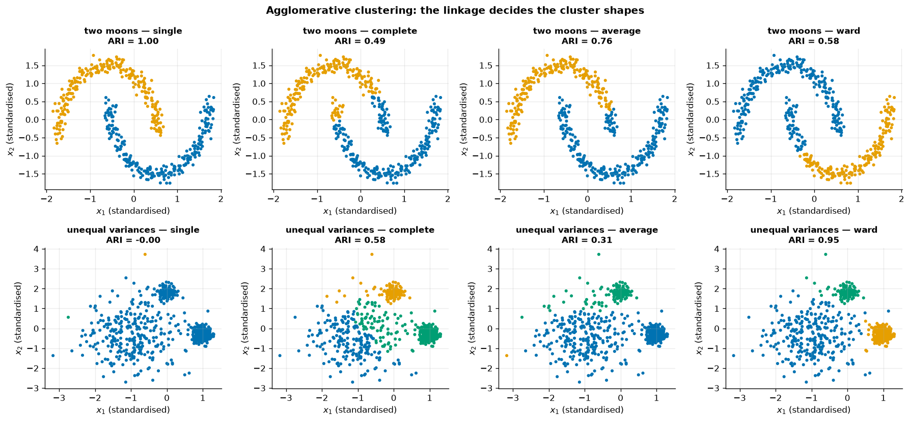
*Single linkage recovers the moons perfectly — chaining is exactly what connects a crescent — but on the unequal-variance data it lumps almost everything together and returns single outlier points as "clusters" (ARI ≈ 0). Ward behaves like k-means: robust on blobs, wrong on moons.*

### Reading and cutting a dendrogram

We cluster the four standardised penguin measurements (bill length, bill depth, flipper length, body mass; 342 birds) with Ward linkage using SciPy:

```python
from scipy.cluster.hierarchy import linkage, dendrogram, fcluster
Z = linkage(X_std, method="ward")         # (n-1) x 4 merge table
dendrogram(Z, truncate_mode="lastp", p=30)
labels = fcluster(Z, t=cut_height, criterion="distance")
```

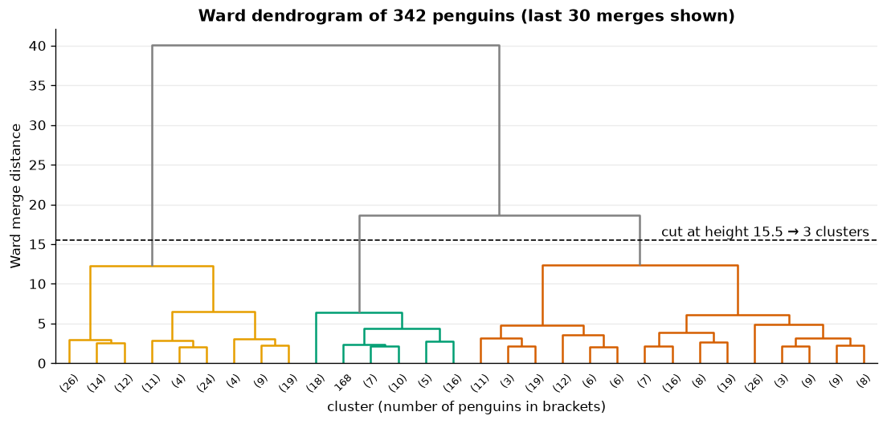
*The last three merges happen at heights 12.35, 18.59 and 40.06. The big jumps above 12.35 suggest 2–3 natural groups; cutting at 15.5 (halfway between the 3-cluster and 2-cluster merges) yields three clusters. Bracketed numbers are the sizes of collapsed sub-trees.*

`AgglomerativeClustering(n_clusters=3, linkage="ward")` gives exactly the same partition (ARI = 1.0 vs the SciPy cut). Compared with the species we never used:

| species \ cluster | 0 | 1 | 2 |
|---|---|---|---|
| Adelie | 151 | 0 | 0 |
| Chinstrap | 11 | 0 | 57 |
| Gentoo | 0 | 123 | 0 |

ARI = 0.916 — the unsupervised grouping essentially rediscovers the species, with 11 Chinstraps landing with the Adelies.

> [!TIP]
> Agglomerative clustering needs the pairwise distance structure, so it is $O(n^2)$ memory — fine for thousands of rows, not for millions. Its big advantage: one fit gives you **every** $k$ via different cuts.

---

## 6 · PCA from scratch via the SVD

### The idea

PCA finds orthonormal directions $w_1, w_2, \dots$ such that projecting the data onto $w_1$ has maximal variance, $w_2$ has maximal variance among directions orthogonal to $w_1$, and so on.

### The math

Centre the data, $X_c = X - \bar x$, and take the thin **singular value decomposition**:

$$
X_c = U\,\Sigma\,V^\top, \qquad \Sigma=\operatorname{diag}(\sigma_1\ge\sigma_2\ge\dots).
$$

Then the covariance matrix is $\frac{1}{n-1}X_c^\top X_c = V\,\frac{\Sigma^2}{n-1}\,V^\top$, so

- the rows of $V^\top$ are the **principal axes** (`components_`);
- $\lambda_j=\sigma_j^2/(n-1)$ is the variance along axis $j$ (`explained_variance_`);
- the **explained variance ratio** is $\lambda_j/\sum_l\lambda_l$;
- the **scores** are $Z = X_c V_k = U_k\Sigma_k$ (`transform`);
- the **reconstruction** is $\hat X = Z V_k^\top + \bar x$ (`inverse_transform`), the best rank-$k$ approximation of $X$ in squared error (Eckart–Young theorem).

```python
class PCAScratch:
    def fit(self, X):
        self.mean_ = X.mean(axis=0)
        U, S, Vt = np.linalg.svd(X - self.mean_, full_matrices=False)
        var = S**2 / (X.shape[0] - 1)
        self.components_ = Vt[:self.n_components]
        self.explained_variance_ratio_ = (var / var.sum())[:self.n_components]
        return self
    def transform(self, X):         return (X - self.mean_) @ self.components_.T
    def inverse_transform(self, Z): return Z @ self.components_ + self.mean_
```

> [!IMPORTANT]
> **Sign ambiguity.** If $w$ is a principal axis, so is $-w$: flipping a column of $U$ and the matching row of $V^\top$ leaves $U\Sigma V^\top$ unchanged. scikit-learn applies a deterministic `svd_flip` convention; raw LAPACK output does not. On digits, components 1, 6 and 7 of our implementation came out with the opposite sign. Align with `signs = np.sign((ours * sk).sum(axis=1))` before comparing — afterwards components, explained variance (ratio), `transform` and `inverse_transform` all match sklearn (`np.allclose` → `True`).

### How many components? The scree plot

On the 64-pixel digits:

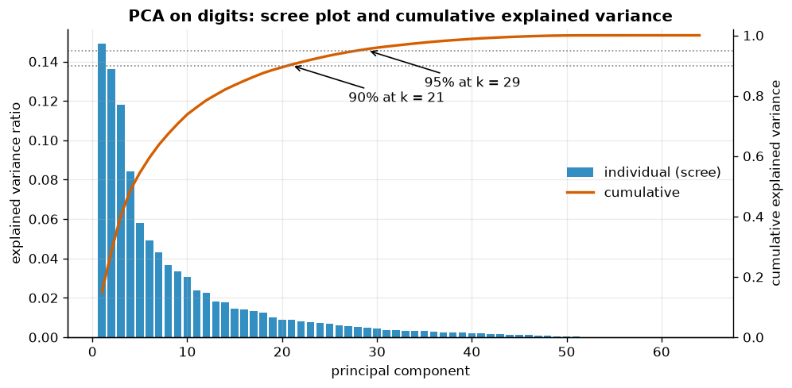
*PC1 explains 14.9 % and PC2 13.6 % of the variance (28.5 % together). 21 components reach 90 % and 29 reach 95 %. There is no sharp elbow — typical for images.*

Common rules: keep enough components for 90–95 % of the variance; look for the elbow; or — best when PCA is preprocessing — **tune $k$ by cross-validation** of the downstream model.

### Reconstruction

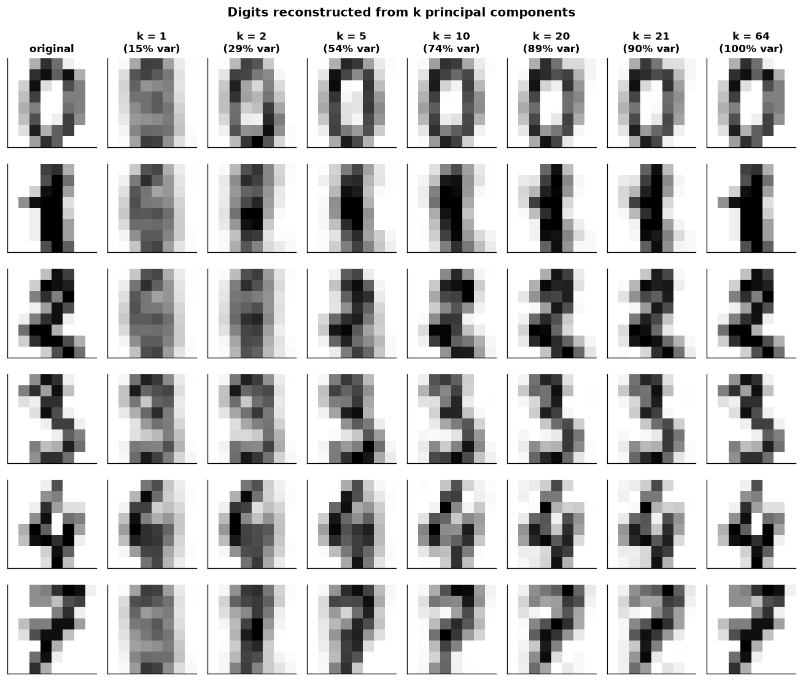
*With 1–2 components every image looks like a blurry "average digit"; at 10 components most are recognisable; at 21 (90 % variance) they are nearly perfect. Mean squared error per pixel falls from 13.42 (k = 2) to 4.91 (k = 10) to 1.82 (k = 21) and 0 (k = 64).*

This is PCA as **lossy compression**: 21 numbers instead of 64 per image. Reconstruction error is also a handy anomaly score — unusual inputs reconstruct badly.

---

## 7 · Why scaling matters for PCA

PCA maximises **variance**, and variance depends on units. Penguin body mass is in grams (std ≈ 800) while bills are in millimetres (std ≈ 2–5), so without scaling:

| Loading | PC1 raw | PC1 standardised | PC2 standardised |
|---|---|---|---|
| bill_length_mm | 0.004 | 0.455 | 0.597 |
| bill_depth_mm | −0.001 | −0.400 | 0.798 |
| flipper_length_mm | 0.015 | 0.576 | 0.002 |
| body_mass_g | **1.000** | 0.548 | 0.084 |

Raw PC1 "explains" 99.99 % of the variance — but it is just `body_mass_g` re-labelled. After `StandardScaler` (PCA on the **correlation** matrix), PC1 (68.8 %) is an overall "size" axis mixing all four features and PC2 (19.3 %) is mostly bill shape.

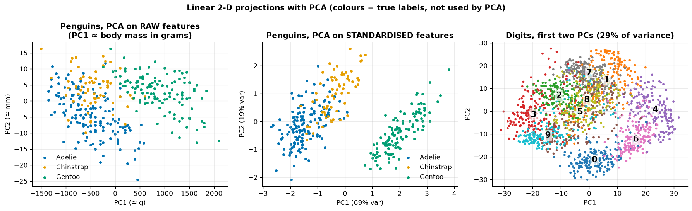
*Left: unscaled PCA is a 1-D ruler of body mass. Middle: standardised PCA separates Gentoo cleanly and partly separates Adelie from Chinstrap. Right: the first two PCs of digits (28.5 % of the variance) separate 0, 4, 6, 3 but pile the other digits on top of each other.*

```python
from sklearn.pipeline import make_pipeline
pca_std = make_pipeline(StandardScaler(), PCA(n_components=2)).fit(X_train)
```

> [!NOTE]
> Don't standardise when all features already share a meaningful unit and scale — e.g. pixel intensities (0–16 in digits). Standardising would blow up nearly-constant border pixels to the same importance as the informative centre pixels.

---

## 8 · t-SNE: non-linear maps for visualisation

**t-SNE** (van der Maaten & Hinton, 2008) turns distances into neighbour probabilities and tries to make the 2-D neighbour probabilities match:

- In the original space: $p_{j\mid i} \propto \exp(-\lVert x_i-x_j\rVert^2/2\sigma_i^2)$, symmetrised into $p_{ij}$. Each bandwidth $\sigma_i$ is set so that the neighbour distribution has a fixed **perplexity** $2^{H(P_i)}$ — roughly "the effective number of neighbours".
- In the map: a heavy-tailed Student-t kernel $q_{ij}\propto(1+\lVert y_i-y_j\rVert^2)^{-1}$, which lets dissimilar points sit far apart and avoids crowding.
- Minimise $\mathrm{KL}(P\Vert Q)=\sum_{i\ne j}p_{ij}\log\frac{p_{ij}}{q_{ij}}$ by gradient descent (Barnes–Hut approximation, $O(n\log n)$ per iteration).

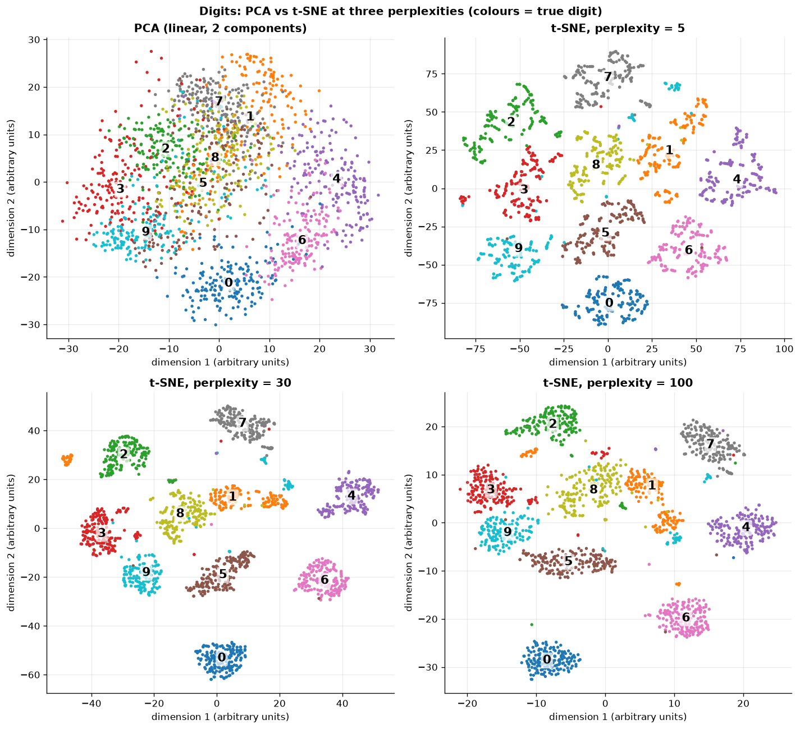
*Top-left: linear PCA mixes most digits. t-SNE separates all ten classes. Perplexity 5 fragments digits into many small islands; 30 (the default) gives compact groups; 100 preserves a bit more global arrangement and produces rounder, more uniform blobs. Note the small detached islands (e.g. some 1s, 9s) — sub-styles of writing.*

### How (not) to read a t-SNE plot

- **Cluster sizes are meaningless.** Adaptive $\sigma_i$ equalise densities: a tight and a diffuse cluster come out the same size.
- **Distances between clusters are barely meaningful.** Global layout depends on perplexity, initialisation and seed.
- **It is stochastic.** Another `random_state` gives a rotated/reflected/re-arranged map.
- **It is non-parametric.** There is no `transform` for new points — you must refit on the combined data.
- **Perplexity is a real hyperparameter.** Always look at several values.
- **Don't cluster the map and then call those clusters "discovered".**

| | PCA | t-SNE |
|---|---|---|
| Type | linear projection | non-linear embedding |
| Preserves | global variance, large distances | local neighbourhoods |
| New data | `transform()` | must refit (non-parametric) |
| Deterministic | yes (up to sign) | no (seed-dependent) |
| Speed | one SVD | slow iterative optimisation |
| Typical use | preprocessing, compression, denoising, quick look | visualisation only |

> [!TIP]
> A common recipe for large, high-dimensional data: PCA to ~50 dimensions (fast, removes noise), then t-SNE (or UMAP) on those 50 for the picture.

---

## 9 · Evaluating clusters against labels (sanity check)

The **Adjusted Rand Index** compares two partitions by counting pairs of points that are together/apart in both, corrected for chance:

$$
\text{ARI} = \frac{\text{RI}-\mathbb E[\text{RI}]}{\max\text{RI}-\mathbb E[\text{RI}]}, \qquad \text{ARI}=1 \text{ identical},\ \approx 0 \text{ random}.
$$

It is invariant to label permutations and to the number of clusters differing. On digits (10 clusters, digit labels only used for scoring):

| Pipeline | ARI vs digit | Silhouette (own space) |
|---|---|---|
| k-means, raw 64 pixels | 0.667 | 0.182 |
| k-means on PCA(20) | 0.670 | 0.213 |
| Ward agglomerative, raw | 0.794 | 0.178 |
| GMM (diagonal) on PCA(20) | 0.607 | 0.202 |
| k-means on t-SNE(30) map ⚠ | 0.883 | 0.639 |

- PCA to 20 dimensions barely changes k-means' ARI while making it cheaper.
- Ward beats k-means here even though its silhouette is lower — internal and external criteria can disagree.
- Clustering the t-SNE map scores best, but that pipeline can't embed new points and its silhouette is inflated by construction. It is a curiosity, not a method.

> [!WARNING]
> The "true" labels are just *one* valid grouping. A clustering that splits 1s written with and without a base stroke is not wrong — it may just answer a different question. In real unsupervised work you won't have labels at all.

---

## Common pitfalls

| Pitfall | Why it hurts | Fix |
|---|---|---|
| Clustering / PCA on unscaled features | the largest-unit feature dominates distances and variance | `StandardScaler` in a pipeline (unless units are shared, e.g. pixels) |
| Trusting one k-means run | local minima | k-means++ and `n_init ≥ 10` |
| Picking $k$ from inertia alone | always decreases | elbow + silhouette + domain knowledge (+ BIC for GMMs) |
| Using k-means for elongated / nested / density-varying clusters | Voronoi boundaries | GMM, DBSCAN/HDBSCAN, single-linkage |
| Comparing cluster IDs across runs | label switching | ARI / contingency tables |
| Comparing PCA loadings across tools | sign ambiguity | align signs; interpret magnitudes and relative signs |
| Reading distances / sizes in t-SNE | not preserved | treat as a neighbourhood picture only; try several perplexities & seeds |
| Fitting PCA on the full data before a train/test split | leakage (small, but real) | put PCA inside the `Pipeline` |

---

## Key takeaways

- **k-means** alternates *assign to nearest centroid* and *move centroid to mean*; it converges to a local minimum of the inertia, so seed with **k-means++** and restart.
- Choose $k$ with the **elbow** curve, **silhouette** scores and silhouette plots — then sanity-check with domain knowledge.
- k-means assumes round, similar clusters. **GMMs** fit ellipses of different spread; **DBSCAN** fits arbitrary shapes and flags noise.
- **Hierarchical clustering** gives a whole tree; the **linkage** controls shapes (single = chains, ward = compact). Cut where merge heights jump.
- **PCA = SVD of centred data**; explained variance ratio $=\sigma_j^2/\sum\sigma^2$; components are unique only up to sign; **scale** features with different units.
- **t-SNE** preserves local neighbourhoods for visualisation; cluster sizes, gaps and positions are not interpretable.
- The **ARI** against known labels is a useful sanity check — not the goal.

---

## Exercises

1. **Bad seeds.** Run the from-scratch `lloyd` from 50 random (non-++) initialisations on the blobs with $k=4$ and plot the histogram of final inertias; repeat with k-means++.
   *Hint:* count how often each reaches the minimum inertia (1313.33).
2. **Mini-batch.** Time `KMeans` vs `MiniBatchKMeans` on `make_blobs(n_samples=200_000)`. How much inertia do you lose?
   *Hint:* use `time.perf_counter()` and compare `inertia_` on the same data.
3. **GMM model selection.** Choose the number of GMM components for the unequal-variance data with BIC.
   *Hint:* `GaussianMixture(n).fit(X).bic(X)` for `n` in 1..8 — lower is better.
4. **PCA as preprocessing.** Build `Pipeline([StandardScaler(), PCA(k), LogisticRegression(max_iter=2000)])` on digits and plot 5-fold CV accuracy against $k$.
   *Hint:* `GridSearchCV` over `pca__n_components`; accuracy saturates long before 64.
5. **t-SNE stability.** Re-run t-SNE (perplexity 30) with three `random_state`s. What stays the same, what changes?
   *Hint:* compare which digits are neighbours vs where clusters sit on the canvas.

---

## Further reading

- James, Witten, Hastie & Tibshirani, *An Introduction to Statistical Learning* (2nd ed.), ch. 12 "Unsupervised Learning".
- Hastie, Tibshirani & Friedman, *The Elements of Statistical Learning*, ch. 14.3 (clustering) and 14.5 (PCA).
- Géron, *Hands-On Machine Learning* (3rd ed.), ch. 8 "Dimensionality Reduction" and ch. 9 "Unsupervised Learning Techniques".
- Arthur & Vassilvitskii (2007), "k-means++: The Advantages of Careful Seeding", *SODA*.
- Ester, Kriegel, Sander & Xu (1996), "A density-based algorithm for discovering clusters in large spatial databases with noise" (DBSCAN), *KDD*.
- Rousseeuw (1987), "Silhouettes: a graphical aid to the interpretation and validation of cluster analysis", *J. Comput. Appl. Math.* 20.
- van der Maaten & Hinton (2008), "Visualizing Data using t-SNE", *JMLR* 9.
- Wattenberg, Viégas & Johnson (2016), ["How to Use t-SNE Effectively"](https://distill.pub/2016/misread-tsne/), *Distill*.
- Hubert & Arabie (1985), "Comparing partitions" (Adjusted Rand Index), *Journal of Classification* 2.
- scikit-learn user guide: [Clustering](https://scikit-learn.org/stable/modules/clustering.html), [Decomposition (PCA)](https://scikit-learn.org/stable/modules/decomposition.html), [Manifold learning](https://scikit-learn.org/stable/modules/manifold.html).
