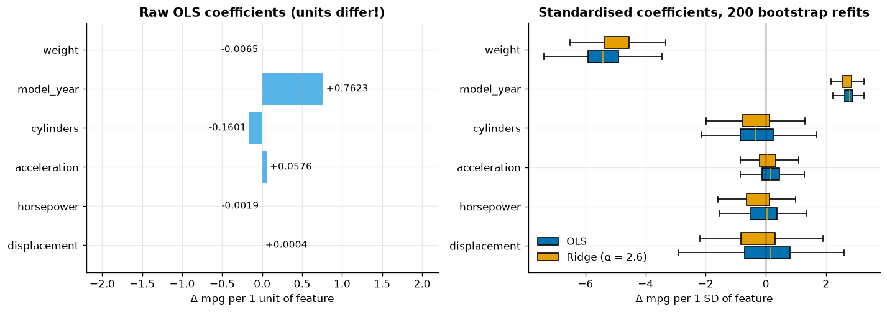
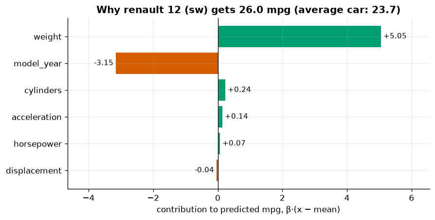
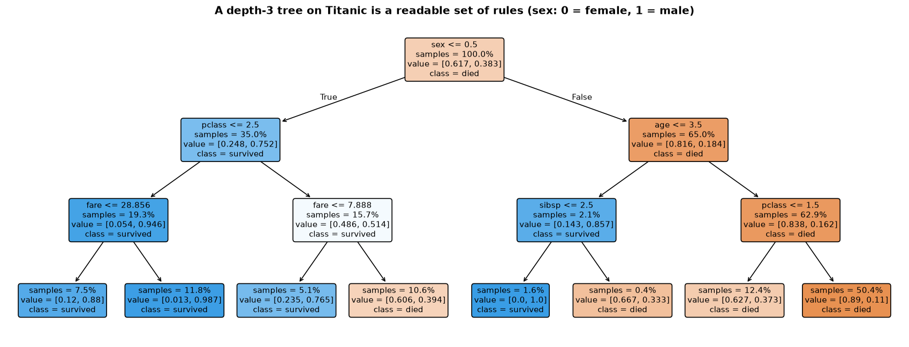
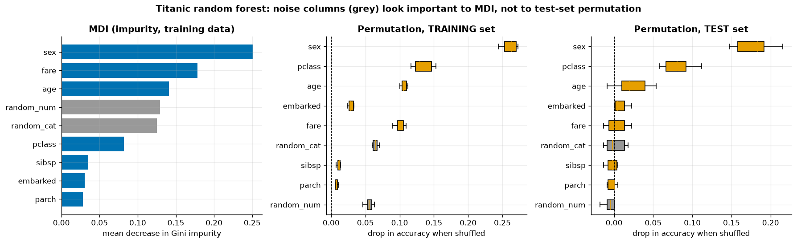
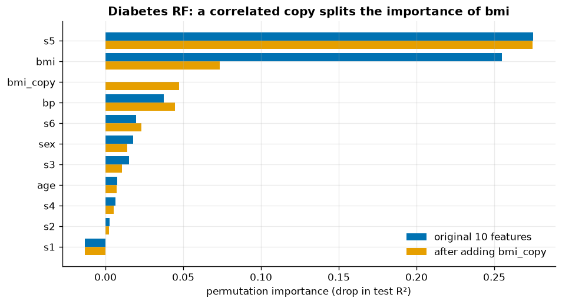
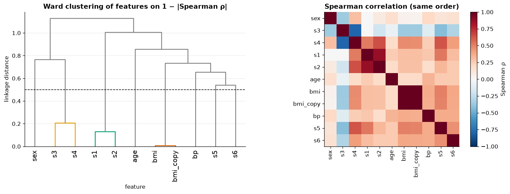
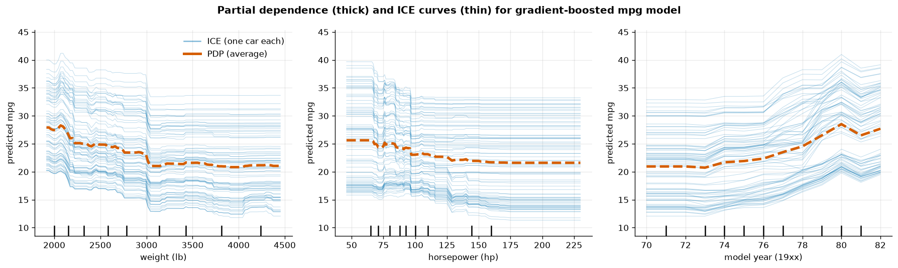
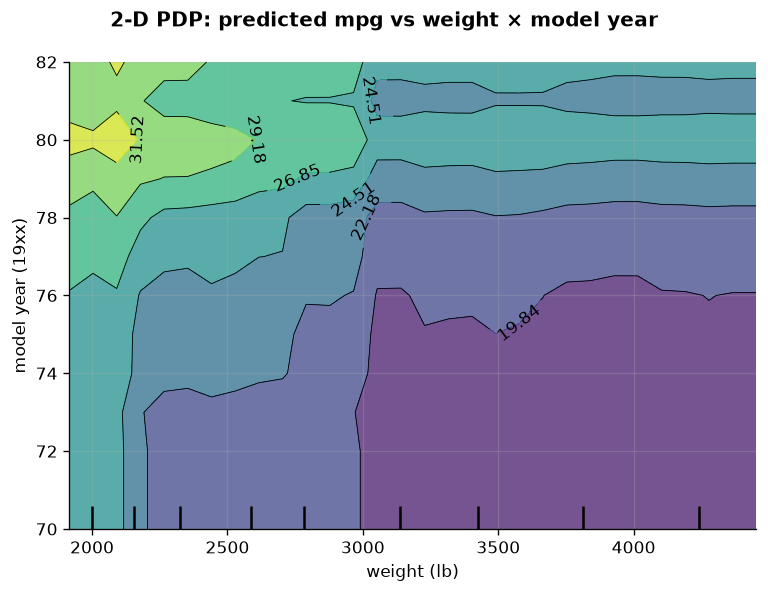
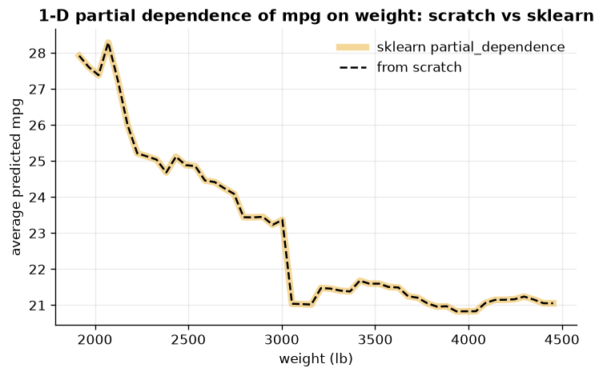
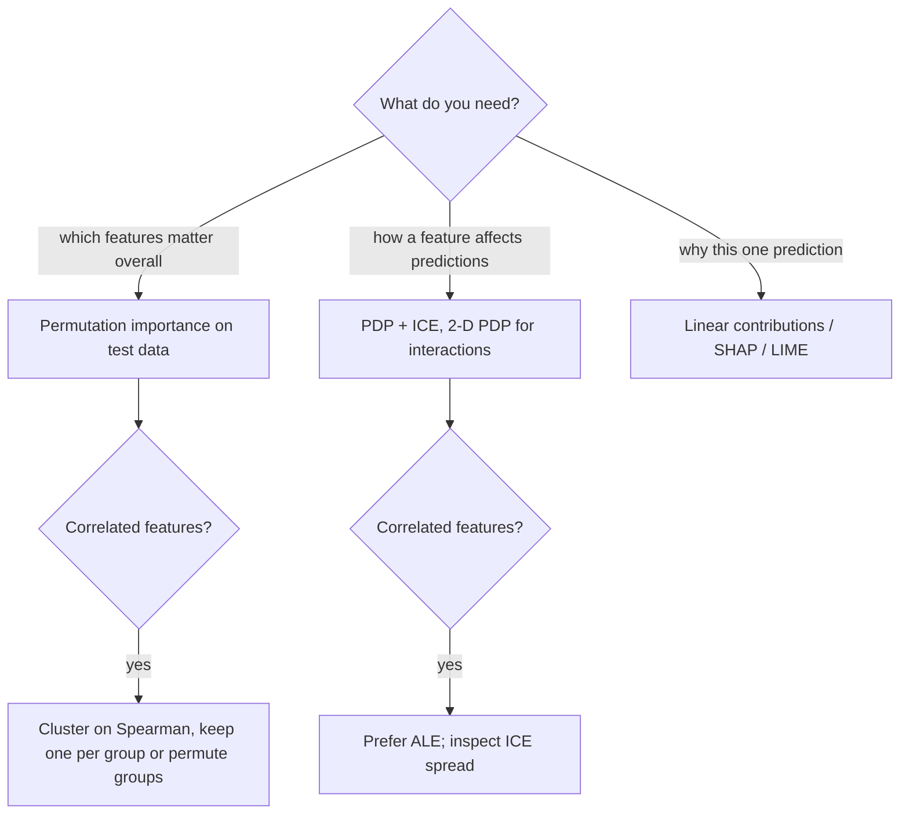

# 11 · Interpretability

> Ask a fitted model *why*: read coefficients and trees correctly, measure feature importance without being fooled, and visualise how predictions depend on features with partial dependence and ICE curves.

[← Previous](../10-unsupervised-learning/README.md) · [Course home](../README.md) · [Next →](../12-capstone-concrete-strength/README.md)

**Notebook:** [`11-interpretability.ipynb`](11-interpretability.ipynb) · **Datasets:** Auto MPG (`mpg.csv`), Titanic (`titanic.csv`), diabetes (`load_diabetes`) · **Time:** ~2.5 h

---

## Learning objectives

By the end of this chapter you can:

1. Place any interpretability method on the **global/local** and **intrinsic/post-hoc** axes.
2. Interpret linear coefficients on **standardised** features and recognise instability caused by **correlated features**.
3. Explain — and demonstrate — why **impurity-based (MDI) importance** is biased toward high-cardinality / continuous features.
4. Implement **permutation importance** from scratch, reproduce `sklearn.inspection.permutation_importance` exactly, and read its boxplots.
5. Diagnose how **correlated features** distort permutation importance, and fix it by clustering features on Spearman correlation.
6. Draw and interpret **partial dependence (PDP)**, **ICE** and **2-D PDP** plots, and compute a PDP from scratch.
7. Know where **SHAP** and **LIME** fit and what they have in common with the tools above.

---

## 1 · Why, and what kind of, interpretability?

Reasons to open the black box: **debugging** (is the model using a leaky or nonsensical feature?), **trust** (does it agree with domain knowledge?), **compliance** (a customer is entitled to an explanation), and **science** (what drives the outcome — carefully!).

| | **Global** — how does the model behave overall? | **Local** — why *this* prediction? |
|---|---|---|
| **Intrinsic** (read off the model) | linear coefficients, the rules of a small tree | $\beta_j(x_j-\bar x_j)$ contributions, a tree's decision path |
| **Post-hoc** (probe any model $\hat f$) | permutation importance, partial dependence (PDP) | ICE curves, SHAP values, LIME |

> [!IMPORTANT]
> Every method in this chapter explains the **model**, not the **world**. "The model relies on feature $j$" does **not** imply "$j$ causes $y$". A proxy feature (e.g. postcode for income) can be highly important without any causal role.

---

## 2 · Linear models: coefficients and their pitfalls

For $\hat y=\beta_0+\sum_j\beta_jx_j$, $\beta_j$ is the change in prediction when $x_j$ increases by **one unit** with **all other features held fixed**. Both parts of that sentence hide a pitfall. We predict `mpg` for 392 cars (294 train / 98 test) from six numeric features; test $R^2 = 0.799$.

### Pitfall 1 — units

| Feature | raw coef (mpg per unit) | standardised coef (mpg per SD) |
|---|---|---|
| cylinders | −0.1601 | −0.274 |
| displacement | +0.0004 | +0.039 |
| horsepower | −0.0019 | −0.073 |
| weight | **−0.0065** | **−5.426** |
| acceleration | +0.0576 | +0.164 |
| model_year | +0.7623 | +2.779 |

The raw `weight` coefficient looks negligible only because a pound is a tiny unit (SD ≈ 842 lb). Standardising ($z_j=(x_j-\bar x_j)/s_j$) makes coefficients comparable:

$$
\beta^{\text{std}}_j=\beta^{\text{raw}}_j\,s_j \quad(\text{verified in the notebook: "raw × SD" equals the standardised coefficient}).
$$

Per standard deviation, **weight** (−5.4 mpg) and **model year** (+2.8 mpg) dominate.

### Pitfall 2 — correlated features

`cylinders`, `displacement`, `horsepower` and `weight` all measure "engine/car size": pairwise correlations are 0.85–0.96. "Hold the others fixed" then describes cars that do not exist, and OLS can trade one coefficient against another with almost no change in fit. A **bootstrap** (200 refits on resampled training sets) makes the instability visible:

| Feature | OLS mean | OLS 95 % CI | OLS sign flips | Ridge 95 % CI |
|---|---|---|---|---|
| cylinders | −0.32 | [−1.79, +1.38] | 35 % | [−1.54, +0.95] |
| displacement | +0.09 | [−2.06, +2.24] | 45.5 % | [−1.89, +1.45] |
| horsepower | −0.06 | [−1.30, +1.00] | 51 % | [−1.48, +0.65] |
| weight | −5.41 | [−6.84, −4.05] | 0 % | [−6.18, −3.83] |
| acceleration | +0.19 | [−0.54, +1.01] | 34.5 % | [−0.62, +0.78] |
| model_year | +2.77 | [+2.29, +3.24] | 0 % | [+2.25, +3.18] |


*Left: raw coefficients are dominated by the unit of each feature. Right: standardised coefficients over 200 bootstrap refits. `weight` and `model_year` are rock-solid; the correlated engine-size features have boxes straddling zero and change sign in 35–51 % of the refits. Ridge (α = 2.6, chosen by CV) narrows the intervals by sharing the effect among them.*

> [!TIP]
> With correlated features, interpret the **group** ("engine size lowers mpg"), not the individual coefficient. Regularisation (Ridge) stabilises coefficients; dropping redundant features or combining them (e.g. PCA, a single "size" index) makes the model easier to read.

### A local, intrinsic explanation

A linear prediction decomposes **exactly** into contributions relative to the average car:

$$
\hat y(x)=\underbrace{\beta_0+\textstyle\sum_j\beta_j\bar x_j}_{\text{average prediction}}+\sum_j\underbrace{\beta_j(x_j-\bar x_j)}_{\text{contribution of }j}.
$$


*The Renault 12 (sw) is predicted at 26.0 mpg (actual 26.0) vs 23.7 for the average car: its low weight adds +5.05 mpg, while being an older model (1970s) costs −3.15. This additive decomposition is exactly what SHAP values reduce to for a linear model with independent features.*

---

## 3 · Trees: intrinsically interpretable — when small

A depth-3 tree is a handful of if/else rules anyone can audit.


*Each box shows the split, the share of training passengers reaching it, and the class proportions [died, survived]. The rules read like history: women (sex = 0) in 1st/2nd class survived 95 % of the time; men older than 3.5 years in 2nd/3rd class survived 11 % of the time. Test accuracy: 0.785.*

Beyond depth ≈ 4 the rules stop being readable, and forests or boosted ensembles of hundreds of deep trees are not interpretable by inspection. We need post-hoc tools.

---

## 4 · Impurity-based importance (MDI) and its bias

`RandomForestClassifier.feature_importances_` is the **Mean Decrease in Impurity**: for every node that splits on feature $j$, the weighted decrease in Gini impurity, summed over the tree, averaged over trees, normalised to 1:

$$
\text{MDI}_j=\frac1T\sum_{t=1}^T\ \sum_{\substack{v\in t\\ \text{split on } j}}\frac{n_v}{n}\,\Delta\text{Gini}(v).
$$

It is free (computed during training) — and flawed:

1. It is measured on the **training** data, so it rewards features the forest used to **overfit**.
2. Features with **many candidate split points** (continuous, high-cardinality categoricals) get more chances to produce a split that looks good by luck.

**Experiment.** Add two columns of pure noise to Titanic: `random_num` (standard normal) and `random_cat` (a categorical with 100 random levels, ordinal-encoded). Fit a default random forest (200 fully grown trees) in a `Pipeline` with imputation and encoding.

| Feature | MDI importance |
|---|---|
| sex | 0.250 |
| fare | 0.178 |
| age | 0.141 |
| **random_num** | **0.129** |
| **random_cat** | **0.125** |
| pclass | 0.082 |
| sibsp | 0.035 |
| embarked | 0.030 |
| parch | 0.028 |

The forest reaches 100 % training accuracy but 78.5 % test accuracy — and according to MDI, both noise columns matter more than passenger class!

---

## 5 · Permutation importance

**Idea** (Breiman, 2001): if the model relies on feature $j$, destroying the relationship between $x_j$ and $y$ should hurt performance. Destroy it by **shuffling column $j$** of a held-out set, leaving everything else unchanged:

$$
\text{PI}_j = s(\hat f, X, y) - \frac1R\sum_{r=1}^R s\big(\hat f, X^{(\pi_r,j)}, y\big).
$$

Model-agnostic, any metric, no retraining. Computed on **test** data it measures what helps the model **generalise**.

### From scratch

```python
def permutation_importance_scratch(model, X, y, n_repeats=10, random_state=42):
    baseline = model.score(X, y)
    seed = np.random.RandomState(random_state).randint(np.iinfo(np.int32).max + 1)
    importances = np.zeros((X.shape[1], n_repeats))
    for j, col in enumerate(X.columns):
        r = np.random.RandomState(seed)          # same scheme as sklearn
        X_perm, idx = X.copy(), np.arange(len(X))
        for rep in range(n_repeats):
            r.shuffle(idx)
            X_perm[col] = X_perm[col].to_numpy()[idx]
            importances[j, rep] = baseline - model.score(X_perm, y)
    return importances
```

Because we shuffle the **raw DataFrame column** before the pipeline, importances are reported for original features (not one-hot columns). Mimicking sklearn's random-number scheme lets us check the result **exactly**: `np.allclose(ours, sklearn.importances)` → `True`.

| Feature | test-set PI (mean) | std over 10 shuffles |
|---|---|---|
| sex | 0.1794 | 0.0224 |
| pclass | 0.0821 | 0.0187 |
| age | 0.0242 | 0.0201 |
| embarked | 0.0076 | 0.0072 |
| fare | 0.0045 | 0.0124 |
| random_cat | 0.0009 | 0.0118 |
| sibsp | −0.0027 | 0.0061 |
| parch | −0.0040 | 0.0088 |
| random_num | −0.0054 | 0.0056 |


*Grey = pure noise. Left: MDI ranks both noise columns 4th and 5th. Middle: permutation on the training set still credits them (≈ 0.06) — the forest memorised them. Right: on the test set their boxes straddle zero. `fare`, second by MDI, is also ≈ 0 on test data: its information overlaps with `pclass`, and its many split points were mostly used to overfit.*

> [!TIP]
> Read the **spread**, not just the mean. A box that crosses zero means the feature is indistinguishable from noise for this model. Small negative values are just noise (the shuffled column happened to help by chance).

| | MDI | Permutation importance |
|---|---|---|
| Cost | free | $p\times R$ extra predictions |
| Data | training only | any set — use held-out |
| Models | trees only | any model, any metric |
| High-cardinality bias | **yes** | no |
| Correlated features | splits credit arbitrarily | splits credit, evaluates unrealistic rows |

---

## 6 · Correlated features fool permutation importance

Permutation importance asks "how much worse is the model **without the information in $x_j$**?" If a correlated twin $x_k$ still carries that information, the model partly compensates — **both** look less important. And shuffling one of two correlated features creates impossible rows (a 200 kg person with a normal BMI), so the model is evaluated off the data manifold.

**Experiment** (diabetes: 442 patients, 10 baseline variables, target = disease progression after one year). Fit a random forest; then add `bmi_copy = bmi + small noise` (correlation 0.995) and refit.

| Feature | PI, original | PI, with `bmi_copy` |
|---|---|---|
| s5 | 0.275 | 0.275 |
| **bmi** | **0.255** | **0.074** |
| **bmi_copy** | — | **0.047** |
| bp | 0.037 | 0.045 |
| s6 | 0.019 | 0.023 |


*Test R² barely moves (0.485 → 0.483), yet bmi's importance collapses from 0.255 to 0.074 and the copy gets only 0.047. Together they are worth less than bmi alone was: shuffling one leaves the other to cover for it. A naïve reader would conclude BMI is a minor factor.*

### Remedy: cluster the features

1. Compute the **Spearman rank correlation** $\rho$ between features (robust to monotone non-linearity).
2. Turn it into a distance $d_{jk}=1-|\rho_{jk}|$.
3. Hierarchically cluster the **features** (Ward linkage, as in chapter 10) and cut the dendrogram.
4. Keep one representative per cluster (or permute each cluster **as a group**).

```python
corr = spearmanr(X_train).correlation
dist = 1 - np.abs(corr)
link = hierarchy.ward(squareform(dist, checks=False))
clusters = hierarchy.fcluster(link, t=0.5, criterion="distance")
```


*Cutting at 0.5 groups {bmi, bmi_copy}, {s1, s2} (total and LDL cholesterol) and {s3, s4} (HDL and total/HDL ratio, negatively correlated — hence the absolute value). The heatmap, ordered like the dendrogram, shows the blocks.*

Keeping one feature per cluster (8 features: s3, sex, s1, bmi, s5, s6, bp, age), test $R^2$ = 0.471 and `bmi` is back to 0.240 — its full importance, alongside `s5` (0.273).

---

## 7 · Partial dependence and ICE curves

Importance says **how much**; partial dependence says **how**. The partial dependence of $\hat f$ on feature(s) $x_S$ is the average prediction when we force $x_S$ to value $v$ for every row, keeping each row's other features $x_C$:

$$
\widehat{\text{PD}}_S(v)=\frac1n\sum_{i=1}^n\hat f\big(x_S=v,\;x_C^{(i)}\big).
$$

An **ICE curve** (Individual Conditional Expectation; Goldstein et al., 2015) is the un-averaged version — one curve per row, $v\mapsto\hat f(x_S=v,x_C^{(i)})$. The PDP is the mean of the ICE curves.

We fit a `HistGradientBoostingRegressor` for `mpg` (six numeric features + one-hot `origin`) — test $R^2$ = 0.871 vs 0.799 for the linear model.

```python
PartialDependenceDisplay.from_estimator(
    hgb, X_train, ["weight", "horsepower", "model_year"],
    kind="both", subsample=80, random_state=42)
```


*Thick dashed = PDP, thin = ICE curves for 80 cars, tick marks = deciles of the data. **Weight:** predicted mpg drops steeply up to ~3,000 lb, then flattens — a threshold the linear model cannot express. **Horsepower:** most of the effect is over by ~130 hp. **Model year:** flat until ~1976, then a rise peaking in 1980 (post-oil-crisis fuel-economy standards). The ICE curves for weight and horsepower are nearly parallel (additive effect); for model year they fan out a little — an interaction.*

> [!NOTE]
> Integer columns must be converted to `float` first: sklearn refuses PDPs on integer data because grid values would be silently rounded.

### 2-D partial dependence: interactions


*If effects were additive, contour lines would be straight and parallel to one axis. Here the bright peak (≈ 31 mpg) exists only for light, late-model cars: moving from 1970 to 1980 is worth roughly +7 mpg at 2,000 lb but only about +5 mpg above 3,000 lb, and the steep drop near 3,000 lb is sharper for newer cars — a weight × year interaction.*

### PDP from scratch

```python
def pdp_scratch(model, X, feature, grid):
    X_mod = X.copy()
    ice = []
    for v in grid:
        X_mod[feature] = v                 # force the value for ALL rows
        ice.append(model.predict(X_mod))
    ice = np.array(ice).T                  # (n_rows, n_grid)
    return ice.mean(axis=0), ice
```

Taking the grid from `partial_dependence(..., grid_resolution=50, method="brute")` (50 evenly spaced values between the 5th and 95th percentiles: 1916 … 4453 lb), both the averaged curve **and** every ICE curve match sklearn (`np.allclose` → `True`).


*The dashed from-scratch line sits exactly on sklearn's curve. For tree models sklearn can also use `method="recursion"`, a faster algorithm that walks the trees once instead of predicting n × grid times.*

> [!WARNING]
> **PDPs assume you may vary one feature independently.** Forcing `weight = 4,500 lb` onto a 4-cylinder compact creates cars that never existed, and the PDP averages over them. With strongly correlated features consider **ALE plots** (accumulated local effects), which only use local changes, and always look at the ICE spread and the data rug.

---

## 8 · SHAP and LIME (further reading)

Not installed in this course's environment, but ubiquitous:

- **SHAP** (Lundberg & Lee, 2017) gives each feature its **Shapley value** — its average marginal contribution over all orderings in which features could be "added". The values sum exactly to $\hat f(x)-\mathbb E[\hat f(X)]$ (our linear decomposition in §2 is the special case). `TreeSHAP` is exact and fast for tree ensembles. Averaging $|\text{SHAP}|$ gives a global importance consistent with local explanations.
- **LIME** (Ribeiro, Singh & Guestrin, 2016) fits a small weighted linear model to the black box's outputs on perturbed samples around one instance — a **local surrogate**.

Both inherit the problems of this chapter: correlated features, off-manifold perturbations, and explaining the model rather than causation.



---

## Common pitfalls

| Pitfall | Consequence | Better |
|---|---|---|
| Comparing raw coefficients | unit choice decides the "most important" feature | standardise first |
| Interpreting one coefficient in a correlated group | unstable, may flip sign | interpret the group; bootstrap; Ridge |
| Trusting `feature_importances_` (MDI) | noise and high-cardinality features look important | permutation importance on held-out data |
| Permutation importance on training data | rewards overfitting | use a test/validation set |
| Ignoring the spread of permutation importance | reading noise as signal | boxplots over repeats; is 0 inside the box? |
| Correlated features in permutation importance / PDP | split credit, unrealistic rows | cluster features; grouped permutation; ALE |
| Reading importance as causation | wrong business/scientific conclusions | causal inference needs design, not a model probe |

---

## Key takeaways

- Decide between **global** and **local**, and try an **intrinsically** interpretable model before reaching for **post-hoc** tools.
- Linear coefficients are only comparable on **standardised** features; correlated features make individual coefficients unstable — **bootstrap** them and interpret groups.
- **MDI** importance is computed on training data and favours continuous/high-cardinality features: random noise scored 0.13 on Titanic, above passenger class.
- **Permutation importance on held-out data** fixes this, works for any model, and is simple enough to write in 15 lines — but it **splits credit among correlated features**. Cluster features on Spearman correlation and keep one per group.
- **PDPs** show average effects, **ICE** curves show heterogeneity, **2-D PDPs** show interactions — all under an independence assumption.
- Interpretability explains the **model**, not the world.

---

## Exercises

1. **Metric matters.** Recompute the Titanic permutation importances with `scoring="roc_auc"` and `scoring="neg_log_loss"`. Does the ranking change?
   *Hint:* pass `scoring=` to `permutation_importance`.
2. **Tame the forest.** Refit the Titanic forest with `min_samples_leaf=10`. What happens to the MDI of the noise columns, and to the train/test gap?
   *Hint:* fewer, larger leaves mean fewer opportunities to split on noise.
3. **Grouped permutation.** Extend `permutation_importance_scratch` to accept column *groups* and shuffle all columns of a group with the same permutation. Apply it to `{bmi, bmi_copy}`.
   *Hint:* apply the same `idx` to every column of the group.
4. **Centred ICE.** Plot ICE curves for `model_year` with `centered=True`. What does centring reveal?
   *Hint:* `PartialDependenceDisplay.from_estimator(..., kind="both", centered=True)` — all curves start at 0, so differences in *slope* stand out.
5. **ALE by hand.** Implement a first-order ALE plot for `weight`: split into quantile bins, and for rows in each bin average $\hat f(\text{upper edge}) - \hat f(\text{lower edge})$, then accumulate and centre. Compare with the PDP.
   *Hint:* only rows whose weight is inside the bin are moved, so no unrealistic cars are created.

---

## Further reading

- Molnar, *Interpretable Machine Learning* (free online book), chapters on permutation importance, PDP, ICE, ALE, SHAP and LIME — https://christophm.github.io/interpretable-ml-book/
- Breiman (2001), "Random Forests", *Machine Learning* 45 — introduces permutation importance.
- Strobl, Boulesteix, Zeileis & Hothorn (2007), "Bias in random forest variable importance measures", *BMC Bioinformatics* 8.
- Friedman (2001), "Greedy function approximation: a gradient boosting machine", *Annals of Statistics* 29 — partial dependence.
- Goldstein, Kapelner, Bleich & Pitkin (2015), "Peeking Inside the Black Box: Visualizing Statistical Learning with Plots of Individual Conditional Expectation", *JCGS* 24.
- Apley & Zhu (2020), "Visualizing the effects of predictor variables in black box supervised learning models" (ALE), *JRSS-B* 82.
- Lundberg & Lee (2017), "A Unified Approach to Interpreting Model Predictions" (SHAP), *NeurIPS*.
- Ribeiro, Singh & Guestrin (2016), "'Why Should I Trust You?': Explaining the Predictions of Any Classifier" (LIME), *KDD*.
- James et al., *ISLR* (2nd ed.) §3.3 (collinearity) and §8.2 (variable importance); Hastie et al., *ESL* §10.13 (relative importance, partial dependence).
- scikit-learn user guide: [Inspection](https://scikit-learn.org/stable/inspection.html) and the examples "Permutation Importance vs Random Forest Feature Importance (MDI)" and "Permutation Importance with Multicollinear or Correlated Features".
