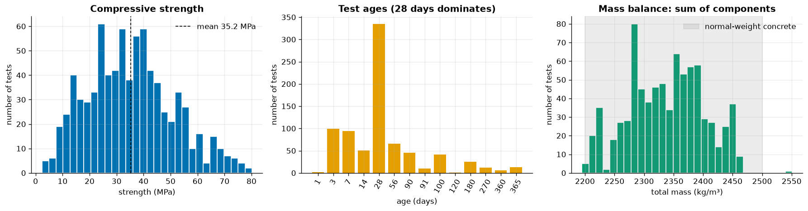
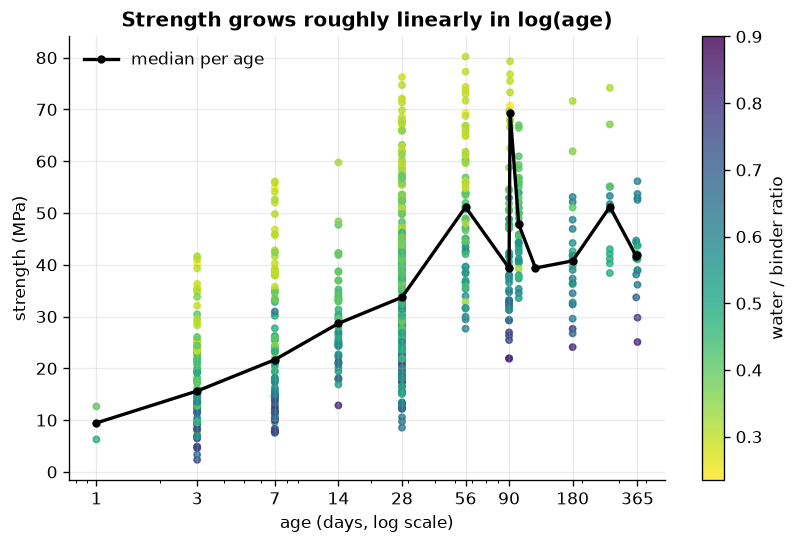
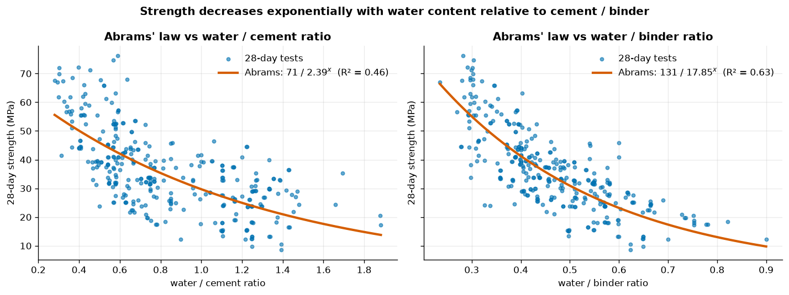
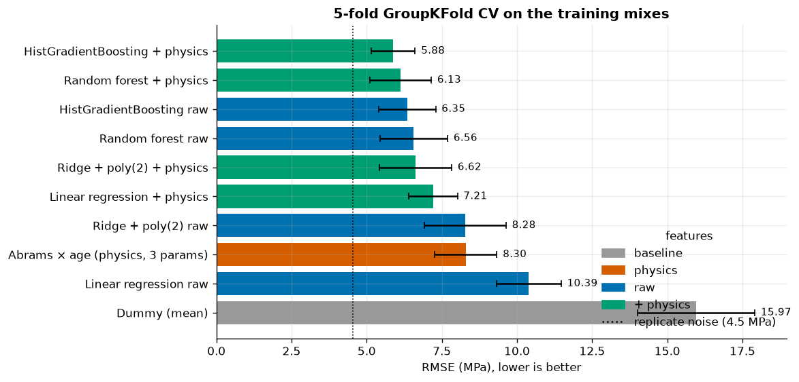
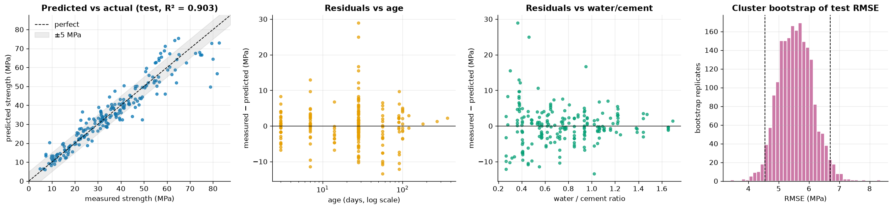
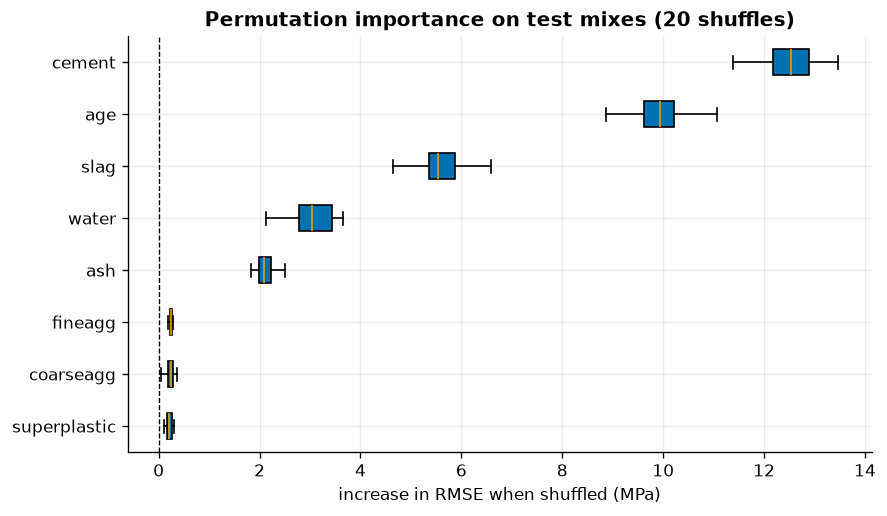
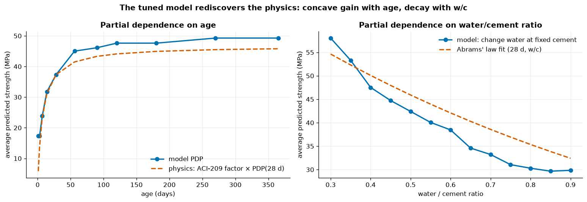
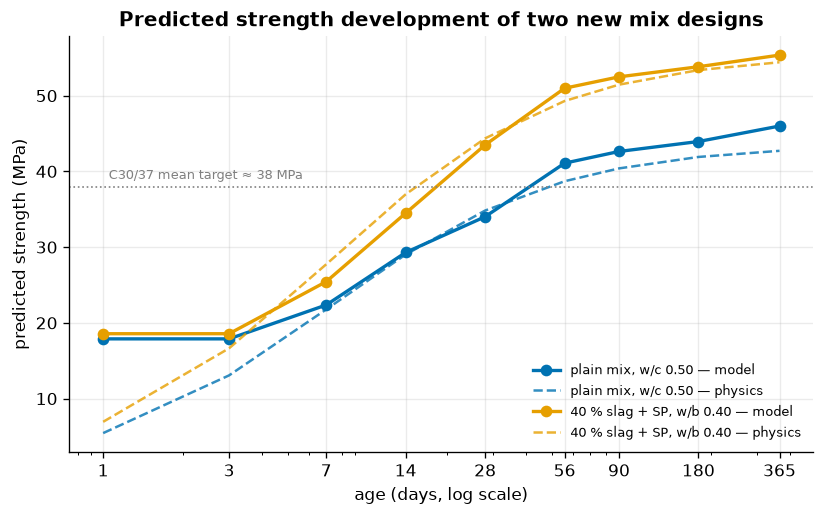

# 12 · Capstone: Predicting Concrete Compressive Strength

> An end-to-end, physics-informed regression project on real laboratory data: from problem framing and a raw-data audit to a tuned, interpreted, saved and documented model.

[← Previous](../11-interpretability/README.md) · [Course home](../README.md)

**Notebook:** [`12-capstone-concrete-strength.ipynb`](12-capstone-concrete-strength.ipynb) · **Dataset:** [`data/raw/concrete.csv`](../data/raw/concrete.csv) — Yeh (1998), UCI Concrete Compressive Strength, 1030 tests, CC BY 4.0 · **Saved model:** [`model/`](model/) · **Time:** ~3–4 h

---

## Learning objectives

By the end of this capstone you can:

1. Frame a regression problem with a metric an engineer understands, and relate it to the **noise floor** of the measurements.
2. Audit raw data with **physical sanity checks**: mass balance, impossible values, duplicates, replicates.
3. Detect **grouped data** (one mix tested at several ages) and prevent leakage with `GroupShuffleSplit` / `GroupKFold`.
4. Engineer **physics-informed features** (w/c, w/b, log age, …) inside a `Pipeline` with `FunctionTransformer`.
5. Fit **Abrams' law** with `scipy.optimize.curve_fit` and turn it into a cross-validatable **physics baseline** estimator.
6. Compare, tune (`RandomizedSearchCV`) and evaluate models **once** on a held-out test set, with a **cluster-bootstrap** CI.
7. Check the model's **partial dependences against physics**, save it with `joblib`, and write a **model card**.


---

## 1 · Problem framing

### The engineering context

Concrete is **cement + water + aggregates** (fine = sand, coarse = gravel), frequently with **supplementary cementitious materials** (SCMs: ground blast-furnace **slag**, fly **ash**) and a **superplasticizer** admixture that keeps the mix workable with less water. Cement **hydrates**: it reacts with water to form calcium-silicate-hydrate gel that glues the aggregate together. Two century-old empirical laws describe the result:

**Abrams' law (1918)** — at a fixed age, strength decays exponentially with the water–cement ratio:

$$
f_c = \frac{A}{B^{\,w/c}}.
$$

Water beyond what hydration consumes leaves capillary pores, and pores make the paste weak.

**Strength gain with age** — hydration is fast at first and then slows; strength grows roughly linearly in $\log(\text{age})$. ACI 209 models it as

$$
f_c(t)=f_{c,28}\,\frac{t}{a+b\,t}\qquad(a\approx 4\ \text{days},\ b\approx 0.85 \text{ for ordinary cement}).
$$

Designing a mix today means trial batches and **28 days of waiting**. A model that predicts strength from the recipe can screen candidate designs first.

### The ML task

| | |
|---|---|
| **Target** | `strength` — compressive strength in MPa |
| **Inputs** | `cement`, `slag`, `ash`, `water`, `superplastic`, `coarseagg`, `fineagg` (kg per m³ of concrete) and `age` (days) |
| **Task** | supervised regression |
| **Metric** | **RMSE in MPa** (same unit as the target; penalises big misses — over-predicting strength is the dangerous direction). MAE and $R^2$ reported too |
| **Baselines** | predict the training mean (`DummyRegressor`); a 3-parameter **physics model** |

### What error is acceptable?

Strength classes (C25/30, C30/37, C35/45, …) are about **5 MPa** apart, and Eurocode 2 sets the target mean strength **8 MPa** above the characteristic value to absorb production scatter. As we will see, **replicate tests** of the same mix at the same age in this dataset scatter with an SD of **≈ 3–4.5 MPa**. So:

- RMSE ≈ 4–6 MPa → useful for **screening and ranking** mixes;
- no model replaces the **compliance test** on real specimens.

---

## 2 · Load the raw data and audit it

`load_concrete()` returns the CSV exactly as shipped: 1030 rows × 9 columns, all numeric, no missing values.

| Check | Result |
|---|---|
| Missing values | 0 |
| Negative amounts / zero cement / age ≤ 0 / strength ≤ 0 | 0 / 0 / 0 / 0 |
| w/c outside [0.2, 2] | 0 |
| Total mass of components | 2195–2551 kg/m³ (median 2349); 3 mixes just below 2200, 1 above 2500 |
| **Exact duplicate rows** | **25** |

**Mass balance.** One cubic metre of normal-weight concrete weighs ≈ 2200–2500 kg; the sum of the seven components should land there (entrained air takes up the remaining volume). It does, so there is no sign of unit errors or missing components.

**Duplicates.** 25 rows are identical down to 0.01 MPa — copy artefacts from assembling the data from several sources. We drop them (1005 rows remain): they over-weight a few mixes and could land on both sides of a split.

**Mixes and replicates.** Grouping by the seven components reveals only **427 distinct mixes**; 246 were tested at a single age, the rest at up to 12 ages. Nine mix/age combinations have **replicate** tests:

| cement | slag | ash | age | n | mean | SD | range |
|---|---|---|---|---|---|---|---|
| 359 | 19 | 141 | 3 | 2 | 24.38 | 1.05 | 1.48 |
| 359 | 19 | 141 | 28 | 2 | 61.22 | 2.44 | 3.45 |
| **362.6** | **189** | **0** | **7** | **2** | **39.40** | **23.33** | **33.00** |
| 446 | 24 | 79 | 7 | 3 | 43.11 | 7.73 | 13.99 |
| 446 | 24 | 79 | 56 | 3 | 57.49 | 3.14 | 5.82 |

*(5 of 9 rows shown.)* The median replicate SD is **3.14 MPa**; pooled over the non-suspicious groups it is **4.54 MPa** — our **noise floor**. One pair (55.9 vs 22.9 MPa at 7 days) is almost certainly a transcription error, but we cannot tell which value is wrong, so we keep both.

> [!WARNING]
> Deleting points because they hurt your score is how optimistic results are made. Flag suspicious records, document them, and only remove them with an external reason.

---

## 3 · Split first — by mix

Rows of the same mix at different ages are strongly related. If mix #17 is in the training set at 28 days and in the test set at 56 days, the model can "recognise" the recipe and interpolate along age. But the real use case is a **new recipe**. So:

```python
df["mix_id"] = df.groupby(components, sort=False).ngroup()
gss = GroupShuffleSplit(n_splits=1, test_size=0.2, random_state=42)
tr_idx, te_idx = next(gss.split(X_all, y_all, groups=df["mix_id"]))
cv_group = GroupKFold(n_splits=5, shuffle=True, random_state=42)
```

Train: **800 rows / 341 mixes**; test: **205 rows / 86 mixes**; mixes in both: **0**.

**How large is the leak?** Same `HistGradientBoostingRegressor`, same training data:

| CV scheme | CV RMSE (MPa) |
|---|---|
| `KFold` (random rows — leaky) | 4.50 |
| `GroupKFold` (by mix) | **6.35** |

The random split under-states the error by almost **2 MPa (≈ 30 %)**. Every CV from here on is grouped.

> [!IMPORTANT]
> Whenever several rows describe the same physical object (patient, customer, machine, **mix**), split by that object. Row-wise CV answers "how well can I fill in missing measurements of known objects?", not "how well will I do on new ones?".

---

## 4 · Exploratory data analysis (training set only)


*Strength is roughly bell-shaped around 35 MPa (range 2–83). Ages are very unbalanced: 28 days dominates, and there are only two 1-day tests — a warning for early-age predictions. All total masses lie in or very near the normal-weight concrete band.*


*Up to 56 days the median (black) climbs almost linearly on the log-age axis — the log(age) law; strength roughly doubles from 3 to 28 days. Beyond that the median zig-zags, not because concrete weakens but because different mixes were tested at different ages (the 91-day tests are almost all low-w/b, high-strength mixes). This composition confounding is why per-age averages mislead and a multivariate model is needed. At any age, low water/binder mixes (yellow) are the strongest.*

Spearman rank correlation with strength (training set):

| w_b | w_c | water | fineagg | coarseagg | ash | slag | superplastic | cement | age |
|---|---|---|---|---|---|---|---|---|---|
| **−0.58** | −0.48 | −0.26 | −0.22 | −0.13 | 0.00 | 0.13 | 0.31 | 0.44 | **0.61** |

The derived **water/binder ratio** correlates with strength more strongly than any raw ingredient — the case for physics-informed features.

---

## 5 · Physics-informed feature engineering

| Feature | Formula | Physical meaning |
|---|---|---|
| `w_c` | water / cement | Abrams' ratio |
| `binder` | cement + slag + ash | total reactive material |
| `w_b` | water / binder | Abrams' ratio counting SCMs (they hydrate too, more slowly) |
| `log_age` | ln(age) | strength gain ∝ log(time) |
| `agg_binder` | (coarse + fine) / binder | lean vs rich mix (paste content) |
| `sp_binder` | superplasticizer / binder | admixture dosage |
| `scm_frac` | (slag + ash) / binder | cement-replacement level |

```python
# mlaz/concrete.py
def add_physics_features(X):
    X = pd.DataFrame(X, columns=CONCRETE_INPUTS).copy()
    binder = X["cement"] + X["slag"] + X["ash"]
    X["w_c"] = X["water"] / X["cement"]
    X["binder"] = binder
    X["w_b"] = X["water"] / binder
    X["log_age"] = np.log(X["age"])
    X["agg_binder"] = (X["coarseagg"] + X["fineagg"]) / binder
    X["sp_binder"] = X["superplastic"] / binder
    X["scm_frac"] = (X["slag"] + X["ash"]) / binder
    return X

pipe = Pipeline([("physics", FunctionTransformer(add_physics_features, validate=False)),
                 ("model", HistGradientBoostingRegressor())])
```

Because the transformer lives **inside** the pipeline, the features are recomputed identically in every CV fold, on the test set and at prediction time. (They are stateless ratios, so there is nothing to leak — but the habit matters.)

---

## 6 · A physics baseline: Abrams' law with `curve_fit`

On the 335 training tests at 28 days, non-linear least squares gives:

| Ratio $x$ | $A$ (MPa) | $B$ | RMSE (MPa) | $R^2$ |
|---|---|---|---|---|
| water / cement | 70.9 ± 2.8 | 2.39 ± 0.13 | 10.08 | 0.463 |
| water / **binder** | 130.7 ± 7.1 | 17.9 ± 2.3 | **8.41** | **0.626** |

```python
def abrams(x, A, B):
    return A / B**x
(A, B), cov = curve_fit(abrams, w_b_28d, strength_28d, p0=[100, 5])
```


*The exponential decay is clear in both panels, but counting slag and fly ash as binder (right) tightens the cloud considerably: a w/c-only view calls a slag-rich mix "very wet" although its slag also hydrates.*

To predict **all ages**, multiply by an ACI-209-style age factor normalised to 1 at 28 days:

$$
\hat f_c(w/b,t)=\frac{A}{B^{\,w/b}}\cdot\frac{t}{28(1-b)+b\,t}.
$$

Wrapped as a scikit-learn estimator (`AbramsAgeRegressor`, `fit` calls `curve_fit` with bounds), it can be cross-validated like any model. Fitted on all training ages: $A=116.8$ MPa, $B=11.24$, $b=0.800$ → $a=28(1-b)=5.6$ days — close to the textbook ACI values ($a\approx4$, $b\approx0.85$). Three parameters, all interpretable.

---

## 7 · Compare models with grouped cross-validation

Every candidate is a `Pipeline`; "+ physics" versions start with the `FunctionTransformer`; linear models get a `StandardScaler` (and `PolynomialFeatures(2)` for the Ridge variant).

| Model | Features | CV RMSE (MPa) | ± std | CV MAE | CV $R^2$ |
|---|---|---|---|---|---|
| **HistGradientBoosting** | + physics | **5.88** | 0.73 | 4.15 | 0.857 |
| Random forest | + physics | 6.13 | 1.02 | 4.38 | 0.846 |
| HistGradientBoosting | raw | 6.35 | 0.95 | 4.66 | 0.834 |
| Random forest | raw | 6.56 | 1.13 | 4.89 | 0.822 |
| Ridge + poly(2) | + physics | 6.62 | 1.20 | 4.94 | 0.819 |
| Linear regression | + physics | 7.21 | 0.81 | 5.72 | 0.785 |
| Ridge + poly(2) | raw | 8.28 | 1.36 | 6.36 | 0.715 |
| Abrams × age (3 params) | physics | 8.30 | 1.03 | 6.32 | 0.716 |
| Linear regression | raw | 10.39 | 1.08 | 8.29 | 0.545 |
| Dummy (mean) | — | 15.97 | 1.95 | 13.00 | −0.048 |


*Bars = mean over 5 grouped folds, whiskers = std across folds, dotted line = replicate noise (4.5 MPa).*

What we learn:

- The **3-parameter physics model** roughly **halves** the error of the mean-predictor (15.97 → 8.30) and matches a 44-feature polynomial Ridge on raw inputs. Domain knowledge is a strong baseline.
- **Linear models** gain the most from physics features (10.39 → 7.21): they cannot invent `log(age)` or ratios themselves.
- **Tree ensembles** are best, and physics features still help them (HGB 6.35 → 5.88, RF 6.56 → 6.13): ratios are awkward to approximate with axis-aligned splits.
- Fold-to-fold std is ~1 MPa, so differences of a few tenths are within noise; the ranking of families is robust.

---

## 8 · Tune the best model

```python
param_dist = {
    "model__learning_rate": loguniform(0.02, 0.3),
    "model__max_iter": randint(150, 800),
    "model__max_leaf_nodes": randint(6, 48),
    "model__min_samples_leaf": randint(3, 30),
    "model__l2_regularization": loguniform(1e-3, 10),
    "model__max_features": uniform(0.4, 0.6),
}
search = RandomizedSearchCV(pipe, param_dist, n_iter=30, cv=cv_group,
                            scoring="neg_root_mean_squared_error", random_state=42, n_jobs=-1)
search.fit(X_train, y_train, groups=g_train)     # groups go to GroupKFold
```

Best CV RMSE **5.58 MPa** (default: 5.88) with `learning_rate ≈ 0.059`, `max_iter = 339`, `max_leaf_nodes = 8`, `min_samples_leaf = 7`, `l2_regularization ≈ 0.126`, `max_features ≈ 0.43` — small trees, many of them, feature subsampling: a well-regularised model for 800 rows.

---

## 9 · Final evaluation — once — on the test set

| Model | Test RMSE (MPa) | Test MAE (MPa) | Test $R^2$ |
|---|---|---|---|
| Mean of training strength | 17.81 | — | — |
| Abrams × age physics model | 8.87 | — | — |
| **Tuned HGB + physics** | **5.56** | **3.86** | **0.903** |

**Uncertainty.** 205 test rows from 86 mixes is not much. A **cluster bootstrap** resamples *mixes* (rows of one mix are correlated, so resampling rows would understate the uncertainty) 2000 times: **95 % CI for the test RMSE = [4.55, 6.70] MPa**. The CV estimate (5.58) sits comfortably inside.


*Most test mixes fall inside the ±5 MPa band. Residuals show no trend with age or w/c. Mean absolute error is ≈ 3.0 MPa for ages ≤ 7 d and ≈ 4.1–4.3 MPa at later ages. A handful of high-strength 28-day tests are under-predicted by 15–29 MPa — the model is conservative there (the safe direction), and with ~5 MPa replicate scatter plus possible data errors, some of this is irreducible.*

---

## 10 · Interpretability — does the model agree with physics?

### Permutation importance (test set, raw inputs)

Shuffling a **raw** column also scrambles every derived feature computed from it (shuffling `water` changes `w_c` and `w_b`), so importances refer to ingredients as a whole.


*Increase in test RMSE when each input is shuffled (20 repeats): cement 12.5 MPa, age 10.0, slag 5.6, water 3.1, fly ash 2.1; aggregates and superplasticizer ≈ 0.2. Exactly the hierarchy a concrete technologist would expect — binder and age dominate, aggregates are "filler".*

### Partial dependence on age and w/c

- **Age** is a raw input → PDP through the whole pipeline with `partial_dependence(..., custom_values={"age": ages}, method="brute")`.
- **w/c** is derived → we intervene like an engineer: **keep the cement, change the water** (`water = w/c × cement`), average predictions over training mixes, and skip rows where the new water content would fall outside the observed range (no impossible mixes).

| Physics check | Result |
|---|---|
| Age: monotone increasing | ✅ |
| Age: concave (gain 1→28 d vs 28→365 d) | 20.0 vs 11.9 MPa ✅ |
| w/c: monotone decreasing | ✅ |
| w/c 0.30 → 0.90 | 58.0 → 29.8 MPa |


*Left: steep gain to 28 days, then flattening; the model keeps gaining a little more after 56 days than the ACI factor — slag and fly ash react slowly for months. At 1 day the model says ~17 MPa vs ~6 from physics: there are only two 1-day tests, and a tree just repeats its 3-day value. Right: monotone decay with w/c, somewhat steeper than the 28-day Abrams fit; above w/c ≈ 0.8 the curve flattens where data thin out.*

Nothing in the model forced these shapes — gradient boosting learned them from 800 lab tests. If they had come out non-monotone, `HistGradientBoostingRegressor(monotonic_cst=...)` could impose the physics (Exercise 1).

> [!TIP]
> "Does the model agree with physics?" is one of the most powerful validation questions you can ask. A model that is accurate on the test set **and** physically plausible is far more trustworthy than one that is only accurate.

---

## 11 · Save, load and predict a new mix

```python
joblib.dump(final, "model/concrete_strength_hgb.joblib")   # ≈ 369 kB
loaded = joblib.load("model/concrete_strength_hgb.joblib")
loaded.predict(new_mixes)
```

The notebook writes [`model/concrete_strength_hgb.joblib`](model/concrete_strength_hgb.joblib) and [`model/model_card.json`](model/model_card.json) (sklearn version, hyper-parameters, CV/test metrics, bootstrap CI, **training ranges** of every input). Reloaded predictions are identical to the originals.

> [!WARNING]
> `joblib`/`pickle` store `add_physics_features` **by reference**, not by value. That is why it lives in [`mlaz/concrete.py`](../mlaz/concrete.py) rather than in the notebook: any process with `mlaz` installed can `joblib.load` the model. Also pin the scikit-learn version — pickles are not guaranteed to load across versions.

A simple **domain check** compares each new input (and its derived ratios) with the training ranges:

| Mix | cement | slag | water | SP | age | w/c | model (MPa) | physics (MPa) | domain check |
|---|---|---|---|---|---|---|---|---|---|
| plain, w/c 0.50 | 350 | 0 | 175 | 0 | 28 | 0.50 | 34.0 | 34.8 | ok |
| 40 % slag + SP, w/b 0.40 | 210 | 140 | 140 | 6 | 28 | 0.67 | 43.5 | 44.4 | ok |
| very rich, 2 years | 520 | 0 | 125 | 15 | 730 | 0.24 | 66.9 | 80.8 | **age = 730 ∉ [1, 365]; w/c = 0.24 ∉ [0.28, 1.88]** |

For the third mix the two models disagree by 14 MPa — exactly what extrapolation looks like. Tree models output a constant beyond the data; the physics formula extrapolates a trend. Neither should be trusted there.


*The slag + superplasticizer mix, with its much lower water/binder ratio, is stronger at every age and is the one that reaches a C30/37 mean target (~38 MPa) by 28 days. Model (solid) and physics (dashed) agree well from 7 to 365 days; before 3 days the model is flat because only two 1-day tests exist.*

---

## 12 · Model card

| | |
|---|---|
| **Model** | `HistGradientBoostingRegressor` in a `Pipeline` with physics features (w/c, w/b, log age, binder, aggregate/binder, SP/binder, SCM fraction) |
| **Intended use** | Screening and ranking candidate mix designs before trial batches; estimating strength-development curves |
| **Not intended for** | Structural acceptance / compliance (use standard cylinder or cube tests); any safety-critical decision without testing |
| **Training data** | Yeh (1998), UCI Concrete Compressive Strength, 1030 lab tests → 1005 after removing 25 exact duplicates; 427 mixes; CC BY 4.0 |
| **Evaluation** | Split by mix; 86 test mixes never seen in training. Test RMSE 5.56 MPa (95 % cluster-bootstrap CI 4.55–6.70), MAE 3.86 MPa, $R^2$ 0.903; grouped-CV RMSE 5.58 MPa |
| **Inputs & units** | 7 ingredients in kg/m³ + age in days |
| **Valid domain** | Training ranges in `model_card.json` — e.g. age 1–365 d, w/c ≈ 0.28–1.88, cement 102–540 kg/m³ |
| **Not in the data** | cement type/class, aggregate type & max size, curing temperature/humidity, air content, specimen shape/size, batch/lab identity |
| **Known limitations** | Unreliable at 1 day (2 training tests); no extrapolation beyond training ranges (trees predict constants); a few high-strength mixes under-predicted by > 15 MPa; residual noise ≈ replicate scatter (~4.5 MPa) is irreducible |
| **Safety** | Over-prediction is the dangerous direction — for design use a lower bound, e.g. prediction − 1.64 × RMSE ≈ prediction − 9 MPa for ~95 % one-sided coverage (assuming roughly normal errors) |

---

## Common pitfalls

| Pitfall | What happens | Remedy used here |
|---|---|---|
| Random row split on grouped data | same mix in train and test → RMSE understated by ~2 MPa | `GroupShuffleSplit` + `GroupKFold` on `mix_id` |
| Keeping exact duplicates | over-weights some mixes, leaks across splits | audit, drop the 25 duplicates |
| Deleting "outliers" that hurt the score | optimistic, irreproducible results | flag and document; keep unless there is an external reason |
| Computing features outside the pipeline | train/serve skew, leakage for fitted transforms | `FunctionTransformer` inside the `Pipeline` |
| Using raw `age` in a linear model | strength is not linear in time | `log_age` |
| Tuning on the test set / evaluating many times | test score becomes a validation score | tune with CV, test **once** |
| A single test number without uncertainty | over-confident conclusions | cluster bootstrap CI |
| Trusting predictions outside the data | trees go flat, formulas go wild | domain check against training ranges |
| Assuming pickles are portable | load failures in production | importable feature module; pin library versions |

---

## Key takeaways

- **Frame** the metric in engineering units and compare it with the noise floor (replicate scatter ≈ 4.5 MPa) and with decision thresholds (≈ 5 MPa between strength classes).
- **Audit with physics**: mass balance, impossible values, duplicates, replicates — they reveal what the rows really are.
- **Grouped data need grouped splits**: a random split under-stated RMSE by almost 30 %.
- **Physics is a strong model and a great feature source**: 3 parameters (Abrams × age) halve the baseline error; the same ratios make linear models competitive and improve gradient boosting from 6.35 to 5.88 MPa CV RMSE.
- Tune with grouped CV, evaluate **once** (test RMSE 5.56 MPa, 95 % CI 4.55–6.70, $R^2$ 0.90), and check that the model's behaviour (PDPs) agrees with physics.
- Ship the model **with** its model card: intended use, valid domain, limitations.

---

## Exercises

1. **Monotone constraints.** Refit the final model with `monotonic_cst` so that strength increases with `log_age` and `cement` and decreases with `w_c`, `w_b` and `water`. Does test RMSE change? Do the PDPs change?
   *Hint:* `monotonic_cst` accepts a dict `{feature_name: ±1}` when the model receives a DataFrame — the physics transformer returns one.
2. **The 28-day problem.** Keep only 28-day tests and repeat the model comparison, including pure Abrams' law. How much does ML add when age is fixed?
   *Hint:* use `GroupKFold` on the remaining rows; with one age per mix the groups are singletons.
3. **Prediction intervals.** Fit `HistGradientBoostingRegressor(loss="quantile", quantile=0.05)` and `quantile=0.95` and check the empirical coverage of the 90 % interval on the test set.
   *Hint:* coverage = `np.mean((y_test >= lo) & (y_test <= hi))`.
4. **Learning curve.** Would more mixes help? Plot grouped-CV RMSE against the number of training mixes.
   *Hint:* `learning_curve(pipe, X_train, y_train, groups=g_train, cv=cv_group, train_sizes=...)`.
5. **Leakage, quantified.** Redo the whole model comparison with `KFold`. Which models benefit most from the leak, and why?
   *Hint:* the more flexible the model, the better it memorises a recipe seen at other ages.

---

## Further reading

- I-C. Yeh (1998), "Modeling of strength of high-performance concrete using artificial neural networks", *Cement and Concrete Research* 28(12), 1797–1808. — the source of the data.
- I-C. Yeh, *Concrete Compressive Strength* [dataset], UCI Machine Learning Repository (2007), https://doi.org/10.24432/C5PK67 — licensed CC BY 4.0.
- D. A. Abrams (1918), *Design of Concrete Mixtures*, Bulletin 1, Structural Materials Research Laboratory, Lewis Institute, Chicago.
- ACI Committee 209 (2008), *Guide for Modeling and Calculating Shrinkage and Creep in Hardened Concrete* (ACI 209.2R-08) — the $t/(a+bt)$ strength-development model.
- A. M. Neville, *Properties of Concrete* (5th ed., 2011) — hydration, w/c ratio, SCMs, strength development.
- EN 1992-1-1 (Eurocode 2), Table 3.1 — strength classes and $f_{cm}=f_{ck}+8$ MPa.
- Mitchell et al. (2019), "Model Cards for Model Reporting", *FAT\** — the model-card idea.
- Kaufman, Rosset & Perlich (2012), "Leakage in data mining: formulation, detection, and avoidance", *ACM TKDD* 6(4).
- Géron, *Hands-On Machine Learning* (3rd ed.), ch. 2 "End-to-End Machine Learning Project" — the classic template this chapter follows.
- scikit-learn user guide: [Cross-validation iterators for grouped data](https://scikit-learn.org/stable/modules/cross_validation.html#group-k-fold), [`FunctionTransformer`](https://scikit-learn.org/stable/modules/preprocessing.html#custom-transformers), [Model persistence](https://scikit-learn.org/stable/model_persistence.html), [Monotonic constraints](https://scikit-learn.org/stable/modules/ensemble.html#monotonic-constraints).
