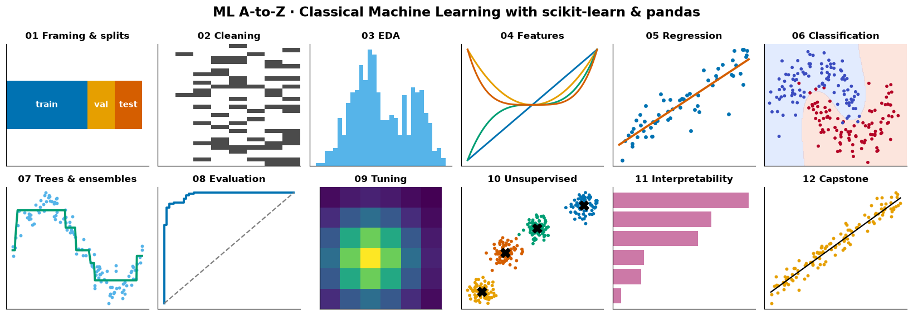
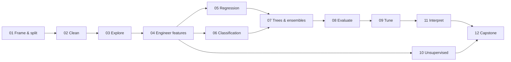

# ML A-to-Z · Classical Machine Learning



A hands-on course in **classical machine learning with scikit-learn and pandas**, from framing a problem to shipping a
tuned, evaluated model. It is the first of the two **ML A-to-Z** repositories; this one covers everything that isn't
deep learning.

Each chapter has two parts:

- **`README.md`**: the lesson. It covers intuition, then the maths, then code, with figures, and ends with pitfalls,
  key takeaways, exercises and further reading. It renders on GitHub, so you can learn from it without running anything.
- **`NN-*.ipynb`**: a Jupyter notebook you can run, with every figure in the lesson generated live. The notebooks
  are committed *with outputs*, so they read fine on GitHub too.

Core algorithms are built **from scratch in NumPy** first: linear regression (normal equations and gradient descent),
logistic regression, k-NN, Gaussian naive Bayes, decision-tree splits, gradient boosting, ROC curves, permutation
importance, partial dependence, k-means and PCA via SVD. Each one is then **checked against scikit-learn**, so you
learn how it works and also how to use it properly.

---

## Syllabus

| # | Chapter | What you'll learn | Data |
|---|---|---|---|
| 01 | [Problem framing & data splits](01-problem-framing/README.md) | Choosing a task, target, metric and baseline; train/validation/test; stratified, group and time splits; **data leakage** (and how it produces fake accuracy) | Titanic, synthetic |
| 02 | [Data cleaning](02-data-cleaning/README.md) | Missing values (MCAR/MAR/MNAR, imputation), outliers (IQR, z, MAD), duplicates, dtypes, **unit conversion**, validation checks | Titanic, messy Auto-MPG |
| 03 | [Exploratory data analysis](03-exploratory-data-analysis/README.md) | Distributions, skew and log transforms, correlations (Pearson vs Spearman), Anscombe, **Simpson's paradox**, target analysis | Penguins, Auto-MPG |
| 04 | [Feature engineering](04-feature-engineering/README.md) | Scaling, power transforms, one-hot/ordinal/target encoding, polynomial & domain features, **Pipelines & ColumnTransformer**, custom transformers | Titanic, Auto-MPG |
| 05 | [Regression](05-regression/README.md) | Linear regression **from scratch** (normal equations + gradient descent), Ridge/Lasso, polynomial regression, **bias–variance** simulation | Synthetic, Auto-MPG, diabetes |
| 06 | [Classification](06-classification/README.md) | Logistic regression **from scratch**, k-NN, naive Bayes, SVMs and the kernel trick, decision boundaries | Synthetic, penguins, breast cancer |
| 07 | [Trees & ensembles](07-trees-and-ensembles/README.md) | Impurity & splits, pruning, bagging, random forests, OOB, gradient boosting **from scratch**, HistGradientBoosting | Synthetic, breast cancer, diabetes |
| 08 | [Model evaluation](08-model-evaluation/README.md) | Cross-validation schemes, confusion matrix, precision/recall, **ROC/AUC from scratch**, PR curves, thresholds, **calibration** | Breast cancer, imbalanced synthetic |
| 09 | [Hyperparameter tuning](09-hyperparameter-tuning/README.md) | Grid vs random search, successive halving, overfitting the validation set, **nested cross-validation** | Breast cancer, digits, wine |
| 10 | [Unsupervised learning](10-unsupervised-learning/README.md) | k-means **from scratch**, choosing *k*, hierarchical clustering, **PCA via SVD**, t-SNE | Digits, penguins, synthetic |
| 11 | [Interpretability](11-interpretability/README.md) | Coefficients, impurity vs **permutation importance**, correlated features, **partial dependence & ICE** | Titanic, Auto-MPG, diabetes |
| 12 | [Capstone: concrete strength](12-capstone-concrete-strength/README.md) | Raw CSV → audit → leakage-safe split → **physics-informed features (Abrams' law)** → model comparison → tuning → test-set evaluation → interpretation → saved model + model card | UCI Concrete (real engineering data) |



**Suggested pace:** one chapter per sitting (2–4 h), or roughly two chapters a week. Chapters 01–04 are the
foundation for everything else, so do them in order. After that you can jump around.

---

## Getting started

```bash
git clone https://github.com/cfdgasman/classical-ML.git
cd classical-ML

python -m venv .venv && source .venv/bin/activate   # Windows: .venv\Scripts\activate
pip install -r requirements.txt
pip install -e .          # installs the tiny `mlaz` helper package used by every notebook

jupyter lab               # then open e.g. 05-regression/05-regression.ipynb
```

Requires Python ≥ 3.10. Everything runs on a laptop CPU in seconds to a few minutes, and **no data is downloaded at
runtime**: the CSVs are in [`data/raw`](data/README.md) and the other datasets ship with scikit-learn.

To re-execute every notebook and regenerate every figure (CI does the same thing on each push):

```bash
python scripts/run_notebooks.py          # all chapters
python scripts/run_notebooks.py 05 12    # just chapters 05 and 12
```

## Repository layout

```text
classical-ML/
├── README.md                     ← you are here
├── 01-problem-framing/
│   ├── README.md                 ← the lesson
│   ├── 01-problem-framing.ipynb  ← runnable notebook (executed, with outputs)
│   └── images/                   ← figures generated by the notebook, embedded in the lesson
├── 02-data-cleaning/ … 12-capstone-concrete-strength/
├── data/raw/                     ← raw CSVs (Titanic, Auto-MPG, Penguins, Concrete)
├── mlaz/                         ← shared helpers: plot style, savefig, dataset loaders
├── scripts/run_notebooks.py      ← executes all notebooks in place
└── requirements.txt
```

## Prerequisites

- **Python**: functions, list comprehensions, and basic NumPy array operations.
- **Maths**: vectors and matrices, matrix multiplication, transpose and inverse; derivatives and the chain rule;
  mean, variance and a normal distribution. The lessons explain the rest as it comes up.
- No prior ML knowledge is assumed.

## Conventions used throughout

| Convention | Meaning |
|---|---|
| $X \in \mathbb{R}^{n \times p}$ | feature matrix: *n* samples (rows), *p* features (columns) |
| $y \in \mathbb{R}^{n}$ | target vector; $\hat{y}$ are predictions |
| $\theta$, $w$, $b$ | model parameters (weights, bias) |
| `RANDOM_STATE = 42` | every random process is seeded, so re-running gives identical numbers |
| `Pipeline` everywhere | preprocessing is always fit on training data only (see chapter 01 on leakage) |

## The golden rules (you'll meet each of these again)

1. **Split before you look.** Put the test set aside first, and touch it once at the very end.
2. **Beat a baseline.** A model is only interesting if it beats `DummyRegressor`/`DummyClassifier` and a simple
   rule of thumb.
3. **Everything learned from data goes in the pipeline.** That includes scalers, imputers, encoders and feature
   selection. Otherwise information leaks from the validation folds.
4. **Pick the metric to match the cost of mistakes**, not just because it's the default.
5. **Cross-validate, and report uncertainty.** A single split is an anecdote.
6. **Check against domain knowledge.** If the model says strength *increases* with more water, something is wrong.

## Further reading for the whole course

- G. James, D. Witten, T. Hastie, R. Tibshirani, J. Taylor, *An Introduction to Statistical Learning (with Python)*,
  2023. Free at [statlearning.com](https://www.statlearning.com/).
- T. Hastie, R. Tibshirani, J. Friedman, *The Elements of Statistical Learning*, 2nd ed., 2009. Free online.
- A. Géron, *Hands-On Machine Learning with Scikit-Learn, Keras & TensorFlow*, 3rd ed., O'Reilly, 2022.
- [scikit-learn User Guide](https://scikit-learn.org/stable/user_guide.html), which is one of the best ML
  references anywhere.
- S. Raschka, *Model Evaluation, Model Selection, and Algorithm Selection in Machine Learning*, arXiv:1811.12808.

## Licence

Code and text are released under the [MIT licence](LICENSE). Dataset licences are listed in
[`data/README.md`](data/README.md).
